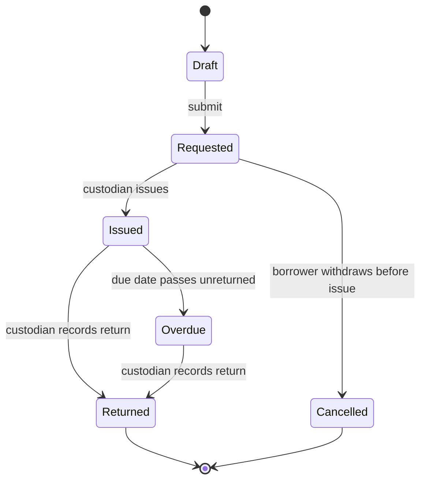

# Equipment checkout: design

Approved by: Jordan Lee (@jordan-lee) · 12/08/2026 · revision a1c4e02

## Current state

Today there is no system record at all; the spreadsheet sits outside Frappe entirely. This
specification introduces `Equipment Item` (one row per physical item in the pool) and `Equipment
Checkout` (submittable, one document per loan, states `Requested → Issued → Returned`, plus
`Cancelled`). Two new roles: `Equipment Borrower` may create, submit, and, only before issue,
cancel their own checkouts; `Equipment Custodian` may additionally move any checkout through Issue
and Return. Neither role may delete a submitted checkout.

## Words in this request

| Requester's word | Means in this app |
|---|---|
| item | `Equipment Item` |
| request, loan | `Equipment Checkout` |
| waiting to be issued | Workflow state `Requested` |
| borrower | Role `Equipment Borrower` |
| custodian | Role `Equipment Custodian` |

## Decisions (locked)

- `D-1`: One submittable document carries a checkout's whole life, not a separate document per
  state change. Chosen over separate request/issue/return records, which would scatter one loan's
  history across three rows instead of one.
- `D-2`: At most one checkout may sit in the Issued state against a given item at any time. Chosen
  over allowing a second request to queue silently against an already-issued item, which hid the
  fact that it was already out.
- `D-3`: A checkout can only be cancelled before it is issued. Chosen over allowing cancellation at
  any time, which would let an issued loan disappear from the record with no return ever logged
  against it.
- `D-4`: Only the custodian role may move a checkout from Requested to Issued or from Issued to
  Returned. Chosen over letting a borrower self-serve the Issue step, which would defeat the
  physical hand-off the record exists to prove happened.

## Design

**This diagram is the design, not the build.** Each verification record redraws it from what
was actually observed and tallies the two. Use one transition per line and stable node names
so the two diagrams diff cleanly.

## Frappe-first

| What we need | Native Frappe/ERPNext mechanism | Custom code, and why it is unavoidable |
|---|---|---|
| Track a document through Draft/Submitted/Cancelled | Native `docstatus` | none |
| Represent Requested/Issued/Returned/Cancelled as states of one submitted document | `Workflow` DocType, transitions gated by an `Allowed` role | none |
| Restrict who may issue or return | Workflow transition's own role gate | none |
| Stop an item being issued while already on loan | No native cross-document uniqueness primitive exists | One `validate`-time guard on the Issue transition, checking no other `Equipment Checkout` against this item is currently Issued |

## Data and migration plan

No existing data affected: both DocTypes are new.

## Correctness properties

### Property 1: One loan per item

For every item, at most one checkout is Issued at any time.

**Validates: Requirements 2.1, 2.2**

### Property 2: Only custodians move loans

For every role other than Equipment Custodian, the Issue and Return transitions are refused.

**Validates: Requirements 2.3**

## Errors and permissions

- A second Issue against an item on loan is refused with a message naming the current borrower.
- A borrower cancelling an issued checkout is refused; the message says only a return closes it.
- No role may delete a submitted checkout.
