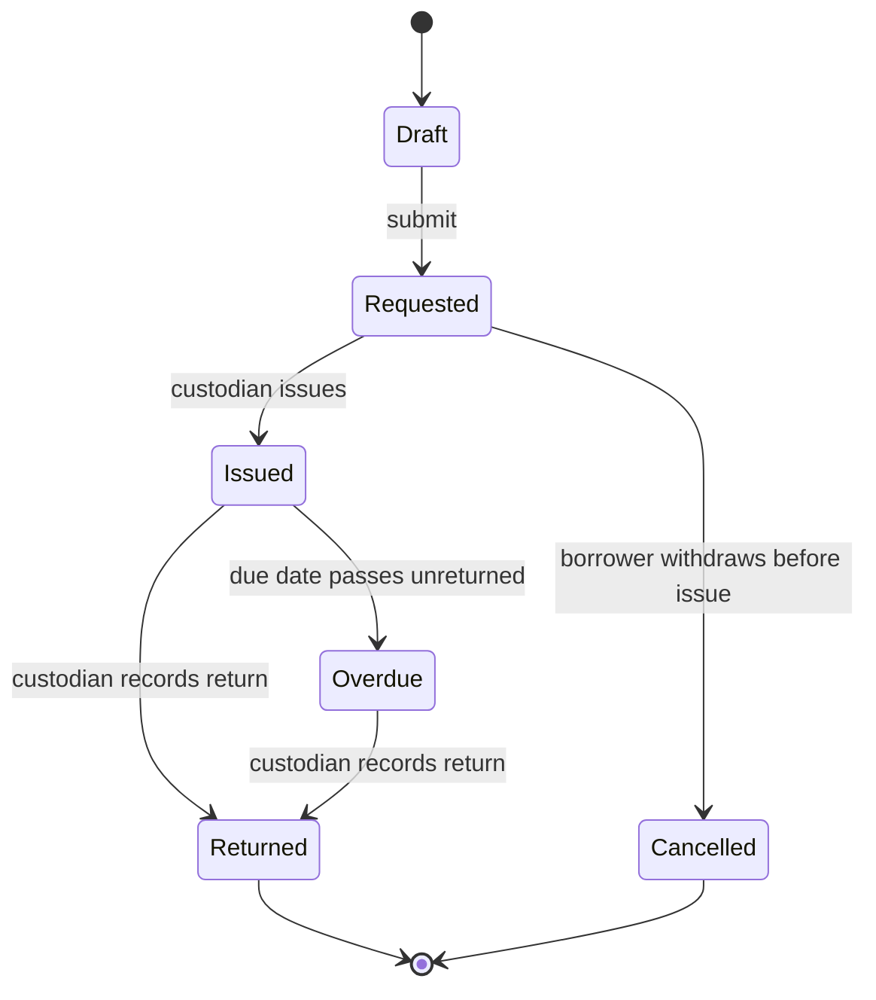

# Equipment checkout

| | |
|---|---|
| Status | `Implementing` |
| Owner | `Jordan Lee` |
| Started | `2026-08-11` |
| Approved by / date | `Jordan Lee / 2026-08-12` |
| Approved revision | `a1c4e02` |
| Branch | `feature/equipment-checkout` |

## Problem

Shared equipment — cameras, laptops, site tools — is tracked in a spreadsheet a custodian
updates by hand. Nothing stops two people writing themselves down as holding the same item,
nobody can tell at a glance what is currently out, and a borrower has no record they can point
to when asked to bring something back.

## Goal

A staff member can request an item from the shared pool and a custodian can issue it and later
reclaim it, entirely from the desk. The pool's state is always queryable and correct: an item
already out cannot be handed to a second person, and every loan traces back to who issued it and
who asked for it.

## Decisions (locked)

- `D-1` — One submittable document carries a checkout's whole life, not a separate document per
  state change. Chosen over separate request/issue/return records, which would scatter one loan's
  history across three rows instead of one.
- `D-2` — At most one checkout may sit in the Issued state against a given item at any time. Chosen
  over allowing a second request to queue silently against an already-issued item, which hid the
  fact that it was already out.
- `D-3` — A checkout can only be cancelled before it is issued. Chosen over allowing cancellation at
  any time, which would let an issued loan disappear from the record with no return ever logged
  against it.
- `D-4` — Only the custodian role may move a checkout from Requested to Issued or from Issued to
  Returned. Chosen over letting a borrower self-serve the Issue step, which would defeat the
  physical hand-off the record exists to prove happened.

## Current state

Today there is no system record at all — the spreadsheet sits outside Frappe entirely. This
specification introduces `Equipment Item` (one row per physical item in the pool) and `Equipment
Checkout` (submittable, one document per loan, states `Requested → Issued → Returned`, plus
`Cancelled`). Two new roles: `Equipment Borrower` may create, submit, and — only before issue —
cancel their own checkouts; `Equipment Custodian` may additionally move any checkout through Issue
and Return. Neither role may delete a submitted checkout.

## Design

**This diagram is the design, not the build.** Each phase's verification record redraws it from
what was actually observed and tallies the two. Use one transition per line and stable node names
so the two diagrams diff cleanly.

## Frappe-first

| What we need | Native Frappe/ERPNext mechanism | Custom code, and why it is unavoidable |
|---|---|---|
| Track a document through Draft/Submitted/Cancelled | Native `docstatus` | none |
| Represent Requested/Issued/Returned/Cancelled as states of one submitted document | `Workflow` DocType, transitions gated by an `Allowed` role | none |
| Restrict who may issue or return | Workflow transition's own role gate | none |
| Stop an item being issued while already on loan | No native cross-document uniqueness primitive exists | One `validate`-time guard on the Issue transition, checking no other `Equipment Checkout` against this item is currently Issued |

## Tracer bullet plan

### Phase 0 — Request and issue, with the duplicate-issue guard

Introduce `Equipment Item` and `Equipment Checkout`, the Draft → Requested → Issued path, and the
rule that an item already on loan cannot be issued again.

**Tracer:** A borrower submits a request for an available item; a custodian issues it; a second
attempt to issue that same item — including a concurrent one — is rejected.

**Acceptance**
- `AC-1` — A borrower can submit a checkout request for an available item.
- `AC-2` — A custodian can issue a Requested checkout; the item becomes recorded as on loan.
- `AC-3` — An item already on loan cannot be issued a second time, even under a concurrent attempt.
- `AC-4` — A checkout can be withdrawn before issue; it cannot be cancelled afterward.
- `AC-5` — Only the Equipment Custodian role can issue or return equipment.

### Phase 1 — Return

A custodian records an item's return; the item becomes available again and the loan closes with
a returned timestamp.

**Tracer:** A custodian returns an Issued checkout; the item's on-loan flag clears and it can
immediately be issued to someone else.

### Phase 2 — Overdue visibility

A due date on the checkout, and a status a custodian can filter on once that date passes
unreturned.

**Tracer:** An Issued checkout past its due date shows as Overdue on the custodian's list without
any manual flag-setting; returning it clears the flag.

### Phase 3 — Permission audit and closure

Confirm the full role matrix holds under direct-document access as well as list filtering, and
close the specification.

**Tracer:** A borrower is denied Issue and Return on every checkout, including their own, while a
custodian is allowed on every checkout regardless of who filed it.

## Out of scope

- Condition or damage reporting on return.
- Reservations or a waitlist for an item that is already out.
- Overdue email or chat reminders — phase 2 only surfaces the status, it does not notify anyone.
- Multi-item checkouts. One `Equipment Checkout` document names exactly one `Equipment Item`.

## Progress log

- `2026-08-14` — Phase 0 ✅ request-and-issue path shipped, duplicate-issue guard closed under a
  concurrent attempt. [Verification](verification/phase-00-example.md)
- Phases 1–3 not started.
