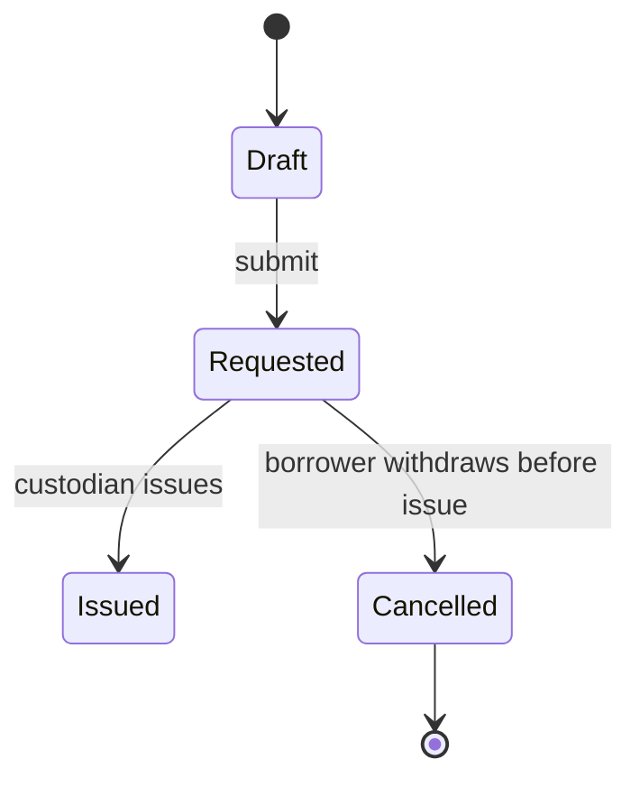

# Phase 0 — Request and issue, with the duplicate-issue guard

| | |
|---|---|
| Specification | [`../spec.md`](../spec.md) @ `a1c4e02` |
| Status | Complete |
| Started / Closed | 2026-08-12 / 2026-08-14 |
| Author | Jordan Lee |
| Reviewed by | Independent review, fresh context |
| Signed off | Jordan Lee, 2026-08-14 |
| Landed in | [PR #12](https://github.com/example-org/equipment-checkout/pull/12) |
| Covers | AC-1 – AC-5 |

## What this phase makes true

A staff member can ask for an item from the shared pool, and a custodian can hand it to them,
entirely from the desk. Two things that were not true before now hold: an item that is already
out cannot be handed to a second person — even if two custodians reach for it in the same
moment — and a request can still be withdrawn cleanly right up until the moment it is issued,
but never after.

## The rule, as observed

Drawn from the verification table below, **not** copied from the specification — only a
transition an actual observation caught appears here.

### Design vs. observed

| Specification edge | Observed | Verdict |
|---|---|---|
| `[*] → Draft` | yes | As designed |
| `Draft → Requested: submit` | yes | As designed |
| `Requested → Issued: custodian issues` | yes, but the availability guard reads a locked flag on `Equipment Item`, not the live query across sibling checkouts the Frappe-first table planned | **Drift — guard mechanism reshaped.** See note 1 |
| `Requested → Cancelled: borrower withdraws before issue` | yes | As designed |
| `Cancelled → [*]` | yes | As designed |
| `Issued → Returned: custodian records return` | not observed | Not in scope — phase 1 delivers it |
| `Returned → [*]` | not observed | Not in scope — phase 1 delivers it |
| `Issued → Overdue: due date passes unreturned` | not observed | Not in scope — phase 2 delivers it |
| `Overdue → Returned: custodian records return` | not observed | Not in scope — phase 2 delivers it |

**1. The duplicate-issue guard was built, not queried.** The Frappe-first table in `spec.md`
assumed a live check at validate time — no other `Equipment Checkout` against this item
currently Issued — read straight off sibling documents. Under a genuine race (row 4 below) two
Issue calls landing in the same instant both read "no sibling Issued" and both would have
written it. The shipped guard instead denormalizes state onto `Equipment Item.on_loan`, set and
cleared by the Issue and Return transitions, and reads it with `for_update` inside the Issue
guard — the second caller blocks on the first's row lock instead of racing its read. Nobody
proposed this back into `spec.md` at the time it was made. **Action:** update the Frappe-first
table and add a decision recording the lock.

## Frappe-first / native-first

| What we needed | Native mechanism used | Custom code, and why |
|---|---|---|
| Track a document through Draft/Submitted/Cancelled | Native `docstatus` | none |
| Represent Requested/Issued/Returned/Cancelled as states of one submitted document | `Workflow` DocType, `Allowed`-role transitions | none |
| Restrict Issue and Return to the custodian | Workflow transition's own role gate | none |
| Stop an item being issued while already on loan | — | `Equipment Item.on_loan`, set/cleared by the Issue/Return transitions, read with `for_update` in the Issue guard (see Drift note above) |

**Scope deliberately not taken:** a third "Equipment Admin" role with override powers. The
Borrower/Custodian split covers every operation this phase needs; a third role would be
permission surface with no caller yet.

## Verification

| # | Put the system in this state | Expect | Covers |
|---|---|---|---|
| 1 | As Equipment Borrower, submit a checkout request for an available item | Checkout reaches Requested; the item's on-loan flag stays unset | AC-1 |
| 2 | As Equipment Custodian, issue a Requested checkout for an available item | Checkout reaches Issued; the item's on-loan flag becomes set | AC-2 |
| 3 | As Equipment Custodian, issue a second checkout against an item whose first checkout is already Issued | Rejected; the second checkout stays Requested, the item's on-loan flag is unchanged | AC-3 |
| 4 | Two Equipment Custodians submit the Issue action on the same item at the same moment | Exactly one succeeds; the other is rejected with the same message as row 3 — never two Issued checkouts against one item | AC-3 |
| 5 | As Equipment Borrower, cancel a checkout still in Requested | Checkout reaches Cancelled; the item's on-loan flag is unaffected | AC-4 |
| 6 | As Equipment Borrower, attempt to cancel a checkout that is already Issued | Rejected; cancellation is only allowed before Issue | AC-4 |
| 7 | As Equipment Borrower, attempt to issue a Requested checkout | Rejected for role; only Equipment Custodian may issue | AC-5 |

**How to run it.** Rows 1, 2, 3, 5, 6 and 7 run through the `IntegrationTestCase` suite on the
test site — each is a document-API call that rolls back cleanly. Row 4 needs two genuinely
concurrent sessions and is exercised as a live Desk walkthrough with two custodian sessions open
side by side, screenshotted at
`specs/000-example-spec/verification/screenshots/phase-00-01-concurrent-issue.png`.

**Result:** 7 of 7 observed. Evidence is in the CI run and commit linked from PR #12.

## What we learned that the plan did not predict

- **A site that never finished the setup wizard fails misleadingly.** Every DocType route
  resolved as a Page and returned `403 Not permitted` for every role, including Custodian, while
  the roles in the boot payload looked correct. Cost most of an afternoon before tracing it to
  the wizard, not the new roles.
- **The `Equipment Item` link field on the checkout form needed its autocomplete entry clicked.**
  Typing the exact item code and tabbing away left the field undefined on the in-memory document
  even though the input showed the typed text — Frappe only commits a link when its
  `div[role="option"]` entry is clicked.

## Known limitations — accepted, not fixed

- **The `for_update` lock is verified for two concurrent custodians, not for more.** Row 4 proves
  the pair case; lock contention above that has not been load-tested. Accepted for a pool this
  small — revisit with a concurrency test if the custodian count or pool size grows materially.

## Review

| Round | Date | Verdict | Closed by |
|---|---|---|---|
| 1 | 2026-08-13 | Changes required | PR #12, review notes |
| 2 | 2026-08-14 | Approved | PR #12 |

**Closure:** Round 1 raised two findings — the race in row 4 (blocking, fixed by the
`for_update` lock, the Drift recorded above) and the lack of a load test beyond two custodians
(non-blocking). Round 2 checked only those two: the blocking one closed, the non-blocking one
was accepted as the Known limitation above rather than reopening the review. Zero blocking
findings remain.

**Next:** Phase 1 — return flow.
