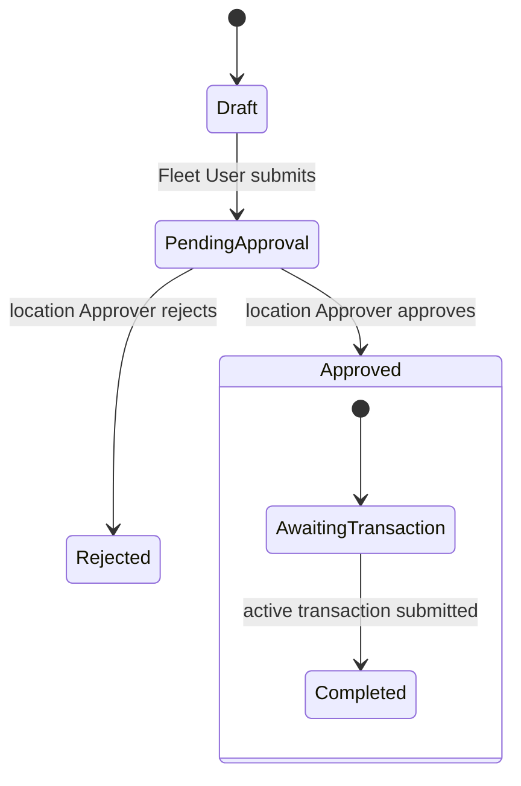

<!--
The proof document. Written as the phase is verified, from what was actually observed.
On 2026-09-24 this phase was cut back to the tracer bullet planned on 2026-09-17 (spec D-16).
Rows for location access, hard blocks, concurrency, validity, extension, notifications, and
km/L moved with their evidence to the Phase 1–4 records; the review history below is kept as
it happened, including rounds that reviewed the wider 2026-09-18 scope.
-->

# Phase 0 — Core vehicle journey

| | |
|---|---|
| Specification | [`../spec.md`](../spec.md) @ `07bf479` (D-16) |
| Status | Complete |
| Started / Closed | 2026-09-17 / 2026-09-24 |
| Author | Fleet Management team |
| Reviewed by | Claude Opus 5.5 — independent review (Phase 0.5), 2026-09-24; Rishabh Vyas — final review of the re-phasing and gap fixes, 2026-09-24 |
| Signed off | BrianKipngetich1 — 2026-09-24 (merged PR #2) |
| Landed in | [PR #2](https://github.com/BrianKipngetich1/fleet_management/pull/2) — merge commit `81754a0` |
| Covers | AC-01, AC-03, AC-04, AC-05, AC-06, AC-19 |
| Credential inventory | `verification/CREDENTIALS.md` — local-only, gitignored, mode `0600` |

## What this phase makes true

A Fleet User can enter a fuel request on behalf of a driver or custodian without giving that
person system access. A different Approver for the vehicle's location approves or rejects it,
and nobody can approve their own request. The approved slip prints for signing before fueling.
After fueling, the Fleet User records the transaction with the signed invoice and signed slip;
it completes the order, and the vehicle's first full fill is kept as a baseline with no
efficiency result yet.

## The rule, as observed

### Design vs. observed

| Specification edge | Observed | Verdict |
|---|---|---|
| `Draft → PendingApproval` | yes, row 2 | As designed |
| `PendingApproval → Approved` | yes, row 3 | As designed |
| `PendingApproval → Rejected` | yes, row 3 | As designed |
| `AwaitingTransaction → Completed` | yes, row 8 | As designed |
| `Approved → Cancelled` | — | Not in scope — Phase 3 (AC-22) |
| `AwaitingTransaction → AwaitingTransaction`, `AwaitingTransaction → Expired`, `Expired → AwaitingTransaction` | — | Not in scope — Phase 3 |
| `Expired → Completed` | — | Not in scope — Phase 2 (AC-20) |
| `Completed → AwaitingTransaction`, `Completed → Expired` | — | Not in scope — Phase 6 |

## Frappe-first / native-first

| What we needed | Native mechanism used | Custom code, and why |
|---|---|---|
| Masters, forms, naming, print | Native DocTypes, naming series, Jinja Print Format fixture | Server-side guard so only approved orders print |
| Approval and immutability | Native Workflow and docstatus | Self-approval guard covering owner, submitting User, and the requester's linked User |
| Signed evidence | Attach fields and Frappe File records | Submission resolves the linked Files and checks privacy, detected type, and size |
| Baseline and one active transaction | Submittable transaction linked to one order | Server-side baseline |
| Fulfillment condition | Virtual field backed by a controller property (as Frappe's Scheduled Job Type does for its next run) | Derives Awaiting / Completed / Expired from the active transaction and validity; nothing is stored |
| Request gauge and estimate | Int field, `fetch_from` asset type, `depends_on` / `mandatory_depends_on` | Server repeats the vehicle-only and 0–100 checks and calculates the estimate before approval |
| Attendant identity | Data field | Required at submission, like the fueling time |

**Scope deliberately not taken (D-16):** location scoping of lists, reports, and print (Phase 1);
hard blocks, concurrency, fueling-time provenance (Phase 2); validity print, extension, expiry,
order cancellation, notifications (Phase 3); partial fills, km/L, bands (Phase 4); everything later.

## Verification

| # | Put the system in this state | Expect | Covers |
|---|---|---|---|
| 1 | As Fleet Admin, configure one location, one approved station there, a fuel type, a vehicle model, a vehicle with an active assignment, and one Fleet User and two Fleet Approvers permitted there | The vehicle shows its fuel type, capacity, target, custodian, and location | AC-01 |
| 2 | As the Fleet User, create a full-fill vehicle Fuel Order naming a Fleet Person without a login as requester and driver; save once without the gauge, then with 40% on a 60 L tank; submit it | Refused without the gauge; then estimated litres read 36; Pending Approval; the Fleet Person and the entering User are separate facts | AC-01, AC-04 |
| 3 | Give the Fleet User the Approver role too and try to approve their own order; approve it as another Approver; reject a second order the same way | Self-approval refused server-side; the other Approver approves (order frozen) and rejects (terminal) | AC-03 |
| 4 | As an Approver, print a draft, a rejected, and an approved full-fill order with the Fuel Order Approval Slip format | Draft and rejected refuse to print; the approved slip shows order number, asset, odometer and gauge, station, fuel, quantity basis with estimated litres, approver, and signature areas | AC-04 |
| 5 | As the Fleet User, submit a transaction for the approved order with each document in turn missing, public, of an unsupported type, or over the size limit | Each is refused server-side | AC-05 |
| 6 | Attach a private PDF, JPG, or PNG signed invoice and signed slip, and submit | Submits; both files stay private and linked to their fields | AC-05 |
| 7 | Make row 6 the vehicle's first full fill, confirmed full; submit once without the attendant's name, then with it; then try a second transaction for the same order | Refused without the name; with it, the transaction records a baseline with no km/L and the name; the second active transaction is refused | AC-06, AC-19 |
| 8 | Open the approved order before and after row 7's transaction | Fulfillment Status reads Awaiting Transaction, then Completed, while the workflow state stays Approved | AC-19 |

**How to run it.** Every row is asserted by `test_fuel_order.py` (including the gauge, generator,
fulfillment, and print tests), `test_fueling_transaction.py` (evidence, baseline, attendant,
fulfillment, second-active tests), and the Playwright `lifecycle.spec.ts` / `acceptance.spec.ts`
flows: `bench --site fleet_management-test.localhost run-tests --app fleet_management` and
`npm run test:ui`. The new behaviour in rows 2, 4, 7 and 8 is also walked through Desk with
`agent-browser` as the Fleet User and the Approver, because the form, the slip, and the status are
read by a person.

**Result:** 8 of 8 observed on the MariaDB test site on 2026-09-24: backend suite and
`npm run test:ui` both pass. Walkthrough screenshots, in reading order, in
`screenshots/phase-00-core-vehicle-journey/`: `phase-00-01-gauge-required.png`,
`-02-draft-gauge-and-estimate.png`, `-03-approved-awaiting-transaction.png`,
`-04-approved-slip-gauge-estimate.png`, `-05-submit-refused-without-attendant.png`,
`-06-submitted-with-attendant-baseline.png`, `-07-order-completed.png`. Self-approval refusal
(row 3) and draft/rejected print refusal (row 4) are unchanged and rest on the tests; their
SQLite-era screenshots (`ac03-*`, `ac04-*`) are historical.

## What we learned that the plan did not predict

- Desk routes need explicit DocType metadata; grouped custom buttons appear under `Actions`;
  `frm.call` goes through `run_doc_method`.
- `bench browse --user` prints a sid that may not be the persisted one; read `tabSessions`.
- An empty Int field stays unset until save, so the server can tell a missing gauge from 0%;
  Frappe only enforces `mandatory_depends_on` in Desk, so the server repeats the check.
- Frappe parses uploaded PDFs; a hand-made PDF without a page tree is rejected at upload.
- Frappe's own "Not permitted" dialog repeats the document name typed in the URL. A Playwright
  check that the page never contains the name was racy; it now waits for the denial and checks
  that no order data reached the page.
- The 2026-09-18 revision widened this phase to most of Release 1. It took four review passes
  and an escalation without closing; D-16 restores the thin slice and moves the rest to phases.

## Known limitations — accepted, not fixed

- The code already contains Phase 1–4 and 7 behaviour built under the wider scope. It is
  verified in those phase records, not here, and it is not a Phase 0 closure condition.
- Owner review of historical host logs (`logs/frappe.log`, `worker.error.log`, the test site's
  `logs/frappe.log`, `bench.log`) is an operations task, not a Phase 0 criterion; it no longer
  blocks this phase. No identifier from those logs is reproduced in any record.

## Review

| Round / audit | Date | Verdict | Closed by |
|---|---|---|---|
| 1 | 2026-09-19 | AC-06–AC-08 diffs and test evidence reviewed; no blocking findings (wider scope) | Lead orchestrator |
| 2 | 2026-09-21 | Closure verdict, later superseded by the escalation | Implementation agent |
| Escalation audit | 2026-09-23 | Reopened: list authorization, event-time provenance, concurrency, notifications — all outside the 2026-09-17 scope, now Phases 1–3 | — |
| Closure evidence review | 2026-09-24 | Completed work accepted; concurrency and log review left open, now Phase 2 and an operations task | Rishabh Vyas and James Kabochi |
| Independent review | 2026-09-24 | Phase 0.5: this phase had absorbed most of Release 1 and could not close; three gaps inside the 2026-09-17 scope (request gauge and estimate, attendant identity, order Completed condition). Re-phased to the initial plan (D-16) and the gaps were built | Claude Opus 5.5 |
| Final review | 2026-09-24 | Approved — re-phasing and gap fixes; zero blocking findings | Rishabh Vyas |

**Closure:** Closed 2026-09-24 with zero blocking findings. The escalation findings belong to
Phases 1–3; the independent review's three gaps were built and observed; the final review
approved the re-phasing and the fixes. The independent review is recorded in the Phase 0.5 record.

**Next:** Phase 1 — location access.
