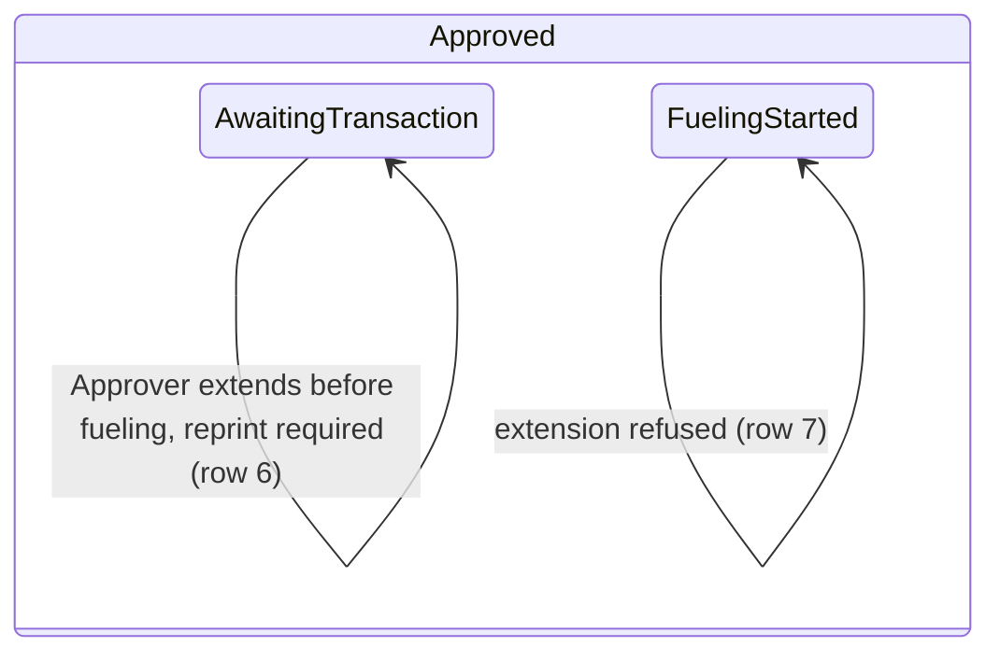

<!--
The proof document. Written as the phase is verified, from what was actually observed.
Phase 0.5 is the independent review of Phase 0, performed by Claude Opus 5.5 on 2026-09-24,
and the cleanup it led to for Phase 0 and every later phase. It re-phased the specification
(D-16), which re-scoped the Phase 0 record and scaffolded the Phase 1–9 records; the three Phase 0
gaps it found were built and are recorded in the Phase 0 record. No recorded decision changed.
-->

# Phase 0.5 — Test harness, site conventions, and re-phasing

| | |
|---|---|
| Specification | [`../spec.md`](../spec.md) @ `07bf479` (D-14–D-16) |
| Status | Complete |
| Started / Closed | 2026-09-24 / 2026-09-24 |
| Author | Claude Opus 5.5 (independent review of Phase 0), for the Fleet Management team |
| Reviewed by | Rishabh Vyas — final review of the re-phasing and gap fixes, 2026-09-24 |
| Signed off | BrianKipngetich1 — 2026-09-24 (merged PR #2) |
| Landed in | [PR #2](https://github.com/BrianKipngetich1/fleet_management/pull/2) — merge commit `81754a0` |
| Covers | D-14–D-16; independent review of Phase 0; harness defects; re-phasing |
| Credential inventory | No new logins; the Phase 0 QA users in `verification/CREDENTIALS.md` were reused |

## What this phase makes true

Every person using any site reads and types dates as day/month/year, and the system puts that
format back if installing, setting up, or upgrading a site changes it. Desk receives live updates
again, while anyone calling the API still gets a plain error without internal detail. All
automated and manual testing happens on the one dedicated test site, which keeps what was tested.
The regression suites give the same answer every time they run, so a failure means a real break.
The plan is cut into phases a reviewer can close one at a time, each saying honestly what is
already built.

## The rule, as observed

Only the Fuel Order edges this phase walked are drawn; the rest belong to Phases 0–6.

### Design vs. observed

| Specification edge | Observed | Verdict |
|---|---|---|
| `Draft → PendingApproval`, `PendingApproval → Approved`, `PendingApproval → Rejected` | Regression suite only (row 9) | Not in scope — Phase 0 |
| `Approved → Cancelled`, `AwaitingTransaction → Expired` (both), `Expired → AwaitingTransaction` | no | Not in scope — Phase 3 |
| `AwaitingTransaction → Completed`, `Expired → Completed` | no | Not in scope — Phases 0 and 2 |
| `Completed → AwaitingTransaction`, `Completed → Expired` | no | Not in scope — Phase 6 |
| `AwaitingTransaction → AwaitingTransaction` (extend before fueling) | yes, row 6 | As designed — this phase added the edge to the spec diagram, which had described it only in text; Phase 3 owns it |
| Extension refused once fueling started | yes, row 7 | As designed — a refusal, not a state edge (`FuelingStarted` is not a spec node) |

## Frappe-first / native-first

| What we needed | Native mechanism used | Custom code, and why |
|---|---|---|
| Day/month/year dates on every site | System Settings date format, `dd/mm/yyyy` option | One function on `after_install`, `setup_wizard_complete`, `after_migrate`: the setup wizard overwrites the format from the chosen country |
| Desk realtime on the dev server | `DEV_SERVER=true`, exactly what `bench start` exports | One line in the host's `frappe-web` systemd user unit (outside the repo; backup in `~/Backups/frappe-bench/bench-config/systemd-user/`) |
| No tracebacks to API callers | `disable_traceback` flag (honoured by a production server) and the `after_request` hook | Dev server ignores the flag, so traceback fields are removed from each API response. This replaces Phase 0's process-wide `frappe._dev_server = 0`, which disabled realtime for every later Desk page |
| Suite reaches the test site | Bench web server selects the site by host name | None; Playwright reuses `:8000` and fails with a start hint if it is down |

**Scope deliberately not taken:** an nginx proxy for Socket.IO (production layout, needs sudo);
an AppArmor profile for `agent-browser`'s Chrome (needs sudo); the site time zone, which the
US setup helper left at America/New_York.

## Verification

| # | Put the system in this state | Expect | Covers |
|---|---|---|---|
| 1 | As Administrator on each site, open System Settings after `migrate` | Date Format reads `dd/mm/yyyy` (`screenshots/phase-00.5-test-harness-cleanup/phase-00.5-04-system-settings-date-format.png`) | D-14 |
| 2 | Set Date Format to `mm-dd-yyyy`, then run `bench --site <site> migrate` | Date Format is `dd/mm/yyyy` again | D-14 |
| 3 | As a Fleet User (Nairobi), open an approved Fuel Order | Request, approval and Valid Until show as `dd/mm/yyyy HH:mm:ss` (`…/phase-00.5-01-fleet-user-order-dates.png`) | D-14 |
| 4 | Stay on that Desk page with the browser console open | No `/socket.io/` 404 on `:8000`; Desk connects to the realtime service on `:9000` | Realtime |
| 5 | Without logging in, request `/api/method/fleet_management.missing.not_whitelisted` on `:8000` | 403 whose body has no `exc`, `_exc_source`, `exception` or traceback text; Desk realtime (row 4) still connects afterwards | API errors |
| 6 | As a Fleet Approver, on an approved order with no fueling, choose Actions → Extend Validity and type Valid Until one day later as `dd/mm/yyyy HH:mm:ss` with a reason | The typed day and month are kept (not swapped), Reprint Required is ticked, Slip Revision goes up by one (`…/phase-00.5-02-approver-extension-dialog.png`, `…/phase-00.5-03-extended-validity-dates.png`) | D-14, AC-08 |
| 7 | Repeat row 6 on an order whose fueling has started | Refused: "Fuel Order validity cannot be extended after fueling has started." | AC-08 |
| 8 | Stop `frappe-web`, run `npm run test:ui`; start it; run it with `BASE_URL` set to any other host or port | First run stops with the start hint; the other URL is refused before any test runs | D-15 |
| 9 | Run the backend suite three times and `npx playwright test lifecycle.spec.ts --repeat-each=6` on the test site | Every run passes, apart from the opt-in concurrency test (Phase 2) | Stability |
| 10 | Read the spec's acceptance criteria and phase table, and each phase record | Every criterion sits in exactly one phase; each phase record states built / partly built / not built per criterion with carried evidence; decisions D-1–D-15 are unchanged; the Phase 0 record covers only the 2026-09-17 plan | D-16 |

**How to run it.** Rows 1–2 and 4–5 are asserted by `fleet_management/tests/test_site_defaults.py`,
`fleet_management/tests/test_request.py`, and `e2e/tests/session.spec.ts`:
`bench --site fleet_management-test.localhost run-tests --app fleet_management` and
`npm run test:ui`. Row 10 is a document check. Rows 8 and 9 are shell procedures a reviewer runs as written; a suite
cannot assert its own server being down or its own repeat stability. Rows 3, 6 and 7 are Desk
walkthroughs with `agent-browser` as the named QA roles, because typed-date handling and the
reprint state are only visible to a person.

**Result:** 10 of 10 observed on the MariaDB test site (row 10 on the working tree). There is no CI yet; evidence is the commit
that lands this record.

## What we learned that the plan did not predict

- Phase 0's API guard set `frappe._dev_server = 0` on the module. After the first API call,
  every Desk page in that process lost realtime. That, not port 8001, caused the Socket.IO 404s
  noted in the Phase 0 record.
- The bench runs as systemd user units, not `bench start`, and the web unit lacked `DEV_SERVER`.
  Python changes need `systemctl --user restart frappe-web frappe-worker frappe-schedule`.
- Frappe re-encodes uploaded JPEGs to strip EXIF, which drops bytes appended to make them unique.
  Identical files share one URL, and attachments can land on the wrong field. Test JPEGs now
  differ in size. This was the order-dependent attachment failure.
- A Datetime field must be typed after its picker opens. An instant fill loses the value or keeps
  the picker's current time. Frappe does not auto-focus Datetime fields in dialogs.
- An approved order can show two "Actions" buttons (workflow and app group) while it refreshes.
- `bench browse --user` prints a sid that is not always the persisted one; read `tabSessions`.
  `agent-browser`'s Chrome needs `--no-sandbox` on this host.

## Known limitations — accepted, not fixed

- Re-phasing found code that departs from the spec (Fleet Approvers cannot cancel orders) and
  a spec that contradicts itself (lapsed-order extension). Both are recorded in the Phase 3
  record, not fixed here.
- `.github/workflows/ci.yml` still holds template placeholders and is not committed, so these
  checks stay local until CI is adopted.
- Traceback suppression on a production server relies on Frappe's flag and was not exercised
  here, because no production server exists yet.
- The site time zone is America/New_York; change it only by a new decision.

## Review

| Round | Date | Verdict | Closed by |
|---|---|---|---|
| Independent review of Phase 0 | 2026-09-24 | This phase: Phase 0 over-scoped and unclosable; three gaps inside its initial scope; re-phased (D-16); harness and site conventions repaired | Claude Opus 5.5 |
| 1 — final review | 2026-09-24 | Approved — re-phasing and gap fixes; zero blocking findings | Rishabh Vyas |

**Closure:** Closed 2026-09-24 with zero blocking findings in round 1.

**Next:** Phase 1 — location access.
