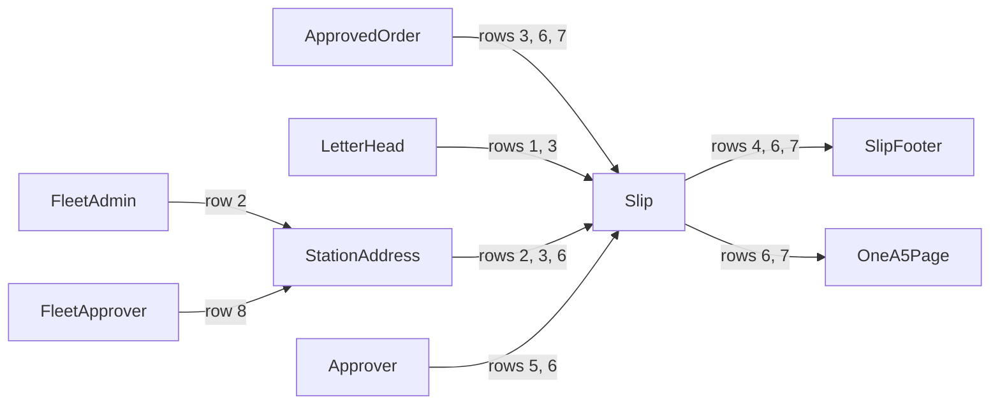

<!--
The proof document. Scaffolded 2026-09-25 with the specification; filled in as the phase is
verified, from what was actually observed. Procedure, not transcript. Never record credentials.
-->

# Phase 0 — Company fuel order slip

| | |
|---|---|
| Specification | [`../spec.md`](../spec.md) @ `3c37dbb` |
| Status | In progress — verified, awaiting independent review |
| Started / Closed | 2026-09-25 / — |
| Author | Fleet Management team |
| Reviewed by | — |
| Signed off | — |
| Landed in | — |
| Covers | AC-01, AC-02, AC-03 |
| Credential inventory | `verification/CREDENTIALS.md` (gitignored, mode 0600) |

## What this phase makes true

Whoever prints an approved Fuel Order gets a page that reads like the company's paper fuel order slip: the company heading, the order number and date, the station's address, the litres and fuel to supply, the vehicle's registration and meter reading, and the name of the person who authorised it. Everything the earlier slip had to show — validity, the attendant instruction, and the signature lines — is still on the page, and the whole slip fits one A5 page. A Fleet Admin maintains each station's postal address, and approvers and clerks can read it on the station.

## The rule, as observed

### Design vs. observed

The specification's diagram is the approval workflow; this phase prints its `Approved` outcome
and changes no transition.

| Specification edge | Observed | Verdict |
|---|---|---|
| `[*] → Draft` and every transition out of `Draft` or `PendingApproval` | — | Not in scope (Phase 3) |
| `Approved → [*]` — the approved order is printed | rows 3–7 | As designed |
| D-12 "authorised person is whoever approved it" | rows 5, 6 | As designed; the sample green orders are approved by Philip, so the slip names Philip |
| D-13 station address maintained by a Fleet Admin | rows 2, 8 | Drift, reconciled: needed Address permissions and an Address Template (see below) |

## Frappe-first / native-first

| What we needed | Native mechanism used | Custom code, and why |
|---|---|---|
| Company heading from the site Letter Head | Letter Head | — |
| Station postal address and email | Address linked to Fuel Station | — |
| Station address on its form | HTML field rendered by Frappe's address list (`load_address_and_contact`) | — |
| Fleet roles may see station addresses | Role Permission Manager API (`add_permission`, `update_permission_property`) on Address | A site hook applies the owner's choice on install and migrate |
| Rendering any address | Address Template with Frappe's built-in layout | A site hook creates the default template for the site's country; without ERPNext nothing does |
| Slip layout | Jinja Print Format | — |
| Slip PDF | Print Format `pdf_generator = chrome` (Frappe v16) | — |

**Scope deliberately not taken:** Letter Head permissions for Fleet Admin (owner to decide, see
Known limitations); installing wkhtmltopdf on the host (owner chose the Chrome generator).

## Verification

| # | Put the system in this state | Expect | Covers |
|---|---|---|---|
| 1 | Build the test site. As Test Fleet Admin, open the Letter Head list and then "Krystalline Salt Fuel Order Slip" | It is the default; it is based on HTML and its heading reads KRYSTALLINE SALT LIMITED, PIN NO. P000000000T, a P.O. Box, telephone, and email — all synthetic | AC-01 |
| 2 | As Test Fleet Admin, open Fuel Station "Mombasa Road Service Station", then "Industrial Area Fuel Centre" | Each shows its own primary postal address (P.O Box 10001, 00100, Nairobi, mombasa-road.test@example.com; P.O Box 10002, 00500, Nairobi, industrial-area.test@example.com); no "No default Address Template" message | AC-01 — `test_fleet_admin_reads_a_station_address_a_fleet_user_cannot_edit` |
| 3 | A default Letter Head exists; a vehicle order at a station with a primary postal address is approved full-tank; print the slip with and without the letter head | With it: COPY TO BE ATTACHED WITH STATEMENT, FUEL ORDER SLIP, the heading, No. and Date (dd/mm/yyyy), the station name, "P.O Box … – postcode TOWN" and email, "Please supply FULL TANK Ltrs of <fuel>", "to the following motor vehicle", Reg No and speedometer, NAMES OF AUTHORISED PERSON, a company stamp box; A5 portrait CSS and the Chrome PDF generator. Without it: no heading | AC-01 — `test_approved_slip_reads_like_the_company_paper_slip` |
| 4 | Approve a partial order for 42.5 L at a 40% gauge and print it | The footer shows the quantity basis, gauge, estimated litres (36, no ".0"), location, station, fuel, meter reading (1000), approver, approval timestamp and exact valid-until in dd/mm/yyyy HH:mm:ss, the attendant instruction, the do-not-dispense warning, and all four signature lines | AC-02 — `test_approved_print_contains_ac04_fields_and_instruction` |
| 5 | An approver whose full name is "Vikas Test Approver" approves an order; print it | His full name is on the authorised-person line and the signature line; his login id is nowhere on the printed page | AC-03 — `test_slip_names_the_authorised_person_by_full_name` |
| 6 | As Vikas, open the approved KDA 412M order (52,650 km, 21%); print it with the default letter head, then choose Get PDF | One A5 portrait page: Krystalline heading, Mombasa Road Service Station with its P.O. Box and email, FULL TANK of Diesel, Reg No KDA 412M, speedometer 52650, "Philip" as authorised person (he approved this green order), stamp box, footer with validity in dd/mm/yyyy, instruction, and four signature lines | AC-01, AC-02, AC-03 |
| 7 | As Vikas, print the approved GEN-NRB-01 order, then choose Get PDF | One A5 page: "Please supply 200 Ltrs", "to the following generator", "hour meter" 1283.5; the footer shows "Partial authorization: 200 litres" and no gauge or estimated litres | AC-01, AC-02 |
| 8 | As Vikas (Fleet Approver), open Fuel Station "Mombasa Road Service Station" | Its postal address and email show; a Fleet User may read but not edit a station address | AC-01 — `test_fleet_roles_can_see_station_addresses` |

**How to run it.** Backend rows: `bench --site fleet_management-test.localhost run-tests --app fleet_management`.
Desk rows (1, 2, 6, 7, 8): `agent-browser` walkthrough on the test site as the named role; the
screenshots are listed in the pull request.

**Result:** 8 of 8 observed on MariaDB with the site in Kenya / Africa/Nairobi / KES, on
`feature/002-fuel-order-request-slip` at `a5e1492`.

## What we learned that the plan did not predict

- Frappe lets only a System Manager edit a Letter Head; every desk user may read it.
- Letter Head `before_insert` switches any letter head inserted outside install or migrate to
  "Image", so a letter head created with HTML content is stored as an image letter head with no
  image. The sample data sets it back to HTML after inserting it.
- Frappe's standard Address rules give ordinary roles only the "All — if owner" rule: a Fleet
  Admin saw "No address added yet." on stations whose addresses Administrator created. (The
  earlier note here that Address lets every role create and edit was wrong.) Once addresses were
  visible, Frappe refused to render them: no Address Template existed, and without ERPNext nothing
  creates one.
- A custom Jinja print format must render the letter head itself: Frappe passes the default
  Letter Head's HTML as `letter_head` and prints it only where the template places it.
- wkhtmltopdf is not installed on this host, so Frappe's default PDF route fails for every print
  format. The slip uses Frappe's Chrome generator, which needs `chromium_path` in the bench's
  `common_site_config.json` (here `/usr/bin/google-chrome`) or a `bench setup-chrome` download.
- Frappe's print stylesheet forces 6–10 px padding on every table cell with `!important`, and the
  slip set page margins both on `@page` and on `.print-format`; together they pushed the signature
  lines onto a second page. Resetting the margins only under `@media print` keeps the on-screen
  print view padded.
- Frappe's print view closes the page with an HTML comment naming the viewing user; it is never
  printed, so the login-id check strips HTML comments first.
- A fixture is re-imported on migrate only when its `modified` is newer; a changed print format
  needs its `modified` bumped or existing sites keep the old one.

## Known limitations — accepted, not fixed

- The company heading is maintained by a System Manager, not a Fleet Admin, until the owner
  decides whether Fleet Admin gets Letter Head permissions (the same Role Permission Manager hook
  could grant it).
- PDFs of this slip need Chrome on the host and `chromium_path` in the bench config, which is not
  in the repository; other print formats still need wkhtmltopdf.
- Address now uses Custom DocPerm, which freezes Frappe's standard Address rules as copied on
  2026-09-26; a later Frappe change to those standard rules will not apply by itself.
- Every desk user keeps Frappe's "All — if owner" Address rule, so an approver or clerk sees
  "New Address" on a station and may add an address of their own; they cannot edit a Fleet Admin's.
- A generator's Reg No is its full asset name ("GEN-NRB-01 Cummins 100 kVA"), which pushes the
  hour-meter value onto the next line.

## Review

| Round | Date | Verdict | Closed by |
|---|---|---|---|

**Closure:** —

**Next:** independent review of this phase.
