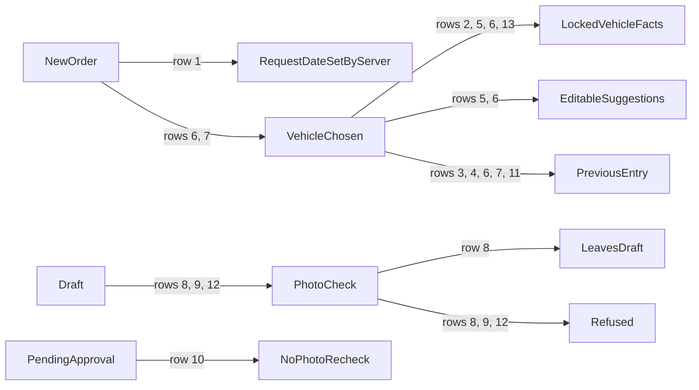

<!--
The proof document. Scaffolded 2026-09-25 with the specification; filled in as the phase is
verified, from what was actually observed. Procedure, not transcript. Never record credentials.
-->

# Phase 1 — Vehicle-first request with photo evidence

| | |
|---|---|
| Specification | [`../spec.md`](../spec.md) @ `3c37dbb` |
| Status | In progress — verified, awaiting independent review |
| Started / Closed | 2026-09-25 / — |
| Author | Fleet Management team |
| Reviewed by | — |
| Signed off | — |
| Landed in | — |
| Covers | AC-04, AC-05, AC-06, AC-07 |
| Credential inventory | `verification/CREDENTIALS.md` (gitignored, mode 0600) |

## What this phase makes true

A Fleet User starts a request by picking a vehicle by its registration number, and the system fills in everything it already knows about that vehicle and locks it. The user sees the last recorded reading, types today's meter reading and gauge, and cannot send the request for approval without a photo of each.

## The rule, as observed

### Design vs. observed

The specification's diagram is the approval workflow; this phase fills the Draft and gates every
way out of it.

| Specification edge | Observed | Verdict |
|---|---|---|
| `[*] → Draft` — the request is entered vehicle-first | rows 1–7 | As designed |
| `Draft → Approved` and `Draft → PendingApproval` refused without both photos | rows 8, 9, 12 | As designed (the transitions themselves are Phase 3) |
| `PendingApproval → Approved` for an order sent up before the photo rule | row 10 | As designed |
| `Draft → Rejected`, `PendingApproval → Rejected`, `Approved → [*]`, `Rejected → [*]` | — | Not in scope (Phase 3) |

## Frappe-first / native-first

| What we needed | Native mechanism used | Custom code, and why |
|---|---|---|
| Vehicle choice with model | Link field search fields | — |
| Auto-filled facts | fetch_from, read_only | Assignment lookup from 001 |
| Previous Entry | — | Last completed transaction lookup |
| Photos | Attach Image | Private-file and type check from 001 |
| Suggestions on choosing a vehicle | `fetch_from` for make, model, and fuel type | One whitelisted lookup for the assignment facts, Previous Entry, and a single-station suggestion, since `fetch_from` cannot reach the effective assignment |

## Verification

| # | Put the system in this state | Expect | Covers |
|---|---|---|---|
| 1 | Save a new order whose request date was sent as 01/01/2020; change the date through the API and save again | The saved request date is the moment of the first save, and the later change is ignored; the order number series and request date are read-only | AC-04 — `test_request_date_is_set_by_the_server_and_never_changes` |
| 2 | Save an order naming a custodian other than the vehicle's assigned one, then try to change it again | Both saves keep the assignment's custodian; tank size, target km/L, home location, and fuel type come from the vehicle | AC-05 — `test_custodian_comes_from_the_effective_assignment` |
| 3 | Save an order for a vehicle that has never been fuelled and has no approved order | Previous Entry reads "none", with no reading or date | AC-06 — `test_previous_entry_is_none_for_a_vehicle_never_ordered` |
| 4 | A vehicle has an approved order but no completed fueling; save a new order for it | Previous Entry names that approved order with its meter reading and approval date; the approved order's own Previous Entry stays as it was when approved | AC-06 — `test_previous_entry_falls_back_to_the_last_approved_order` |
| 5 | Ask for the facts of a vehicle whose home location has exactly one approved station; then add a second station there | Custodian, usual driver, home location, tank size, target, and the one station are returned; with two stations no station is suggested | AC-05 — `test_request_facts_suggest_driver_home_location_and_a_single_station` |
| 6 | As Philip, start a new Fuel Order and type "Hilux" in the vehicle field; choose KDA 412M | KDA 412M is offered with its make and model. On choosing it, make and model, fuel type, tank size 80 L, target km/L, custodian, and home location Nairobi fill in and cannot be edited; the usual driver and location Nairobi are suggested and can be changed; no station is suggested (Nairobi has two approved stations); Previous Entry shows its last completed fueling at 52,024 km | AC-05, AC-06 |
| 7 | As Philip, start a new Fuel Order for KDH 201A | Previous Entry reads "none" | AC-06 |
| 8 | Try to send up a vehicle order with no photos; then with only the meter photo; then with both | Refused, naming the meter photo; refused, naming the gauge photo; with a private PNG of each it reaches Pending Approval and the photos are attached to the order | AC-07 — `test_an_order_cannot_be_sent_up_without_its_photos` |
| 9 | Attach a public photo, or a PDF, and send the order up | Refused as not a private attachment, or as not a JPG or PNG file | AC-07 — `test_a_public_or_wrong_type_photo_is_refused` |
| 10 | An order already waiting for approval carries no photos (sent up before the rule) | The approver can still approve it; only leaving Draft is checked | AC-07 — `test_orders_already_past_draft_are_not_rechecked` |
| 11 | A vehicle has a completed fueling; then that fueling is cancelled | Previous Entry names the fueling with its odometer and fueling date; after the cancellation it falls back to the vehicle's approved order | AC-06 — `test_previous_entry_is_the_last_completed_fueling` |
| 12 | As Philip, open his green draft for KCZ 908T (34,650 km, 23%); clear the gauge photo and choose Actions → Approve | Both photos are listed on the form as private attachments; clearing one saves the draft; Approve is refused with "Gauge photo is required before the order is approved or sent up." and the order stays Draft | AC-07 |
| 13 | Deactivate the fuel type of a vehicle; save a new order for it, naming any fuel type | The order takes the vehicle's fuel type and is refused because that fuel type is inactive | AC-05 — `test_rejects_inactive_references` |

**How to run it.** Backend rows: `bench --site fleet_management-test.localhost run-tests --app fleet_management`.
Desk rows: `agent-browser` walkthrough on the test site as the named role.

**Result:** 13 of 13 observed on MariaDB with the site in Kenya / Africa/Nairobi / KES, on
`feature/002-fuel-order-request-slip` at `a5e1492`.

## What we learned that the plan did not predict

- A read-only `fetch_from` field is overwritten from its source on every save, so a typed fuel type
  can never reach validation; the inactive-fuel-type rule is now reached through the vehicle.
- Since Phase 3 a green draft offers Philip "Approve" and "Reject" only; "Submit for Approval"
  appears only on a red draft. The photo gate is the same on both ways out of Draft.
- Choosing a vehicle now shows its model under the registration in the autocomplete, so a script
  that picks a link option by its exact text must match the option's `title` attribute instead.
- Frappe keeps a single file for identical uploads: sample gauge photos with the same gauge and
  vehicle point at the first order's file. Frappe keeps a shared file until nothing uses it.

## Known limitations — accepted, not fixed

- `Attach Image` shows a private photo as a file link, not a thumbnail, on the order form.
- The Current Gauge field is outlined red as soon as a vehicle is chosen, before anything is
  typed (Frappe's mandatory highlight); it clears when a value is entered.
- Several sample orders share one gauge photo file (see above); the sample data could give each
  photo unique content if that matters for demonstrations.

## Review

| Round | Date | Verdict | Closed by |
|---|---|---|---|

**Closure:** —

**Next:** independent review of this phase.
