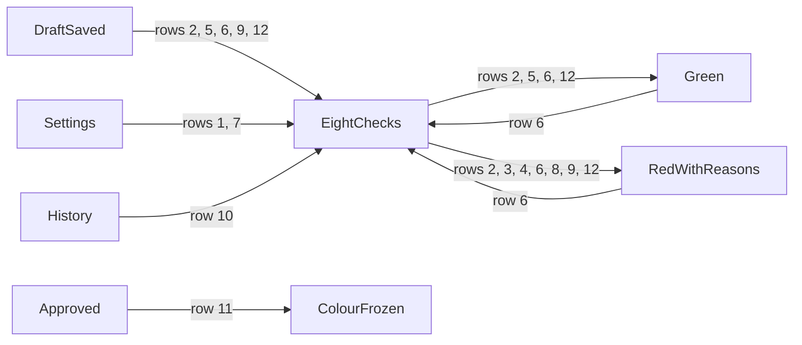

<!--
The proof document. Scaffolded 2026-09-25 with the specification; filled in as the phase is
verified, from what was actually observed. Procedure, not transcript. Never record credentials.
-->

# Phase 2 — Green and red signal

| | |
|---|---|
| Specification | [`../spec.md`](../spec.md) @ `3c37dbb` |
| Status | In progress — verified, awaiting independent review |
| Started / Closed | 2026-09-25 / — |
| Author | Fleet Management team |
| Reviewed by | — |
| Signed off | — |
| Landed in | — |
| Covers | AC-08, AC-09, AC-10, AC-11 |
| Credential inventory | root `CREDENTIALS.md` (gitignored, mode 0600) |

## What this phase makes true

When Philip enters an order, the system colours it green or red and, when red, lists every reason: mileage that does not add up, more litres than the tank has room for, a nearly full tank, another open order, fueling too soon, fueling away from home, an unusual driver, or a vehicle whose mileage is drifting. The limits come from settings a Fleet Admin can change, and nobody can choose the colour by hand.

## The rule, as observed

### Design vs. observed

The specification's diagram is the approval workflow; this phase computes the colour its two Draft
transitions depend on.

| Specification edge | Observed | Verdict |
|---|---|---|
| Colour recomputed on every save of an order not yet approved | rows 6, 12 | As designed |
| Colour frozen with the approval snapshot | row 11 | As designed |
| The eight D-8 checks, each at and just past its limit | rows 2, 3, 8, 9, 10, 12 | As designed |
| `Draft → Approved` only when green; `Draft → PendingApproval` only when red | — | Not in scope (Phase 3) |
| Every other workflow edge | — | Not in scope (Phase 3) |

## Frappe-first / native-first

| What we needed | Native mechanism used | Custom code, and why |
|---|---|---|
| Colour and reasons | Read-only fields | The eight checks |
| Average mileage | — | Last five completed intervals |
| Limits | Fleet Management Settings fields | — |

## Verification

| # | Put the system in this state | Expect | Covers |
|---|---|---|---|
| 1 | As Test Fleet Admin, open Fleet Management Settings | A Fuel Order Signal section holds Mileage Margin 15%, Litres Excess Allowance 10% of tank, Gauge Limit 75%, and Minimum Hours Between Fuelings 24; saving a Gauge Limit of 100 is refused | AC-09 — `test_settings_refuse_a_gauge_limit_of_100` for the refusal |
| 2 | Take a vehicle order that passes every check; make each of the eight checks fail on its own, once exactly at its limit and once just past it | Exactly at a limit the order stays green; just past it the order is red with that check's reason only; the spec's worked examples (20 L tank, 110 km on an empty gauge, 95% off; 60 L tank at 50% asking for more than 36 L) are red | AC-08, AC-09 — `fleet_management/tests/test_fuel_signal.py` |
| 3 | A generator order whose readings would fail the vehicle-only checks; then one that is also away from home, too soon, and has an open order | The first is green (only checks 4, 5, and 6 apply to generators); the second lists exactly those three reasons, in order | AC-08 — `test_fuel_signal.py`, generator cases |
| 4 | As Philip, start a new order for KDA 412M (its approved order at 52,650 km still awaits fuel), fill it in, and save | A red note at the top of the form lists "Open order exists"; the Signal and Signal Reasons fields are read-only and the list view shows the order as Red | AC-08 |
| 5 | Save an order for a vehicle never fuelled, at its home location, with its usual driver, gauge 40%, full tank | Green with no reasons; Average km/L equals the vehicle's target | AC-08, AC-10 — `test_fuel_order_signal.py` `test_first_order_at_home_with_the_usual_driver_is_green` |
| 6 | Save that order again at gauge 80%, then at 40% | Red with "Tank nearly full" only, then Green again | AC-11 — `test_signal_is_recomputed_on_every_save` |
| 7 | Set the Gauge Limit to 85% in settings; save orders at 80%, 85%, and 86% | Green, Green, Red | AC-09 — `test_limits_come_from_settings` |
| 8 | Another order for the vehicle is approved and not yet fuelled; save a new order | Red with "Open order exists" only; a draft does not count, a pending order does, and an order never counts against itself | AC-08 — `test_open_order_turns_a_new_order_red`, `test_an_order_waiting_for_sign_off_counts_as_open` |
| 9 | Save an order fuelling away from the vehicle's home location with a driver other than its usual one | Red with "Away from home" and "Not the usual driver", in that order | AC-08 — `test_away_from_home_and_not_the_usual_driver` |
| 10 | The vehicle has six completed intervals: the oldest at 5 km/L, the five newest at 10 km/L | Average km/L is 10.0 — only the last five count; with no interval it is the target | AC-10 — `test_average_is_taken_over_the_last_five_intervals` |
| 11 | Approve a green order; lower the Gauge Limit to 10%; extend the order's validity | The order stays Green with no reasons | AC-11 — `test_signal_is_frozen_once_approved` |
| 12 | Build the test site. As Philip, open his drafts, newest first | KCZ 908T at 34,630 km / 23% is green; KCZ 908T 34,900 / 25% red "Mileage does not add up"; KCZ 908T 34,610 / 25% for 80 L red "More litres than the tank has room for"; KCZ 908T 34,180 / 80% red "Tank nearly full"; KDA 412M 52,655 / 21% red "Open order exists"; KDG 118X 72,145 / 70% red "Too soon since the last fueling" (within 18 hours of the build); KCZ 908T 34,634 / 22% driven by John Mwangi red "Not the usual driver"; KDJ 507K 63,234 / 25% red "Mileage off its own trend" — each with that one reason only | AC-08 |

**How to run it.** Backend rows: `bench --site fleet_management-test.localhost run-tests --app fleet_management`.
Desk rows: `agent-browser` walkthrough on the test site as the named role.

**Result:** 12 of 12 observed on MariaDB with the site in Kenya / Africa/Nairobi / KES, on
`feature/002-fuel-order-request-slip` at `a5e1492`. Row 1's refusal reads "Gauge Limit must be
below 100%."; row 4's note reads "Open order exists: another order for this asset is waiting for
approval, or approved and not yet fuelled."

## What we learned that the plan did not predict

- 001 has no meter-reset record yet (its Phase 7), so D-7's "after any meter reset" has nothing to
  read; the average uses the last five completed intervals regardless.
- A reason's percentage is rounded to a whole number, so an order 15.17% off reads "15% off;
  limit 15%" and looks as if it sits exactly on the limit. The comparison itself uses the exact
  value (sample approved order for KDJ 507K: 268 km against 232.7 km expected).
- A reason is written when the order is saved and not refreshed until the next save, so the
  sample "Too soon" draft keeps the hours it had at build time.

## Known limitations — accepted, not fixed

- "Away from home" has no sample example: Philip is scoped to Nairobi and may only use Nairobi
  vehicles at Nairobi, so he cannot meet it; it is covered by a backend row only.
- The sample "Too soon since the last fueling" draft (KDG 118X) is red only for about 18 hours
  after the site is built; a later save turns it green.
- Average km/L ignores meter resets until 001 Phase 7 adds them; intervals before a reset must then
  be excluded.
- Straight after the first save of a new order the colour note appears twice; a reload shows it
  once. Cosmetic.
- The list view's Signal column is only visible on a wide window; at about 1400 px it is cut off.
- Reasons round percentages to whole numbers (see above).

## Review

| Round | Date | Verdict | Closed by |
|---|---|---|---|

**Closure:** —

**Next:** independent review of this phase.
