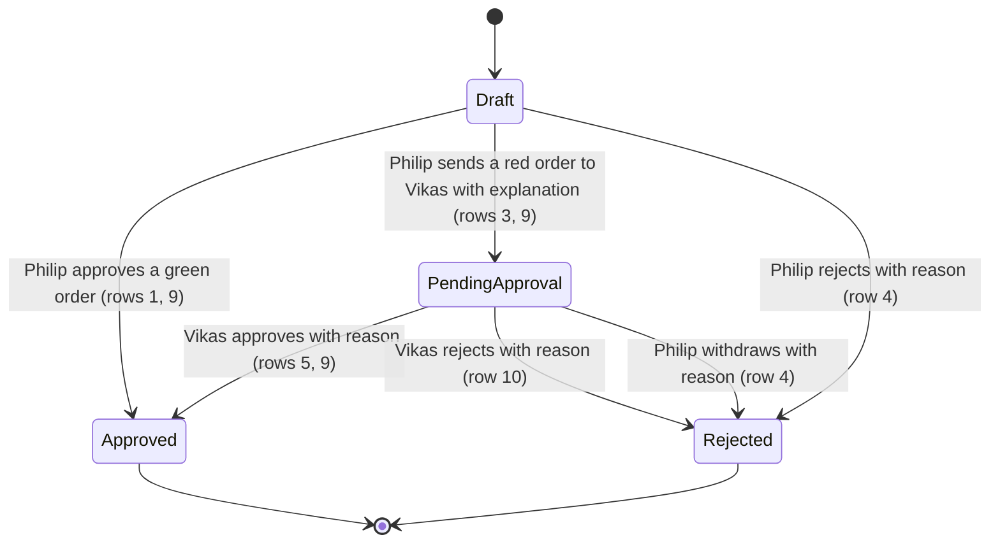

<!--
The proof document. Scaffolded 2026-09-25 with the specification; filled in as the phase is
verified, from what was actually observed. Procedure, not transcript. Never record credentials.
-->

# Phase 3 — Philip decides, Vikas signs off red

| | |
|---|---|
| Specification | [`../spec.md`](../spec.md) @ `3c37dbb` |
| Status | In progress — verified, awaiting independent review |
| Started / Closed | 2026-09-25 / — |
| Author | Fleet Management team |
| Reviewed by | — |
| Signed off | — |
| Landed in | — |
| Covers | AC-12, AC-13, AC-14, AC-15 |
| Credential inventory | `verification/CREDENTIALS.md` (gitignored, mode 0600) |

## What this phase makes true

Philip approves green orders himself, including ones he entered, and can reject any order at any stage before approval. A red order can only go ahead if Philip sends it to Vikas with an explanation and Vikas approves it with a reason; the slip then names Vikas. Vikas and fleet administration hear about each sent-up order once.

## The rule, as observed

Refusals observed: a red or turned-red draft cannot be approved by Philip (row 2); a green draft
cannot be sent up (row 3); Amina, the order's own enterer, and an approver who asked for it cannot
decide it (row 5); a blank reason or an unavailable action is refused (row 8).

### Design vs. observed

| Specification edge | Observed | Verdict |
|---|---|---|
| `[*] → Draft` | rows 1–10 | As designed |
| `Draft → Approved`: Philip approves a green order | rows 1, 9 | As designed |
| `Draft → PendingApproval`: Philip sends a red order to Vikas with explanation | rows 3, 9 | As designed |
| `Draft → Rejected`: Philip rejects with reason | row 4 | As designed |
| `PendingApproval → Approved`: Vikas approves with reason | rows 5, 9 | As designed |
| `PendingApproval → Rejected`: Vikas rejects with reason | row 10 | As designed |
| `PendingApproval → Rejected`: Philip withdraws with reason | row 4 | As designed |
| `Rejected → [*]`, `Approved → [*]` | rows 4, 7, 9 | As designed |

## Frappe-first / native-first

| What we needed | Native mechanism used | Custom code, and why |
|---|---|---|
| Green/red routing | Workflow states, actions, allowed roles, conditions | Reason on send-up and decisions; narrowed self-approval check |
| Notices | Notification Log | Recipient helper from 001 |
| Written reasons | `before_workflow_action` form hook and read-only fields | One whitelisted call records the reason first, because Frappe's workflow action reloads the order and drops unsaved input |

## Verification

| # | Put the system in this state | Expect | Covers |
|---|---|---|---|
| 1 | As Philip, approve a green order he entered | Approved, with Philip as approver and a validity set; no "waiting for approval" notice is created | AC-12 — `test_fuel_order_decisions.py` `test_philip_approves_his_own_green_order` |
| 2 | Offer Philip a red draft; then let a green draft turn red because another order for the vehicle is approved meanwhile, and have Philip approve it | Approve is not offered on the red draft and is refused if forced; the turned-red draft is refused "has turned red" and stays Draft | AC-12 — `test_philip_can_never_approve_a_red_order` |
| 3 | Send up a green draft; a red draft without an explanation; the red draft with one | Refused; refused; Pending Approval with the explanation kept | AC-13 — `test_only_a_red_order_with_an_explanation_is_sent_up` |
| 4 | As Philip, reject a draft without and then with a written reason; withdraw a pending order with a reason | Refused without a reason; with one it is Rejected with Philip as rejecter and the reason kept; the withdrawn order is Rejected | AC-13 — `test_philip_rejects_or_withdraws_only_with_a_reason` |
| 5 | A red order is waiting for sign-off: Vikas decides without and then with a reason; Amina (Mombasa) tries; a user holding both roles who entered it tries; an approver who asked for it tries | Vikas is refused without a reason and approves with one; the other three are refused | AC-14 — `test_only_a_permitted_independent_approver_decides_a_sent_up_order` |
| 6 | Send a red order up, then save the pending order again | Exactly one notice for Vikas and one for the Fleet Admin, and no duplicates after the second save | AC-14 — `test_a_sent_up_order_notifies_the_approver_and_admin_once_each` |
| 7 | Print a green order Philip approved and a red order Vikas approved | The first slip names Philip; the second names Vikas on the authorised line and the signature line | AC-15 — `test_the_slip_names_whoever_approved_it` |
| 8 | Record a blank reason; record a reason for an action the user cannot take now; change a reason field by an ordinary save | Refused; refused; the saved reason is unchanged | AC-13, AC-14 — `test_record_decision_reason_refuses_blank_reasons_and_unavailable_actions` |
| 9 | As Philip, open his green draft KCZ 908T (34,630 km) and choose Approve; open his red draft KCZ 908T (34,180 km, 80%) and choose Submit for Approval; as Vikas, open that order and choose Approve | The green draft offers Approve and Reject, is approved at once with no question, and its slip names Philip; the red draft offers Submit for Approval and Reject, asks "Why is this red order genuine?", and waits for Vikas, who sees one "requires approval" notice for it; Vikas is asked for a reason, the order is approved by him, and its slip names Vikas on the authorised line and the signature line | AC-12, AC-13, AC-14, AC-15 |
| 10 | A red order is waiting for sign-off; a permitted approver rejects it with a reason | It is Rejected, with that approver as rejecter and the reason kept | AC-14 — `test_different_permitted_approver_can_approve_and_reject` |

**How to run it.** Backend rows: `bench --site fleet_management-test.localhost run-tests --app fleet_management`.
Desk rows: `agent-browser` walkthrough on the test site as the named role.

**Result:** 10 of 10 observed on MariaDB with the site in Kenya / Africa/Nairobi / KES, on
`feature/002-fuel-order-request-slip` at `a5e1492`. The row 9 slip frames were taken before the
slip's timestamps were formatted (Phase 0); the names they show are unaffected.

## What we learned that the plan did not predict

- The order's colour is recomputed when it is sent up. Approving Philip's green KCZ 908T draft
  first made his red KCZ 908T draft gain "Open order exists" as a second reason when it was sent
  up; other drafts for that vehicle keep their old colour until they are saved again.
- An approved order that Vikas can extend shows a second "Actions" button (the app's group, with
  Extend Validity) next to Frappe's workflow actions.

## Known limitations — accepted, not fixed

- Vikas's reason dialog does not repeat Philip's explanation; he reads it on the form under
  "Explanation for Sign-off".
- A draft's stored colour can be stale until it is saved again (see above); the server recomputes
  it at every transition, so a stale green draft cannot be approved once it has turned red.

## Review

| Round | Date | Verdict | Closed by |
|---|---|---|---|

**Closure:** —

**Next:** independent review of this phase.
