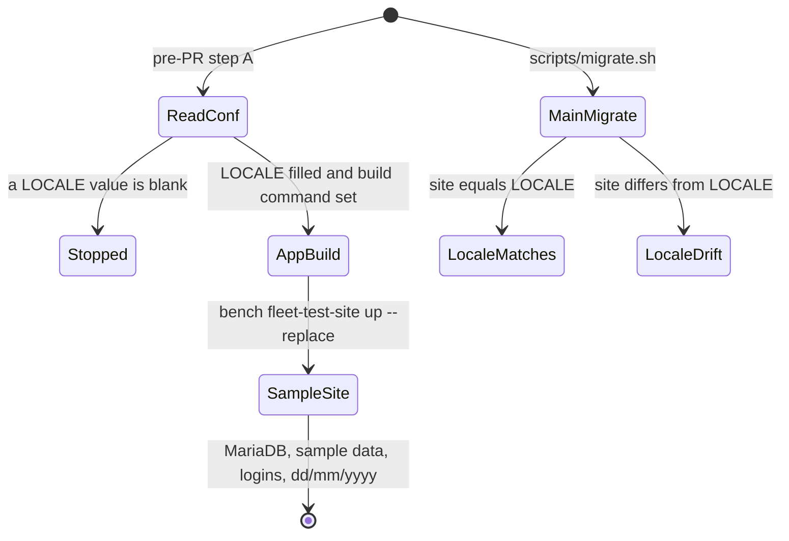

<!--
How the requirements will be met (Kiro's design.md). Written in step 2 of the Kaysalt
workflow and approved before building starts; a small task writes it with requirements.md
and shares that approval. Audience: the requester, who may ask for a plain-language
explanation, and an agent resuming cold who must not reopen settled decisions.

This is the first file allowed to name DocTypes, fields, routes, and roles. Every
correctness property validates at least one acceptance criterion. Never invent records or
labels for existing data; ask the requester and record the answer in "Data and migration
plan".

The approval line is written only after an explicit "approve" and reset to `pending`
whenever this file changes.
-->

# Test-site rebuild and regional settings: design

Approved by: pending

Fixes [bugfix.md](bugfix.md).

## Current state

- `.kaysalt/project.conf` has every `LOCALE_*` key blank.
- `scripts/rebuild-test-site.sh` (kit-owned, from `chore(kit): update to f4a3c20`, PR #6) calls
  `require_conf LOCALE_COUNTRY …` and stops. With the Locale filled it would drop and recreate
  the site with `KAYSALT_DB_ROOT_PASSWORD`, look only for
  `fleet_management/tests/sample_data.py`, print "No … sample_data.py yet", and leave an empty
  site with no test logins.
- `scripts/migrate.sh` calls `locale_drift` in `scripts/project-env.sh`, which skips every blank
  value (`if value and …`), so it prints "Locale matches" when nothing is recorded.
- The app builds its test site with its own bench command, `bench fleet-test-site up --replace`
  (`fleet_management/commands.py`): it copies the main site's regional settings, installs,
  completes the setup wizard, loads `fleet_management/sample_data.py`, sets the test logins'
  passwords from the 001 `CREDENTIALS.md`, and uses the site's own database user.
- An untracked `fixtures/role.json` at the repository root is byte-identical to
  `fleet_management/fixtures/role.json`. Frappe syncs fixtures only from `<app>/fixtures/`
  (the `fixtures` hook in `hooks.py`), so the root copy is never read.

## Root cause

The kit's test-site path assumes a new app: the updater added the `LOCALE_*` keys to an existing
app's `project.conf` without values, the rebuild script hard-codes `tests/sample_data.py` and a
root-password build, and the drift check treats blank as "matches". The kit fix
(`krystallinesalt/Frappe-Starter-Kit`, `plans/existing-app-test-site.md`, a `fix/…` PR to the
kit's `develop`) fills the Locale on update, fails on a blank Locale, and adds `project.conf`
settings naming an app's own test-site build command and its sample-data seed path. This spec
fixes the app's side through `.kaysalt/project.conf`, the app's own file.

## Words in this request

| Requester's word | Means in this app |
|---|---|
| regional settings, Locale | System Settings `country`, `time_zone`, `currency`, `date_format`, `language`; recorded as `LOCALE_*` in `.kaysalt/project.conf` |
| test-site rebuild before a pull request | Step A of `docs/agents/pre-pr-pipeline.md` |
| the app's own build command | `bench fleet-test-site up --replace` |
| one-step test run | `npm run test:all` (`scripts/test-cycle.sh`) |
| Fleet role list | `fleet_management/fixtures/role.json` (Fleet Admin, Fleet Approver, Fleet User) |

## Decisions (locked)

- `D-1`: Fill `LOCALE_*` from the main site's System Settings: `Kenya`, `Africa/Nairobi`, `KES`,
  `dd/mm/yyyy`, and `English` (the site stores `en`; the Locale holds the Language record's
  `language_name`, as the setup wizard takes it). Chosen over leaving them blank for the kit
  updater to fill, because the main site is also what `fleet-test-site up` copies.
- `D-2`: Name `bench fleet-test-site up --replace` in the kit's new build-command setting in
  `.kaysalt/project.conf`, so step A runs the app's own build. Chosen over editing
  `scripts/rebuild-test-site.sh` (kit-owned; the updater stops refreshing an edited kit file)
  and over moving the sample data to `tests/sample_data.py` (the kit build needs the database
  root password and does not set the test logins).
- `D-3`: The blank-Locale guard (bugfix 2.4) comes from the kit fix; the app does not patch
  `scripts/migrate.sh` or `scripts/project-env.sh`. Chosen over a local patch for the reason in
  D-2.
- `D-4`: Until the kit fix is merged into `develop`, step A for this app is
  `bench fleet-test-site up --replace` run directly, and nobody runs
  `scripts/rebuild-test-site.sh` here; the D-2 task stays open and marked blocked. Chosen over
  running the kit script, which would now pass the Locale check and build an empty site.
- `D-5`: Delete the untracked root `fixtures/` folder after re-confirming it is untracked and
  identical to `fleet_management/fixtures/role.json`. Chosen over committing or ignoring it,
  because Frappe never reads it and a second copy invites drift.

## Design

**This diagram is the design, not the build.** Each verification record redraws it from what
was actually observed and tallies the two. Use one transition per line and stable node names
so the two diagrams diff cleanly.

## Frappe-first

| What we need | Native Frappe/ERPNext mechanism | Custom code, and why it is unavoidable |
|---|---|---|
| The recorded regional settings | Read from the main site's System Settings and Language record | None |
| A test site with sample data and logins | The app's existing `fleet-test-site` bench command (already built for 001/002) | None new |
| The Fleet roles on install and migrate | Frappe's `fixtures` hook syncing `fleet_management/fixtures/role.json` | None |
| Choosing the build in the pipeline | The kit's `project.conf` build-command setting | None |

## Data and migration plan

No existing data affected. No schema change. `bench fleet-test-site up`, `sample_data.py`, and
the test logins are untouched. The deleted root `fixtures/role.json` is an untracked duplicate.

## Correctness properties

None. This fix changes configuration only, so it adds no code or property tests; tasks.md checks
each criterion by a migrate and a test-site build.

## Errors and permissions

No role or permission changes. A blank Locale value stops the kit scripts with "set LOCALE_… in
.kaysalt/project.conf".
