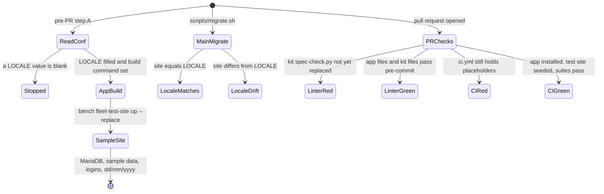

<!--
How the requirements will be met (Kiro's design.md). Written in step 2 of the Kaysalt
workflow and approved before building starts; a small task writes it with requirements.md
and shares that approval. Audience: the requester, who may ask for a plain-language
explanation, and an agent resuming cold who must not reopen settled decisions.

This is the first file allowed to name DocTypes, fields, routes, and roles. Every
correctness property validates at least one acceptance criterion. Never invent records or
labels for existing data; ask the requester and record the answer in "Data and migration
plan".

The approval line is written only after an explicit "approve" and reset to `pending`
whenever this file changes.
-->

# Test-site rebuild, regional settings, and pull-request checks: design

Approved by: Brian Kipngetich (@BrianKipngetich1) · 29/09/2026 · revision e78027c

Fixes [bugfix.md](bugfix.md).

## Current state

- `.kaysalt/project.conf` has every `LOCALE_*` key blank.
- `scripts/rebuild-test-site.sh` (kit-owned, from `chore(kit): update to f4a3c20`, PR #6) calls
  `require_conf LOCALE_COUNTRY …` and stops. With the Locale filled it would drop and recreate
  the site with `KAYSALT_DB_ROOT_PASSWORD`, look only for
  `fleet_management/tests/sample_data.py`, print "No … sample_data.py yet", and leave an empty
  site with no test logins.
- `scripts/migrate.sh` calls `locale_drift` in `scripts/project-env.sh`, which skips every blank
  value (`if value and …`), so it prints "Locale matches" when nothing is recorded.
- The app builds its test site with its own bench command, `bench fleet-test-site up --replace`
  (`fleet_management/commands.py`): it copies the main site's regional settings, installs,
  completes the setup wizard, loads `fleet_management/sample_data.py`, sets the test logins'
  passwords from the 001 `CREDENTIALS.md`, and uses the site's own database user.
- An untracked `fixtures/role.json` at the repository root is byte-identical to
  `fleet_management/fixtures/role.json`. Frappe syncs fixtures only from `<app>/fixtures/`
  (the `fixtures` hook in `hooks.py`), so the root copy is never read.
- PR #7 (`chore/kit-update-6d6918d` → `develop`, kit 6d6918d) already carries the kit fix: it adds
  `TEST_SITE_BUILD` and `SAMPLE_DATA_SEED` (both blank here), makes `require_locale` stop on a
  blank `LOCALE_*`, and makes `locale_drift` report a blank value as drift. Its `.kaysalt/project.conf`
  still has every `LOCALE_*` blank.
- PR #7's Server, UI, and Frappe Linter checks fail, and fail on `develop` too, since `ci.yml`
  arrived with kit update PR #6 (`d80f103`):
  - Server and UI: `bench get-app [app_name]` gives `No module named '[app_name]'`.
  - UI also calls a missing `[app_name].tests.fixtures.seed_e2e_users`, uses Frappe's US-only
    `frappe.utils.install.complete_setup_wizard`, builds `test_site` (refused by `e2e/target.ts`
    and by `sample_data._assert_test_site`), runs `npm ci` with no `package-lock.json`, and sets
    `PC_SID_CMD`, which this app's `e2e/sid.ts` never reads (it needs `BENCH_ROOT` and
    `PC_BENCH_PATH`).
  - Linter: pre-commit (ruff 0.14.10, prettier 2.7.1) rewrites 23 files and reports 5 errors
    (B905 and RUF007 at `fleet_asset.py:86`, RUF001 at `test_fuel_order.py:497`, RUF012 at
    `tests/test_sample_data.py:73`, E731 at `scripts/spec-check.py:115`). Semgrep, the job's second
    step, has never run; a full scan finds 27 older findings, one rated ERROR (`request.py:37`).

## Root cause

The kit's test-site path assumes a new app: the updater added the `LOCALE_*` keys to an existing
app's `project.conf` without values, the rebuild script hard-codes `tests/sample_data.py` and a
root-password build, and the drift check treats blank as "matches". The kit fix
(`krystallinesalt/Frappe-Starter-Kit`, `plans/existing-app-test-site.md`, a `fix/…` PR to the
kit's `develop`) fills the Locale on update, fails on a blank Locale, and adds `project.conf`
settings naming an app's own test-site build command and its sample-data seed path. This spec
fixes the app's side through `.kaysalt/project.conf`, the app's own file. That kit fix
has since shipped as 6d6918d and arrives with PR #7.

The failing checks have a second kit cause. The kit ships `scripts/spec-check.py` in 4-space
indentation with a lambda, while every app's `pyproject.toml` comes from Frappe's `bench new-app`
boilerplate (tabs, `E` selected), so the kit's own file fails the Linter in every app. The kit
also installs its `ci.yml` template verbatim, and nothing fills `[app_name]`. Both are universal
and are fixed in the kit (prompt handed to the owner on 29/09/2026), not here.

## Words in this request

| Requester's word | Means in this app |
|---|---|
| regional settings, Locale | System Settings `country`, `time_zone`, `currency`, `date_format`, `language`; recorded as `LOCALE_*` in `.kaysalt/project.conf` |
| test-site rebuild before a pull request | Step A of `docs/agents/pre-pr-pipeline.md` |
| the app's own build command | `bench fleet-test-site up --replace` |
| one-step test run | `npm run test:all` (`scripts/test-cycle.sh`) |
| Fleet role list | `fleet_management/fixtures/role.json` (Fleet Admin, Fleet Approver, Fleet User) |

## Decisions (locked)

- `D-1`: Fill `LOCALE_*` from the main site's System Settings: `Kenya`, `Africa/Nairobi`, `KES`,
  `dd/mm/yyyy`, and `English` (the site stores `en`; the Locale holds the Language record's
  `language_name`, as the setup wizard takes it). Chosen over leaving them blank for the kit
  updater to fill, because the main site is also what `fleet-test-site up` copies.
- `D-2`: Name `bench fleet-test-site up --replace` in the kit's new build-command setting in
  `.kaysalt/project.conf`, so step A runs the app's own build. Chosen over editing
  `scripts/rebuild-test-site.sh` (kit-owned; the updater stops refreshing an edited kit file)
  and over moving the sample data to `tests/sample_data.py` (the kit build needs the database
  root password and does not set the test logins).
- `D-3`: The blank-Locale guard (bugfix 2.4) comes from the kit fix; the app does not patch
  `scripts/migrate.sh` or `scripts/project-env.sh`. Chosen over a local patch for the reason in
  D-2. Revised 29/09/2026: the guard shipped in kit 6d6918d and is on PR #7's branch.
- `D-4`: Nobody runs `scripts/rebuild-test-site.sh` here while `TEST_SITE_BUILD` is blank. With it
  blank, the script takes the kit build, drops the site with the MariaDB root password, and
  recreates it under a new database name, after which `bench fleet-test-site down|up --replace`
  refuses the site. Until D-2 lands, step A is `bench fleet-test-site up --replace` run directly.
  Revised 29/09/2026: the kit fix is no longer awaited; D-2 lands on PR #7 (task 1.3).
- `D-6`: The fixes are committed on `chore/kit-update-6d6918d` in a separate worktree under
  `<bench>/worktrees/`, where `../..` is still the bench, so the kit scripts run there. This record
  stays on `fix/004-test-site-locale`. The bench imports the app from `apps/fleet_management`, so
  before the proof (task 1.4) the finished PR #7 branch is merged into `fix/004-test-site-locale`
  there. Chosen over switching the working folder's branch (the owner keeps it on `fix/004`) and
  over pointing the bench at the worktree.
- `D-7`: The layout comes from the tools pinned in `.pre-commit-config.yaml`. The hand fixes are
  `itertools.pairwise` for the overlap scan in `fleet_asset.py` (same pairs, no `zip` length
  question); `# noqa: RUF001` on the slip-text line in `test_fuel_order.py`, because the en dash
  is the real slip text; and `ClassVar[dict]` in `tests/test_sample_data.py`. Chosen over
  `zip(..., strict=False)`, which silences B905 but leaves RUF007.
- `D-8`: `scripts/spec-check.py` stays byte-identical to the kit's copy. It is fixed in the kit,
  and a later kit update delivers it. Until then PR #7's Linter stays red on that one file.
  Owner's choice (29/09/2026), over a temporary ruff exclusion in `pyproject.toml` and over
  editing the kit file here, which would stop the updater from refreshing it.
- `D-9`: No `ci.yml` patch. Revised 29/09/2026: kit 8f268ac (PR #8) ships a `ci.yml` that reads
  `.kaysalt/project.conf`, so Server and Linter pass. Its UI job fails for two app-side reasons,
  fixed in the app's own files on PR #8's branch: `SAMPLE_DATA_SEED` is blank, so the kit build
  looks for `fleet_management.tests.sample_data.seed` and loads no sample data (set it to
  `fleet_management.sample_data.seed`); and the app's kept `e2e/sid.ts` ignores the `PC_SID_CMD`
  the kit's CI sets, so it runs `bench` from `/home/kayadmin/frappe-bench` and fails with
  `spawnSync bench ENOENT`. `mintSid` runs `PC_SID_CMD` (with `PC_USER`) when it is set and reads
  the printed `sid`, as the kit's `sid.ts` does; unset, it keeps today's `bench browse` plus
  `tabSessions` read-back. Chosen over the owner patching the read-only workflow folder, and over
  replacing `sid.ts` with the kit's copy, which on this host opens the desktop browser.
- `D-10`: The missing `package-lock.json` is part of the kit fix, because the kit ships
  `package.json` without one.
- `D-11`: Semgrep is checked as CI checks a pull request, against `develop`
  (`semgrep scan --baseline-commit origin/develop`), so T1 must add no new finding. The 27 older
  findings are a separate specification. Chosen over annotating all of them here, which would widen
  this fix.
- `D-12`: Two generic `e2e/tests/session.spec.ts` checks meet CI differences, not app defects
  (PR #8 run 36557100515). The realtime check skips when `CI` is set, because the kit's UI job runs
  only `bench serve` and no socketio; locally it still runs. The anonymous-root check asserts the
  login form (`#login_email`) instead of the heading text, because CI installs the tip of Frappe
  `version-16` (16.35.1, "Sign In") while this bench is on 16.22.0 ("Login to Frappe"). Chosen over
  editing the read-only workflow to start socketio or pin Frappe, which only the owner can do.
- `D-5`: Delete the untracked root `fixtures/` folder after re-confirming it is untracked and
  identical to `fleet_management/fixtures/role.json`. Chosen over committing or ignoring it,
  because Frappe never reads it and a second copy invites drift.

## Design

**This diagram is the design, not the build.** Each verification record redraws it from what
was actually observed and tallies the two. Use one transition per line and stable node names
so the two diagrams diff cleanly.

## Frappe-first

| What we need | Native Frappe/ERPNext mechanism | Custom code, and why it is unavoidable |
|---|---|---|
| The recorded regional settings | Read from the main site's System Settings and Language record | None |
| A test site with sample data and logins | The app's existing `fleet-test-site` bench command (already built for 001/002) | None new |
| The Fleet roles on install and migrate | Frappe's `fixtures` hook syncing `fleet_management/fixtures/role.json` | None |
| Choosing the build in the pipeline | The kit's `project.conf` build-command setting | None |

## Data and migration plan

No existing data affected. No schema change. `bench fleet-test-site up`, `sample_data.py`'s data,
and the test logins are untouched; `commands.py` and `sample_data.py` change layout only (T1). The deleted root `fixtures/role.json` is an untracked duplicate.

## Correctness properties

None. This fix changes configuration and code layout only, so it adds no code or property tests.
tasks.md checks each criterion by a migrate, a test-site build, a syntax-tree comparison before
and after the layout change, and the server suite compared with its baseline.

## Errors and permissions

No role or permission changes. A blank Locale value stops the kit scripts with "set LOCALE_… in
.kaysalt/project.conf".
