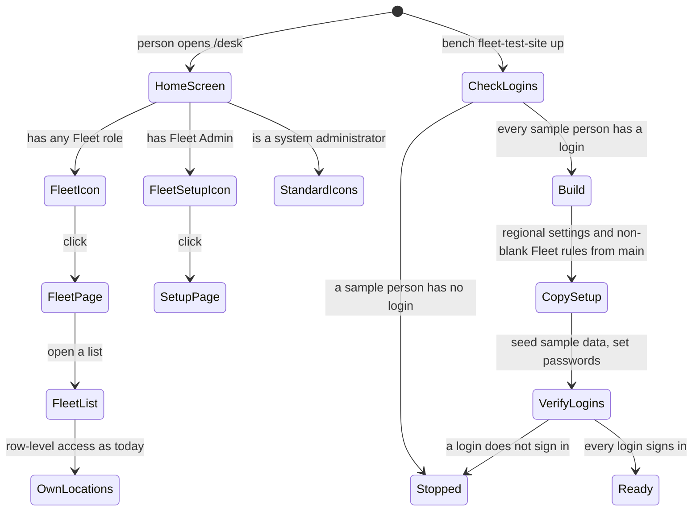

<!--
How the requirements will be met (Kiro's design.md). Written in step 2 of the Kaysalt
workflow and approved before building starts; a small task writes it with requirements.md
and shares that approval. Audience: the requester, who may ask for a plain-language
explanation, and an agent resuming cold who must not reopen settled decisions.

This is the first file allowed to name DocTypes, fields, routes, and roles. Every
correctness property validates at least one acceptance criterion. Never invent records or
labels for existing data; ask the requester and record the answer in "Data and migration
plan".

The approval line is written only after an explicit "approve" and reset to `pending`
whenever this file changes.
-->

# Fleet home page and a test site that copies the main site: design

Approved by: pending

Fixes [bugfix.md](bugfix.md).

## Current state

- Frappe 16's home screen (`/desk`) shows `Desktop Icon` records; each opens a `Workspace Sidebar`.
  The app ships neither, and `add_to_apps_screen` in `hooks.py` is commented out. Every standard
  icon (Build, Users, Data, …) leads to DocTypes a Fleet role cannot read, so Philip's home screen
  is empty. The main site has the same icon set, so its Fleet User sees the same.
- `Desktop Icon` has a `roles` table; Frappe syncs an app's `desktop_icon/` and
  `workspace_sidebar/` folders on install and migrate (`frappe/model/sync.py`).
- All three Fleet roles can read Fuel Order, Fueling Transaction, Fleet Asset, Fuel Station, Fleet
  Location, Vehicle Model, Fuel Type, and Fleet Person; only Fleet Admin reads Fleet Management
  Settings. Row-level access (User Permission on Fleet Location) is unchanged by this fix.
- `bench fleet-test-site up` (`fleet_management/commands.py`) copies System Settings `country`,
  `time_zone`, `language`, `currency` from the main site; the app sets `date_format` to dd/mm/yyyy
  on install. `sample_data.seed()` then overwrites every Fleet Management Settings value with fixed
  numbers. The main site has seven of those values set and `gauge_limit_percent`,
  `litres_excess_percent`, `mileage_margin_percent`, `min_hours_between_fuelings` blank.
- `_read_credentials` reads the test logins from the 001 `CREDENTIALS.md`; a sample user
  (`sample_data.USERS`) missing from it gets no password, and only the opposite case (a login with
  no sample user) prints a warning. No step checks that a login signs in.

## Root cause

The app never shipped a Desk entry point for its own roles, and the test-site build treats the
sample values as the source of the Fleet rules and trusts the login file without checking it.

## Words in this request

| Requester's word | Means in this app |
|---|---|
| home screen | Frappe 16 Desktop, `/desk` |
| Fleet icon, Fleet page | `Desktop Icon` "Fleet" → `Workspace Sidebar` "Fleet" (+ `Workspace` "Fleet") |
| Fleet Setup icon | `Desktop Icon` "Fleet Setup" → `Workspace Sidebar` "Fleet Setup", roles: Fleet Admin |
| Fleet rules | Fleet Management Settings values |
| private login file | `specs/001-fleet-fuel-management/verification/CREDENTIALS.md` (gitignored, 0600) |
| sample person | a row of `sample_data.USERS` |

## Decisions (locked)

- `D-1`: Two icons, following Frappe's own `Users` icon, sidebar, and workspace: "Fleet" for Fleet
  Admin, Fleet Approver, Fleet User; "Fleet Setup" for Fleet Admin only. Chosen over one sidebar
  with a setup section, because all three roles can read the setup DocTypes, so Frappe would show
  those links to everyone.
- `D-2`: The files live in `fleet_management/desktop_icon/`, `fleet_management/workspace_sidebar/`,
  and the module's `workspace/` folder, as standard records synced on install and migrate. Chosen
  over fixtures, because Frappe owns these folders' sync.
- `D-3`: After `sample_data.seed()`, the build copies every non-blank Fleet Management Settings
  value from the main site over the sample value (bugfix 2.4). Blank main values keep the sample
  value. `date_format` is read from the main site too and passed on, instead of relying on the
  install hook alone.
- `D-4`: `up` compares `sample_data.USERS` with the login file before `_down()`, and stops naming
  each missing person (bugfix 2.5). After seeding it checks each password with
  `frappe.utils.password.check_password` and stops naming any login that fails (bugfix 2.6),
  without printing a password.
- `D-5`: Main-site people and logins stay off the test site (bugfix 3.3); the answer to question 1.

## Design

**This diagram is the design, not the build.** Each verification record redraws it from what
was actually observed and tallies the two. Use one transition per line and stable node names
so the two diagrams diff cleanly.

## Frappe-first

| What we need | Native Frappe/ERPNext mechanism | Custom code, and why it is unavoidable |
|---|---|---|
| A Fleet entry on the home screen | Standard `Desktop Icon`, `Workspace Sidebar`, `Workspace` records | None |
| Setup icon for admins only | `Desktop Icon.roles` | None |
| Lists limited to own locations | Existing User Permissions | None |
| Test site copies main setup | Existing `fleet-test-site up` | A few lines to copy Fleet Management Settings; Frappe has no site-to-site settings copy |
| Every login present and working | `frappe.utils.password.check_password` | A comparison with `sample_data.USERS`; the login file is this app's own |

## Data and migration plan

No schema change. Migrating the main site adds the two icons, two sidebars, and the workspace;
nothing else on the main site changes. The test site is rebuilt from code.

## Correctness properties

1. For every Fleet role, the Fleet icon is visible; only Fleet Admin sees Fleet Setup. Validates
   2.1, 2.2, 2.3.
2. For any main-site settings, each built value equals the main value when set, else the sample
   value. Validates 2.4.
3. For any login file, the build stops exactly when a sample person is missing, naming all of them.
   Validates 2.5.

## Errors and permissions

No role or permission changes. The build stops with "The login file has no test login for: …"
(2.5) or "These test logins do not sign in: …" (2.6), naming users, never passwords.
