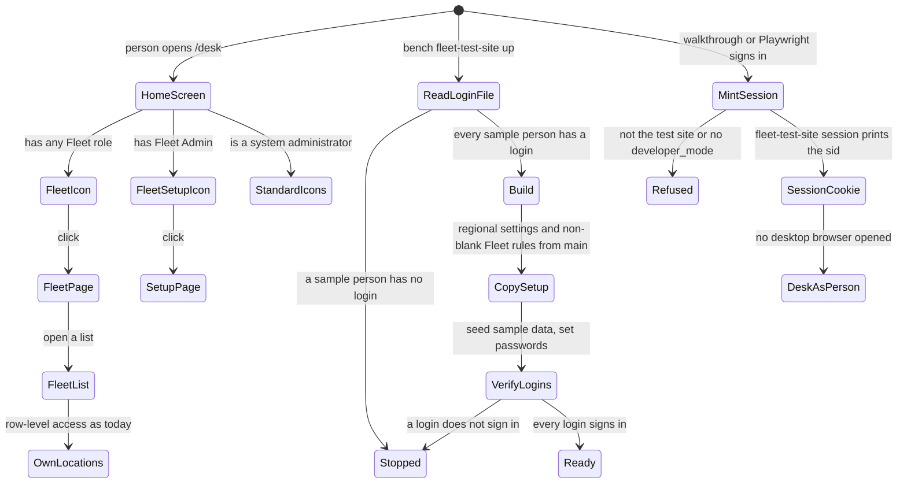

<!--
How the requirements will be met (Kiro's design.md). Written in step 2 of the Kaysalt
workflow and approved before building starts; a small task writes it with requirements.md
and shares that approval. Audience: the requester, who may ask for a plain-language
explanation, and an agent resuming cold who must not reopen settled decisions.

This is the first file allowed to name DocTypes, fields, routes, and roles. Every
correctness property validates at least one acceptance criterion. Never invent records or
labels for existing data; ask the requester and record the answer in "Data and migration
plan".

The approval line is written only after an explicit "approve" and reset to `pending`
whenever this file changes.
-->


# Fleet home page, one login file, and a test site that copies the main site: design

Approved by: Brian Kipngetich (@BrianKipngetich1) · 29/09/2026 · revision 6d8acf1

Fixes [bugfix.md](bugfix.md).

## Current state

- Frappe 16's home screen (`/desk`) shows `Desktop Icon` records; each opens a `Workspace Sidebar`.
  The app ships neither, and `add_to_apps_screen` in `hooks.py` is commented out. Every standard
  icon (Build, Users, Data, …) leads to DocTypes a Fleet role cannot read, so Philip's home screen
  is empty. The main site has the same icon set, so its Fleet User sees the same.
- `Desktop Icon` has a `roles` table; Frappe syncs an app's `desktop_icon/` and
  `workspace_sidebar/` folders on install and migrate (`frappe/model/sync.py`).
- All three Fleet roles can read Fuel Order, Fueling Transaction, Fleet Asset, Fuel Station, Fleet
  Location, Vehicle Model, Fuel Type, and Fleet Person; only Fleet Admin reads Fleet Management
  Settings. Row-level access (User Permission on Fleet Location) is unchanged by this fix.
- `bench fleet-test-site up` (`fleet_management/commands.py`) copies System Settings `country`,
  `time_zone`, `language`, `currency` from the main site; the app sets `date_format` on install.
  `sample_data.seed()` then overwrites every Fleet Management Settings value. The main site has
  seven of those values set and `gauge_limit_percent`, `litres_excess_percent`,
  `mileage_margin_percent`, `min_hours_between_fuelings` blank.
- The logins live in `specs/001-fleet-fuel-management/verification/CREDENTIALS.md` (gitignored,
  0600): five tables in different shapes (main site; test site; Frappe framework test fixtures;
  MariaDB accounts; test-site Administrator) with prose between them. `commands.py`
  (`DEFAULT_CREDENTIALS`, `_read_credentials`) parses the "## Test site" section and two fixed
  rows. The kit (AGENTS.md "Credentials", `scripts/rebuild-test-site.sh`, `scripts/kit-check.py`
  suggestion `credentials-location`) expects one root `CREDENTIALS.md` with a
  `| Site | Username | Role | Password |` table and prints "No CREDENTIALS.md" here.
- The old path is named in `CLAUDE.md` (Credential handling, Frappe conventions), `PROGRESS.md`
  (Environment), `fleet_management/commands.py`, `fleet_management/sample_data.py`,
  `.gitignore` (`specs/*/verification/CREDENTIALS.md`), `specs/TEMPLATE-verification.md` (an older
  copy of the kit's template), `specs/002-fuel-order-request-slip/spec.md`, and the "Credential
  inventory" row of the 001 and 002 phase records.
- Walkthrough sign-in: `scripts/ab-login.sh` (kit) sets `PC_SID_CMD` to
  `BROWSER=echo bench browse <site> --user`, then runs `e2e/sid.ts` under plain Node.
  `e2e/sid.ts` imports `./target` without `.ts`, which Node's type stripping rejects
  (`ERR_MODULE_NOT_FOUND`); Playwright's loader tolerates it. Frappe 16.22's `browse` prints the
  URL only for Administrator and always calls `click.launch`, which on this GNOME desktop opens
  the owner's Chrome whatever `BROWSER` says. `sid.ts`'s default path also calls `bench browse`
  (then reads `tabSessions`), so local Playwright runs may open the owner's browser too.

## Root cause

The app never shipped a Desk entry point for its own roles; the test-site build treats the sample
values as the source of the Fleet rules and trusts the login file without checking it; the login
file predates the kit's single-file rule; and every sign-in path depends on `bench browse`, which
on a desktop host opens a browser instead of just returning a session.

## Words in this request

| Requester's word | Means in this app |
|---|---|
| home screen | Frappe 16 Desktop, `/desk` |
| Fleet icon, Fleet page | `Desktop Icon` "Fleet" → `Workspace Sidebar` "Fleet" (+ `Workspace` "Fleet") |
| Fleet Setup icon | `Desktop Icon` "Fleet Setup" → `Workspace Sidebar` "Fleet Setup", roles: Fleet Admin |
| Fleet rules | Fleet Management Settings values |
| login file | `CREDENTIALS.md` at the repository root (gitignored, 0600) |
| sample person | a row of `sample_data.USERS` |
| sign-in helper | `scripts/ab-login.sh` → `e2e/sid.ts` `mintSid` |

## Decisions (locked)

- `D-1`: Two icons, following Frappe's own `Users` icon, sidebar, and workspace: "Fleet" for Fleet
  Admin, Fleet Approver, Fleet User; "Fleet Setup" for Fleet Admin only. Chosen over one sidebar
  with a setup section, because all three roles can read the setup DocTypes, so Frappe would show
  those links to everyone.
- `D-2`: The files live in `fleet_management/desktop_icon/`, `fleet_management/workspace_sidebar/`,
  and the module's `workspace/` folder, as standard records synced on install and migrate.
- `D-3`: After `sample_data.seed()`, the build copies every non-blank Fleet Management Settings
  value from the main site over the sample value (bugfix 2.4); blank main values keep the sample
  value. `date_format` is read from the main site and passed on too.
- `D-4`: `up` compares `sample_data.USERS` with the login file before `_down()` and stops naming
  each missing person (2.5). After seeding it checks each password with
  `frappe.utils.password.check_password` and stops naming any login that fails (2.6).
- `D-5`: Main-site people and logins stay off the test site (3.3).
- `D-6`: The login file (2.7) is the kit's table and one database table, nothing else:

  ```
  # Logins — private, never committed (mode 0600)

  | Site | Username | Role | Password |
  |---|---|---|---|
  | fleet_management.localhost | … one row per main-site login … |
  | fleet_management-test.localhost | Administrator | Administrator | … |
  | fleet_management-test.localhost | … one row per sample person and the setup user … |

  ## Database

  | Site | Database | Database user | Password |
  |---|---|---|---|
  ```

  Rows move with their values unchanged (3.7). The Frappe framework test-fixture accounts
  (`test@example.com`, `test1…4`, …) are not copied: Frappe's own tests create them with their
  own passwords, and the kit's rebuild step stops on a test-site row whose user the rebuild does not
  create. The notes and dates columns and the prose are dropped; git history keeps when a login
  was made.
- `D-7`: `commands.py` reads `<repo>/CREDENTIALS.md`: test-site rows of the login table give the
  users (the Administrator row gives the admin password), and the test-site row of the Database
  table gives the database password. The "contains test" rule stays. `scripts/rebuild-test-site.sh`
  (kit) then finds the same file unchanged.
- `D-8`: Move, then remove: write the root file at mode 0600, compare every value with the old
  file by script (printing names only), rebuild the test site from it, and only then delete
  `specs/001-fleet-fuel-management/verification/CREDENTIALS.md` (2.9). Every reference listed in
  Current state points at the root file; `CLAUDE.md`'s Credential handling section is rewritten
  to the kit's rule; `specs/TEMPLATE-verification.md` is replaced by the kit's current copy; the
  `.gitignore` line for the old path is removed (`CREDENTIALS.md` stays ignored).
- `D-9`: `mintSid` creates the session without `bench browse`: a new app bench command,
  `bench --site <test site> fleet-test-site session <email>`, refuses any site but the test site
  and any site without `developer_mode`, logs in with Frappe's `LoginManager.login_as`, and prints
  one `?sid=` line; it never launches a browser. The default path of `e2e/sid.ts` uses it, and the
  `./target` import gains `.ts`. The `PC_SID_CMD` path stays for CI.
- `D-10`: `scripts/ab-login.sh` is the kit's and stays as shipped; it always sets `PC_SID_CMD` to
  `bench browse`, which cannot work on a desktop host with Frappe 16.22. A prompt for the kit owner
  asks for `ab-login.sh` to keep a `PC_SID_CMD` that is already set. Until that kit update arrives,
  a walkthrough exports `PC_SID_CMD` to the D-9 command and runs the same two steps as
  `ab-login.sh` (mint through `e2e/sid.ts`, then `agent-browser cookies set`), so no browser
  opens on the desktop (2.10).

## Design



**This diagram is the design, not the build.** Each verification record redraws it from what
was actually observed and tallies the two. Use one transition per line and stable node names
so the two diagrams diff cleanly.

## Frappe-first

| What we need | Native Frappe/ERPNext mechanism | Custom code, and why it is unavoidable |
|---|---|---|
| A Fleet entry on the home screen | Standard `Desktop Icon`, `Workspace Sidebar`, `Workspace` records | None |
| Setup icon for admins only | `Desktop Icon.roles` | None |
| Lists limited to own locations | Existing User Permissions | None |
| Test site copies main setup | Existing `fleet-test-site up` | A few lines copying Fleet Management Settings; Frappe has no site-to-site settings copy |
| Every login present and working | `frappe.utils.password.check_password` | A comparison with `sample_data.USERS` |
| One login file | The kit's `CREDENTIALS.md` table | The app's reader follows the kit's table |
| A session without a browser | `LoginManager.login_as` (what `bench browse` calls) | A bench command, because `bench browse` always launches a browser |

## Data and migration plan

No schema change. Migrating the main site adds the two icons, two sidebars, and the workspace.
The login file's values move unchanged (D-6, D-8); the framework fixture accounts' passwords are
not carried over (Frappe's tests set their own). The old file is deleted only after the comparison
and a successful rebuild. The test site is rebuilt from code.

## Correctness properties

1. For every Fleet role, the Fleet icon is visible; only Fleet Admin sees Fleet Setup. Validates
   2.1, 2.2, 2.3.
2. For any main-site settings, each built value equals the main value when set, else the sample
   value. Validates 2.4.
3. For any login file, the build stops exactly when a sample person is missing, naming all of them.
   Validates 2.5.
4. For any login file in the kit's shape, the reader returns exactly the test-site rows, the
   test-site Administrator password, and the test-site database password. Validates 2.7, 2.8.
5. The session command refuses every site but the test site and any site without developer_mode.
   Validates 2.10.

## Errors and permissions

No role or permission changes. The build stops with "The login file has no test login for: …"
(2.5) or "These test logins do not sign in: …" (2.6), naming users, never passwords. The session
command stops with "Only <test site> with developer_mode can mint a session." Minting a session is
a user-impersonation step on the disposable test site only; the owner permits it for the four
sample people and Administrator before the first walkthrough.
