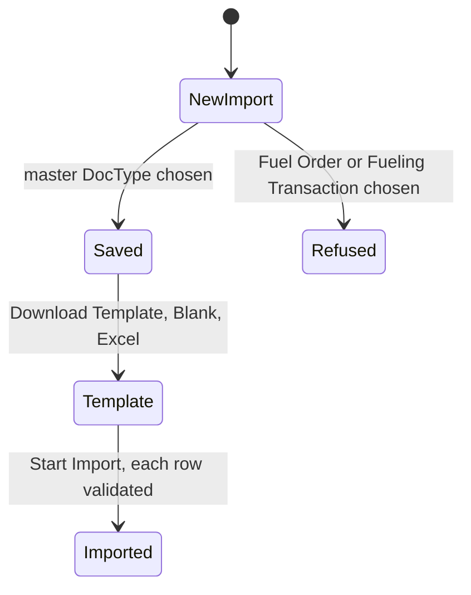

<!--
How the requirements will be met (Kiro's design.md). Written in step 2 of the Kaysalt
workflow and approved before building starts; a small task writes it with requirements.md
and shares that approval. Audience: the requester, who may ask for a plain-language
explanation, and an agent resuming cold who must not reopen settled decisions.

This is the first file allowed to name DocTypes, fields, routes, and roles. Every
correctness property validates at least one acceptance criterion. Never invent records or
labels for existing data; ask the requester and record the answer in "Data and migration
plan".

The approval line is written only after an explicit "approve" and reset to `pending`
whenever this file changes.
-->

# Import the fleet's master lists: design

Approved by: Brian Kipngetich (@BrianKipngetich1) · 30/09/2026 · revision 9e45cae (explained by agent)

## Current state

Every Fleet DocType has `allow_import: 0`. Saving a Data Import for one of them fails with
"Data Import is not allowed for Fleet Location. Enable 'Allow Import' in DocType settings.",
and the Download Template button only appears on a saved Data Import. The `Fleet Admin` role
already has `import: 1` on all seven non-single Fleet DocTypes; `Fleet User` and
`Fleet Approver` have none.

## Words in this request

| Requester's word | Means in this app |
|---|---|
| master data | `Fleet Location`, `Fuel Type`, `Vehicle Model`, `Fleet Person`, `Fuel Station`, `Fleet Asset` with its `Asset Assignment` rows |
| export for them to fill | Data Import → Download Template → Blank Template, Excel |

## Decisions (locked)

- `D-1`: Set `allow_import: 1` on the six master DocTypes only. Chosen over also enabling
  `Fuel Order` and `Fueling Transaction` because their history must pass the workflow,
  photo, and approval rules one order at a time (requirement 2.2).
- `D-2`: `Asset Assignment` needs no flag: Frappe imports child rows through the parent's
  template. `Fleet Management Settings` is a single and cannot be imported.
- `D-3`: No permission change. The Data Import tool stays System Manager only, as Frappe ships
  it, so a system administrator does the import. Chosen over giving `Fleet Admin` access to
  Data Import because that is a role change outside a Small task.

## Design

## Frappe-first

| What we need | Native Frappe/ERPNext mechanism | Custom code, and why it is unavoidable |
|---|---|---|
| Blank Excel template | Data Import → Download Template | |
| Load the filled file | Data Import → Start Import (runs each document's `validate`) | |
| Holder history in the same file | Data Import child-table columns | |
| Switch import on | DocType `allow_import` | |

## Data and migration plan

DocType JSON change only (`allow_import`); migrate picks it up. No existing data affected.

## Correctness properties

### Property 1: Import is open exactly for the master lists

For every Fleet DocType, a new `Insert New Records` Data Import saves when the DocType is one
of the six master DocTypes and is refused for `Fuel Order` and `Fueling Transaction`.

**Validates: Requirements 1.1, 2.2**

### Property 2: Imported rows obey the same rules

An imported `Fleet Asset` with one assignment row is created with that row, and a row
breaking a rule (for example a missing fuel type) is reported, not created.

**Validates: Requirements 1.2, 1.3**

## Errors and permissions

- System Manager: may import the six master lists.
- Fleet Admin, Fleet User, Fleet Approver: cannot open Data Import (System Manager only), as
  today (requirement 2.1).
