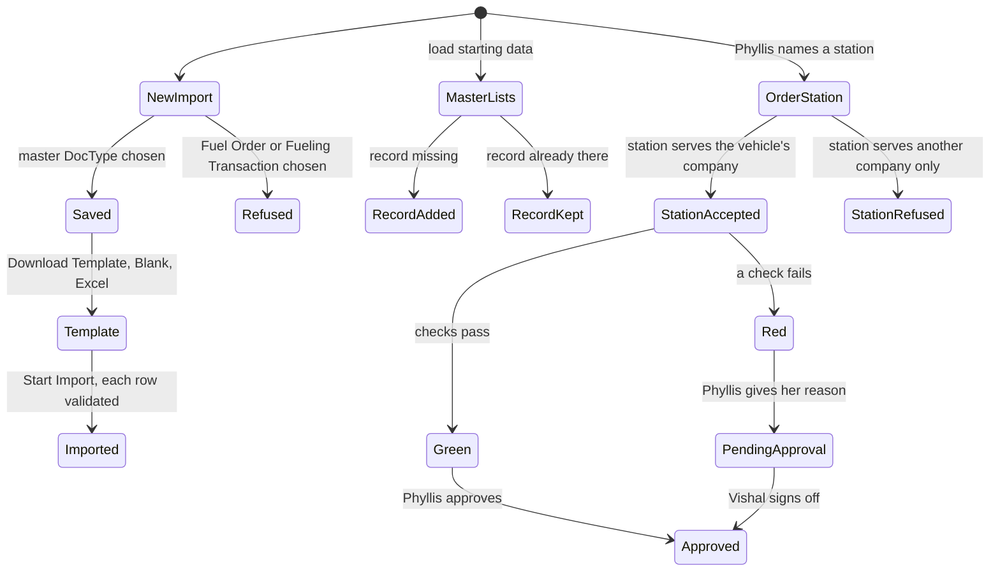

<!--
How the requirements will be met (Kiro's design.md). Written in step 2 of the Kaysalt
workflow and approved before building starts; a small task writes it with requirements.md
and shares that approval. Audience: the requester, who may ask for a plain-language
explanation, and an agent resuming cold who must not reopen settled decisions.

This is the first file allowed to name DocTypes, fields, routes, and roles. Every
correctness property validates at least one acceptance criterion. Never invent records or
labels for existing data; ask the requester and record the answer in "Data and migration
plan".

The approval line is written only after an explicit "approve" and reset to `pending`
whenever this file changes.
-->

# Import the fleet's master lists and load the company's real fleet: design

Approved by: pending

## Current state

Requirement 1 is built: the six master DocTypes have `allow_import: 1` (D-1 to D-3 below).

The test site is seeded by `fleet_management/sample_data.py` with an invented fleet (Nairobi,
Mombasa, Gongoni, Marereni; Philip, Vikas, Amina; KDA 412M and others; two months of history,
open orders, and eight signal examples). The main site holds no fleet records at all (checked
07/10/2026: no locations, vehicles, people, stations, orders, or fuellings), and its users
`fleet.user@example.com`, `fleet.approver@example.com`, and `fleet.admin@example.com` are
placeholders.

`Fuel Station.operational_location` is one required `Link` to `Fleet Location`. Three places
treat it as the only location a station serves: `FuelOrder._validate_station` refuses a
station whose location differs from the order's, `get_request_facts` suggests a station only
from that location, and the `planned_station` query in `public/js/fuel_order.js` filters on
it. `permissions.py` scopes `Fuel Station` by the same field, so a Fleet User or Approver sees
only stations at their own locations. About 28 test fixtures and branches 008 and 010 also
read this field.

## Words in this request

| Requester's word | Means in this app |
|---|---|
| master data | `Fleet Location`, `Fuel Type`, `Vehicle Model`, `Fleet Person`, `Fuel Station`, `Fleet Asset` with its `Asset Assignment` rows |
| export for them to fill | Data Import → Download Template → Blank Template, Excel |
| company (Kabete, Kanha) | a `Fleet Location` |
| holder | `Asset Assignment.custodian` |
| starting data / base of main | the records `fleet_management/master_data.py` creates |
| station serves a company | the company is the station's `operational_location` or one of its `also_serves` rows |
| tolerance | `Fleet Asset.tolerance_percent` |

## Decisions (locked)

- `D-1`: Set `allow_import: 1` on the six master DocTypes only. Chosen over also enabling
  `Fuel Order` and `Fueling Transaction` because their history must pass the workflow,
  photo, and approval rules one order at a time (requirement 2.2).
- `D-2`: `Asset Assignment` needs no flag: Frappe imports child rows through the parent's
  template. `Fleet Management Settings` is a single and cannot be imported.
- `D-3`: No permission change. The Data Import tool stays System Manager only, as Frappe ships
  it, so a system administrator does the import. Chosen over giving `Fleet Admin` access to
  Data Import because that is a role change outside a Small task.
- `D-4`: The real fleet lives as constants in a new module `fleet_management/master_data.py`,
  copied once from the owner's filled templates (07/10/2026) with the corrections below
  applied. One function, `load(people_users)`, creates each record that is missing by its
  name and never updates one that exists (3.3, 3.5). Chosen over Frappe fixtures, which
  re-import and overwrite on every migrate and would undo hand corrections, and over
  re-importing the Excel files at every rebuild, which is a manual step.
- `D-5`: The main site is loaded by running
  `bench --site fleet_management.localhost execute fleet_management.master_data.load_main`
  once. It links Fleet Person Phyllis to `fleet.user@example.com` and Vishal to
  `fleet.approver@example.com`, and adds any missing User Permission for both users on Kabete
  and Kanha. Rerunning it adds nothing. It is not a patch or migrate hook, so it never runs on
  its own.
- `D-6`: `sample_data.seed` calls `master_data.load` with the test logins. The invented fleet,
  its history, its open orders, and its signal examples are removed. The fuelling-cycle code
  stays with an empty `HISTORY`, so the later September phase only adds rows. The synthetic
  letter head stays on the test site only (002 D-13); the main site gets none from this work.
- `D-7`: A station keeps its required `operational_location` (its main company) and gains
  `also_serves`, a Table MultiSelect of a new child DocType `Fuel Station Location`
  (`fleet_location`, Link to `Fleet Location`, required). A station serves its main company
  plus every `also_serves` row. One helper, `get_served_locations(station)`, is used by
  `_validate_station`, `get_request_facts`, a new whitelisted `station_query` for
  `planned_station`, and `permissions.py`, which scopes a station by the whole set. Chosen
  over replacing the single field with a list because the tests, the permission scope, and
  branches 008 and 010 all read `operational_location`, and none of them needs to change.
  Ecoflame Limited: main company Kabete, also serves Kanha.
- `D-8`: Test logins: `phyllis.test@example.com` (Fleet User; Kabete and Kanha),
  `vishal.test@example.com` (Fleet Approver; Kabete and Kanha),
  `kanha.approver.test@example.com` (Fleet Approver; Kanha only), and
  `test.fleet.admin@example.com` (Fleet Admin; all) as today. Phyllis is the company
  representative for both companies. Passwords come from the login file as today.
- `D-9`: Assignments carry no primary driver; orders name the holder as driver (5.4). The
  existing usual-driver check is skipped when no usual driver is set, so it never fires on
  this data. Filling the driver in automatically stays with branch 009.
- `D-10`: Corrections applied in `master_data.py`: one Dennis Kamau; "Lexus" and "Urban
  Cruiser"; KBR136G uses the model template's `Isuzu - ELF-PB-NPR81AN`; stray spaces trimmed;
  "kanha" written as Kanha; holder KLW becomes Phyllis at Kabete and holder Athi_MV becomes
  Phyllis at Kanha; tolerance stored as 10 (the template's 0.1 is Excel's 10%).
- `D-11`: The generator is asset type Generator with model `GEN - 45KVA/36KW` (tank 100 L),
  target 1 (required by the form, unused for generators, as today), and a 100 L per-order
  maximum held in `sample_data.GENERATOR_MAX_LITRES` until the system gets a place for it.
  The mobile crane is a Vehicle with model `Locatel - KZL284` (tank 100 L) and target 2 km/L.
- `D-12`: Browser-test facts in `e2e/fixtures.ts`: locations Kabete and Kanha; station
  Ecoflame Limited; vehicle KAY222A (Kabete, so the Kanha-only approver must not see its
  orders); model `Toyota - Avensis`; requester, driver, and custodian Mrs. Danbhai Kanji;
  representative Phyllis. Phyllis and Vishal hold both companies; the restricted user holds
  Kanha.

## Design

## Frappe-first

| What we need | Native Frappe/ERPNext mechanism | Custom code, and why it is unavoidable |
|---|---|---|
| Blank Excel template | Data Import → Download Template | |
| Load the filled file | Data Import → Start Import (runs each document's `validate`) | |
| Holder history in the same file | Data Import child-table columns | |
| Switch import on | DocType `allow_import` | |
| Fixed starting data, same on every rebuild | Fixtures (overwrite on migrate) or Data Import (manual) | `master_data.py`: create-if-missing, so main-site corrections survive (3.3, 3.5) |
| A station serving several companies | Table MultiSelect with a child DocType | The validation, station suggestion, link query, and location scope are this app's own code and must read the extra rows |
| Company scope for users | User Permission on `Fleet Location` | Existing `permissions.py` hook, extended for `also_serves` |
| Station address on the slip | Address linked to the station | |

## Data and migration plan

- Migrate adds `Fuel Station Location` and `Fuel Station.also_serves`. Existing stations get no
  rows and serve exactly what they served before (2.4). No data patch is needed.
- The main site has no fleet records (07/10/2026), so `load_main` only adds. It is run once,
  after migrate, in its own phase. It does not touch the three placeholder logins beyond linking
  two of them to Phyllis and Vishal and adding their company access.
- Migrating the main site from this branch also brings back the Fleet home page (005, merged
  in). The main site carries no other branch's pages today, so nothing is removed.
- Ecoflame Limited's address on both sites: P.O Box 818, postal code 00606, Nairobi, Kenya,
  ecoflamelimited@gmail.com, primary. Its PIN is not stored (out of scope).
- The test site is rebuilt from code; nothing on it is kept.

## Correctness properties

### Property 1: Import is open exactly for the master lists

For every Fleet DocType, a new `Insert New Records` Data Import saves when the DocType is one
of the six master DocTypes and is refused for `Fuel Order` and `Fueling Transaction`.

**Validates: Requirements 1.1, 2.2**

### Property 2: Imported rows obey the same rules

An imported `Fleet Asset` with one assignment row is created with that row, and a row
breaking a rule (for example a missing fuel type) is reported, not created.

**Validates: Requirements 1.2, 1.3**

### Property 3: The starting data is the listed fleet, every time

After loading into an empty site, the master lists equal the "Sample data" table of the
requirements (2 companies, 2 fuel types, 14 models, 1 station, 15 assets with their holder,
company, fuel, model, target, 10% tolerance, and 01/09/2026 start), with every D-10 correction;
loading the same empty site twice gives the same records.

**Validates: Requirements 3.1, 3.2, 3.4**

### Property 4: Loading the main site only adds

On a site where one listed vehicle exists with a changed tolerance and target, `load` creates
every other missing record and leaves that vehicle unchanged; a second `load` creates nothing.

**Validates: Requirements 3.3, 3.5**

### Property 5: A station serves its main company and every also-serves company

An order for a Kanha vehicle naming a station whose main company is Kabete is accepted when
the station also serves Kanha and refused when it does not; the station suggestion and the
station search follow the same rule.

**Validates: Requirements 4.1, 4.2, 2.4**

### Property 6: Company scope with a shared station

The Kanha-only approver can read Ecoflame and Kanha orders and vehicles, and is refused every
Kabete order and vehicle, both in lists and by direct link.

**Validates: Requirements 5.3**

### Property 7: People and routes

Phyllis can create an order for a vehicle at each company with its holder as driver and herself
as representative; a green one she approves, a red one with her reason reaches Vishal, who
approves it; the printed slip shows Ecoflame's postal address and email.

**Validates: Requirements 5.1, 5.2, 5.4, 2.5, 4.3**

## Errors and permissions

- System Manager: may import the six master lists.
- Fleet Admin, Fleet User, Fleet Approver: cannot open Data Import (System Manager only), as
  today (requirement 2.1).
- Fleet Admin: edits a station's also-serves list (the existing Fuel Station write permission).
- A station that does not serve the order's company: "Planned station must serve the
  operational location." (the existing message, reworded).
- `load` and `load_main` refuse to run on any site but their own, as `sample_data` does today.
