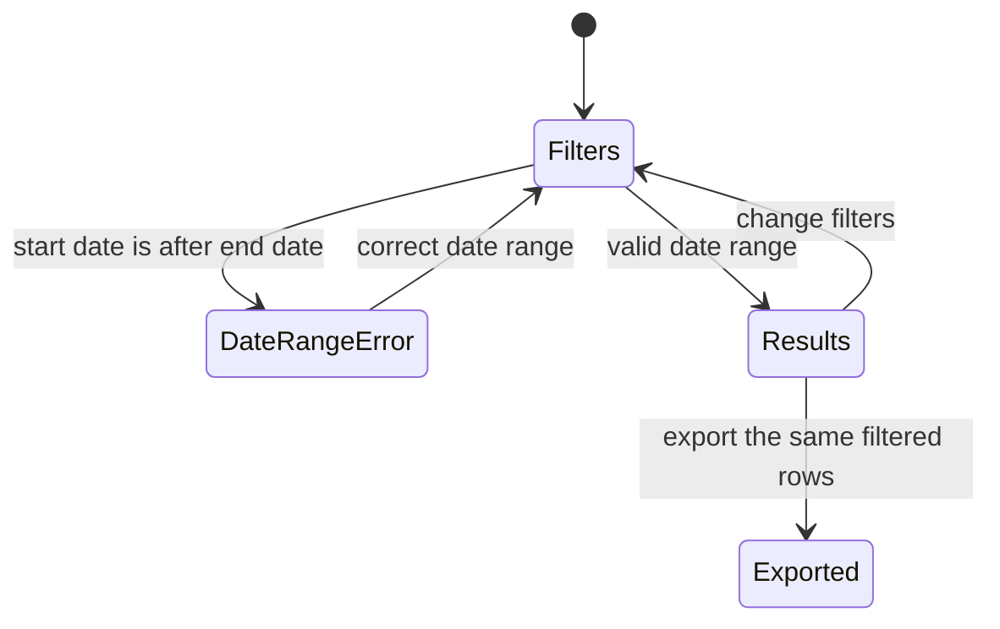

<!--
How the requirements will be met (Kiro's design.md). Written in step 2 of the Kaysalt
workflow and approved before building starts; a small task writes it with requirements.md
and shares that approval. Audience: the requester and an agent resuming cold.

This is the first file allowed to name DocTypes, fields, routes, and roles. Every
correctness property validates at least one acceptance criterion. Never invent records or
labels for existing data; ask the requester and record the answer in "Data and migration plan".

The approval line is written only after an explicit "approve" and reset to `pending`
whenever this file changes.
-->

# Fleet Oversight Reports: design

Approved by: pending

## Current state

- Fleet Oversight has three top-level reports: Fueling Summary, Asset Performance, and Requests & Audit.
- `Fuel Order` stores the request date, workflow state, fulfillment status, warning signal and reasons, and approval or rejection audit details. Rejections and withdrawals both end in `Rejected`; `decision_action` distinguishes them, and `rejected_on` records the event time for either action.
- `Fueling Transaction` stores the actual fueling date, delivered litres, vehicle odometer or generator hour meter, and vehicle full-fill interval values. Submitted transactions are immutable and cancellations retain their source values.
- Fueling transactions have no invoice total or printed unit price fields. The transaction form already requires a private invoice attachment.
- `fleet_management.permissions` already provides location-scoped document checks and `get_report_query_conditions()` for `Fuel Order` and `Fueling Transaction`. A report must apply those conditions itself; report filters alone do not protect rows or exports.
- The approved 001 role plan says Fleet Approvers can view reports for permitted locations and Fleet Admins can access all operational and audit records. It describes a Fleet Auditor as optional, only if a separate auditor login is needed.
- Requests & Audit now colours Green and Red warning statuses with Frappe's indicator pills. The Fuel Order form and Asset Performance report use the same Green/Red warning and Green/Orange/Red efficiency colors.
- Fueling Summary currently charts recorded monthly spend and colours no flags. Asset Performance already selects one asset, shows its period's request/fueling rows, charts monthly delivered litres, and lists vehicle efficiency on valid interval rows.

## Words in this request

| Requester's word | Means in this app |
|---|---|
| overseer | Fleet Approver for permitted locations, or Fleet Admin for all locations, as set out in the approved 001 role plan |
| fueling date | `Fueling Transaction.actual_fueling_datetime` |
| request date | `Fuel Order.request_datetime` |
| decision date | The stored approval or rejection/withdrawal event time on `Fuel Order` |
| flag report | A section of Requests & Audit showing flagged requests, warning reasons, decision status, and source links |
| full fueling report | The selected asset's retained request and fueling history, with optional date filters |
| completed fueling | A submitted `Fueling Transaction` that has not been cancelled |
| generator fuel | Litres delivered in a transaction; reports do not call this consumption |
| discrepancy | A separate recorded observation linked to a `Fueling Transaction`; source transaction values stay unchanged |
| unavailable amount | An older fueling record with no invoice amount; the report shows no amount and does not estimate one |

## Decisions (locked)

- `D-1`: Keep three top-level reports: Fueling Summary, Asset Performance, and Requests & Audit. Fueling Summary combines fueling and spend figures; Asset Performance combines asset history and performance; Requests & Audit contains distinct Approvals, Flag Reports, and Discrepancy Reports sections, plus cancellation audit rows. Chosen over separate top-level reports to preserve the approved three-report limit.
- `D-2`: Use native Frappe Script Reports, report filters, built-in export, and a Fleet Oversight Workspace linking the three reports. The standard report result is the single source for on-screen rows and export. Chosen over a custom dashboard page because it would duplicate filtering, export, and permission behavior.
- `D-3`: Give report access to Fleet Approver and Fleet Admin, with no new role. Fleet Approvers remain limited to their permitted locations; Fleet Admin retains its existing all-location access. Do not create the optional Fleet Auditor role because this request does not ask for a separate auditor login.
- `D-4`: Add an invoice total and an optional printed unit price to `Fueling Transaction`. Require a positive invoice total when a new transaction is submitted; capture a printed unit price when the invoice shows one. Calculate price per litre as invoice total divided by delivered litres in the report. Chosen over storing a second calculated value, because the source fields are immutable after submission and the result can be derived consistently.
- `D-5`: Leave existing invoice totals and printed prices empty. Reports show an unavailable amount for records without one; do not backfill or estimate historical amounts.
- `D-6`: Store each discrepancy as a separate `Fueling Discrepancy` record linked to its transaction, with type, details, reason, server-recorded user, and server-recorded date. Keep it separate from the submitted transaction so recording an observation never edits the source record. Allow multiple discrepancy records per transaction.
- `D-7`: Use a free-text discrepancy type because the request supplies no fixed category list. Chosen over inventing a list that could exclude a real discrepancy.
- `D-8`: Apply the existing location scope in every report query, including the new discrepancy record through its linked transaction. Populate location filter choices only from the current user's permitted locations. Run built-in exports from the same filtered result.
- `D-9`: Use the existing full-to-full interval values and ordering rules for vehicle efficiency. Use an earlier full fill outside the visible date range when required by the interval, but do not display its activity as an in-range row. Do not rate an interval when its target changed.
- `D-10`: Exclude cancelled transactions from fueling, efficiency, and spending totals. Show them in Requests & Audit with their cancellation status. Filter fueling records by actual fueling date; filter requests and their decisions by their request or decision event date.
- `D-11`: Do not change existing request, approval, or transaction submission rules. Fleet Users may record a discrepancy only for a transaction they can access; Fleet Approver and Fleet Admin may also record one within their existing scope.
- `D-12`: Render Green and Red warning statuses in Requests & Audit with the existing Frappe `indicator-pill` green and red classes. Use the standard report formatter and leave the returned status value unchanged, so CSV export and warning reasons are unaffected.
- `D-13`: In Requests & Audit, provide distinct sections reached by report buttons for Approvals, Flag Reports, and Discrepancy Reports. Flag Reports includes every flagged request and its pending, approved, rejected, or withdrawn status, warning reason, and related fueling link when available. Keep cancellation rows in the audit results.
- `D-14`: Colour Fueling Summary transaction detail rows across the full row with a restrained Green or Red gradient from the linked request warning flag. Leave rows without a warning and monthly aggregate rows neutral; keep warning text and exports unchanged.
- `D-15`: Asset Performance defaults to all retained history for its selected asset and allows optional date filters. Show monthly delivered litres and a separate monthly vehicle-efficiency trend in km/L; for each month, divide the total distance of valid intervals closing in that month by their total qualifying litres. Show no efficiency point when a month has no valid interval. Keep generator litres labelled as delivered, not consumed.
- `D-16`: Present the vehicle trends as two aligned monthly line charts—delivered litres and valid-interval km/L—so values with different units and scales are not compared on one axis.

## Design

**This diagram is the design, not the build.** The report returns an error without totals for an invalid range. A valid range returns results filtered by the event date appropriate to each record type. Export uses those same results and filters.

### Report layout

| Report | Contents |
|---|---|
| Fueling Summary | Monthly delivered litres, transaction counts, recorded invoice totals in KES, weighted calculated price per litre for records with an amount, printed unit price as its own detail value, monthly spend trend, and source transaction rows. Transaction detail rows with a linked warning receive a matching full-row Green/Red gradient; unflagged rows and monthly totals remain neutral. Rows without an amount are visibly unavailable and counted separately. |
| Asset Performance | The selected asset's full retained Fuel Orders and fueling transactions by default, links to each source, request and fulfillment status, and optional date filters. Vehicle views include aligned monthly delivered-litre and valid-interval km/L line charts; generator views continue to show delivered litres and hour-meter readings. |
| Requests & Audit | Distinct Approvals, Flag Reports, and Discrepancy Reports sections reached by report buttons. Flag Reports show all warning statuses and reasons, decision status, and source links. Discrepancies appear in their own section; cancelled transaction audit rows remain available in Requests & Audit. |

All reports use inclusive start and end dates and accept any span covered by retained records. Asset Performance uses all retained history when no date filters are set. The relevant filters are date range, location, asset, fuel type, and station. A location, asset, fuel, or station filter applies to every summary, trend, detail row, and export in that report. The Workspace remains a navigation page linking the same three reports; its count does not increase.

For a month with records that lack invoice amounts, the total is the sum of recorded invoice amounts only. The report shows how many records have no amount, rather than implying the total covers those records. The calculated price per litre uses only transactions with a recorded amount and is the recorded amount total divided by their delivered litres. Each detail row shows the calculated value beside, not in place of, a printed unit price.

## Frappe-first

| What we need | Native Frappe/ERPNext mechanism | Custom code, and why it is unavoidable |
|---|---|---|
| Three filterable reports and spreadsheet export | Script Reports, standard report filters, charts, and built-in report export | Report queries and calculations must combine `Fuel Order` and `Fueling Transaction` data and explicitly apply the location scope. |
| One place to open the reports | A standard Desk Workspace with links to the three reports | None beyond its report links and role visibility. |
| Separate review areas without adding top-level reports | Standard Script Report filters and report toolbar buttons | Section buttons select Approvals, Flag Reports, or Discrepancy Reports within Requests & Audit while retaining its shared filters, source links, and export. |
| Invoice amount and printed unit price | `Currency` fields on `Fueling Transaction` | Controller validation must require an amount on new submissions and preserve submitted-record immutability. |
| Discrepancy observations | A standard `Fueling Discrepancy` DocType linked to `Fueling Transaction` | Controller and permission hooks must set audit fields on the server and enforce the linked transaction's location scope. |
| Warning status colors | Standard Script Report formatter and Frappe `indicator-pill` CSS | A small client formatter maps the existing Green/Red status values to their matching flag colors; no new CSS or report data is needed. |
| Full-row warning colour and asset trends | Existing request warning values, transaction interval facts, and Script Report charts | The summary formatter shades transaction detail rows by linked warning; Asset Performance builds monthly litres and valid-interval km/L trends from filtered source records. No schema or historical data change is needed. |
| Full-fill efficiency | Existing `Fueling Transaction` interval fields and shared interval calculation | The report must select a prior full fill outside the visible period when needed and suppress ratings when the target changed. |

## Data and migration plan

Add `invoice_amount` and `printed_unit_price` as optional `Currency` fields in the schema so existing submitted transactions migrate without invented values. New transactions require a positive invoice amount at submission. A printed unit price is optional and is saved separately when present. The report derives calculated unit price; it does not store a duplicate calculation.

Add the `Fueling Discrepancy` DocType with a link to `Fueling Transaction`, discrepancy type, details, reason, recorded-by user, and recorded-on timestamp. The server sets the audit fields. A discrepancy is its own record; neither adding it nor viewing it changes or amends the transaction. No existing records are changed or backfilled. Existing transactions without a discrepancy entry display “No discrepancy was recorded,” which does not claim that no issue occurred.

The warning color is presentation-only. It reads the stored Green or Red status and uses existing Frappe indicator classes. No records or exports are changed.

The additional sections, row gradient, and vehicle trends require no new fields or data migration. Fueling Summary uses a transaction's linked Fuel Order warning status for row colour; a missing link or warning leaves the row neutral. Monthly total rows are neutral because they can combine different warning statuses. Monthly vehicle efficiency uses existing distance and qualifying-litre values from valid intervals, grouped by the interval's closing month and calculated as total valid interval distance divided by total valid interval qualifying litres. No warning or efficiency data is backfilled.

## Correctness properties

### Property 1: Date range and filter consistency

For every valid date range, the report includes both boundary dates, uses the correct event date, and applies the selected location, asset, fuel type, and station filters to every displayed total, trend, detail row, and export. A reversed range returns an error and no totals.

**Validates: Requirements 1.1, 1.2, 1.5, 4.2**

### Property 2: Spend uses recorded source amounts

For every fueling summary, only non-cancelled transactions contribute to litres, counts, and spend. Spend totals only recorded invoice amounts in KES; a missing amount remains unavailable, and calculated and printed unit prices remain separate.

**Validates: Requirements 1.3, 1.4, 3.4**

### Property 3: Asset history preserves source status

For every selected asset and period, the report links its in-range Fuel Orders and fueling transactions and shows the correct request, decision, fulfillment, and cancellation status. Generator litres are presented as delivered, not consumed.

**Validates: Requirements 2.1, 2.4, 3.1, 3.2, 3.4**

### Property 4: Vehicle efficiency follows full-to-full intervals

For every vehicle interval, efficiency is distance divided by the qualifying litres between full fills, including partial fills. The prior full fill may be outside the display range. Missing intervals show unavailable; a changed target removes the rating; rating boundaries are inclusive at 10 percent and 20 percent as written in the requirement.

**Validates: Requirements 2.2, 2.3**

### Property 5: Discrepancies are traceable observations

For every discrepancy, the source transaction remains unchanged and the report shows the type, details, reason, server-recorded user, and date. A transaction without a discrepancy entry is described as having no recorded discrepancy, not as having no issue.

**Validates: Requirements 3.3**

### Property 6: Report rows stay within location permissions

For every report and export, Fleet Approvers receive only rows from permitted locations and Fleet Admins retain their existing access. A user cannot widen access by changing report filters or opening a linked record.

**Validates: Requirements 4.1, 4.2**

### Property 7: Existing fueling operations continue

For every request and fueling submission, the existing approval, evidence, and location checks remain in force.

**Validates: Requirements 5.1**

### Property 8: Flag and discrepancy sections preserve audit detail

Every flagged request appears in Flag Reports with its decision status, warning reason, and source link, while discrepancies remain in their own section and location scope and selected filters still apply.

**Validates: Requirements 3.5, 3.6, 4.1, 4.2**

### Property 9: Warning colours and vehicle trends follow their source facts

Fueling Summary detail-row colours match a linked Green or Red warning, unflagged detail rows and monthly totals remain neutral, and vehicle trend values use only filtered delivered-litre rows and valid full-to-full intervals.

**Validates: Requirements 1.7, 2.1, 2.5, 4.1, 4.2**

## Errors and permissions

- A start date after the end date produces a clear report message and an empty result with no totals.
- Fleet Approver and Fleet Admin can open the Workspace and reports. Fleet Users do not receive report access through this feature, but may create a discrepancy for a transaction they can access.
- Every report query and discrepancy lookup checks the same existing location scope as its linked source record. The server rejects an out-of-scope filter or linked transaction; the client cannot grant access.
- Fleet Admin has the app's existing all-location access. No role gains access to a new location.
- Report exports use the rows returned to the current user under the current filters.
