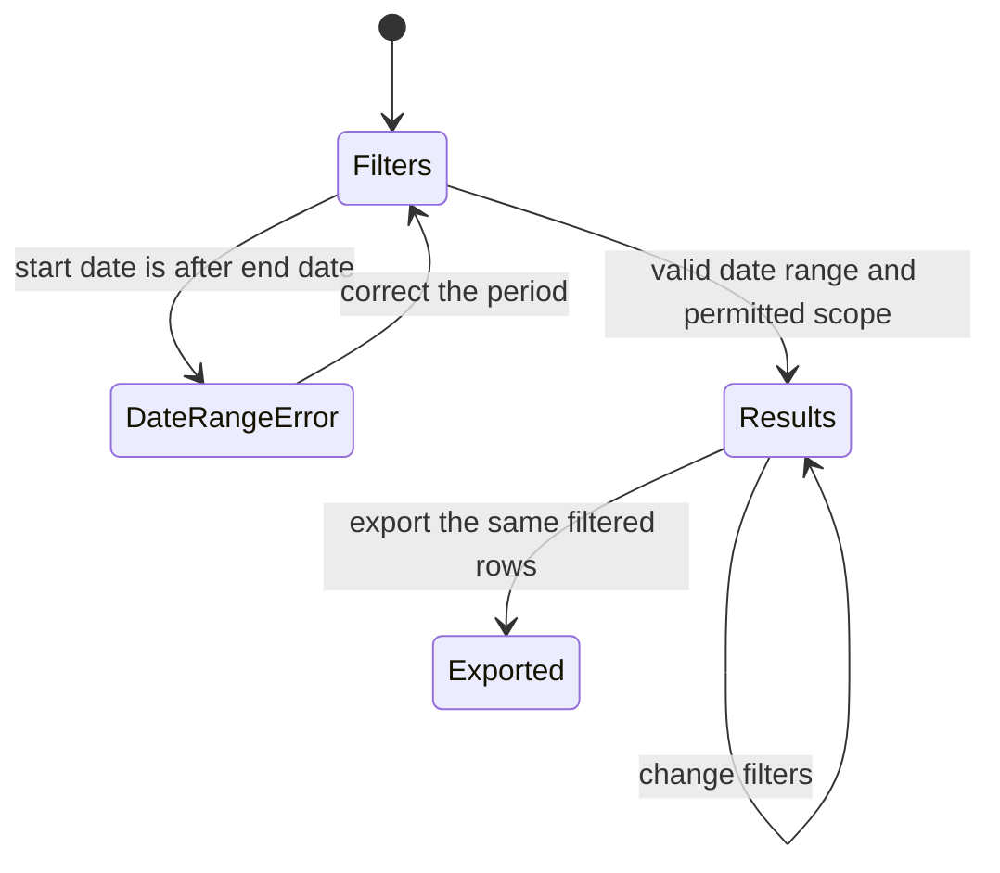

# Phase 2 — Asset performance and history

| | |
|---|---|
| Specification | [`../requirements.md`](../requirements.md) @ approval attribution pending |
| Status | `Complete` (implementation and backend verification) |
| Started / Closed | `2026-10-02` / `2026-10-02` |
| Author | Codex agent |
| Reviewed by | Not reviewed |
| Signed off | Not signed off |
| Landed in | Not published |
| Covers | Requirements 2.1–2.4 |

## What this phase makes true

An overseer can choose an asset and inclusive period to inspect related Fuel Orders and submitted Fueling Transactions, with source links, people, quantities, and request and fulfillment statuses. Vehicle efficiency uses the stored full-to-full interval facts, including partial fills and an opening full fill outside the display period, and withholds the rating if the target changed. Generator rows show delivered litres and hour-meter readings, while selected filters flow through the report rows, monthly figures, trend, and export under the existing location rules.

## The rule, as observed

### Design vs. observed

| Specification edge | Observed | Verdict |
|---|---|---|
| `Filters → DateRangeError` | Reversed range raises a validation error. | As designed |
| `Filters → Results` | Valid periods and permitted locations return matching source rows. | As designed |
| `DateRangeError → Filters` | Corrected valid period returns results. | As designed |
| `Results → Results` | Asset, date, location, fuel type, and station changes update rows and monthly values. | As designed |
| `Results → Exported` | CSV export contains the same filtered order and fueling links as the report. | As designed |

## Frappe-first / native-first

| What we needed | Native mechanism used | Custom code, and why |
|---|---|---|
| Asset history with filters and trend | Standard Script Report filters, chart, Link columns, and export | Joined Fuel Order and Fueling Transaction queries supply status and interval facts from both sources. |
| Location enforcement | Existing `get_report_query_conditions` and location-filter validation | Each report query applies the existing location scope; no access rule or role changed. |
| Vehicle efficiency and generator readings | Existing submitted transaction interval and meter fields | The report selects the opening full fill for target history while keeping out-of-period activity out of visible rows. |

**Scope deliberately not taken:** no new roles, location access changes, fourth report, or Phase 3 work.

## Verification

| # | Put the system in this state | Expect | Covers |
|---|---|---|---|
| 1 | Run the Asset Performance suite on the seeded test site as Fleet Admin and location approvers. | Request states, source links, submitted transactions, and location restrictions match their source records. | `2.1`, `4.1` |
| 2 | Select the KDB 551Q period containing its partial and closing fill, with the prior full fill before the start date. | The partial and closing rows appear, the opening row stays hidden, and the stored interval efficiency includes the partial litres. Changing either boundary hides only out-of-period activity. | `2.2`, `2.3` |
| 3 | Change a partial fill's target snapshot inside a rollback-only test savepoint. | The closing row retains its efficiency and shows no rating; stable interval thresholds and unavailable intervals match the specified bands and states. | `2.2`, `2.3` |
| 4 | Select a generator and a fueling date. | The row shows delivered litres and the hour meter, with no consumed-fuel label. | `2.4` |
| 5 | Filter a permitted asset by date, location, fuel type, and station, then export CSV. | Detail rows, monthly counts/litres, trend, and both source-link types use the same filters; an out-of-scope location is denied. | `1.1`, `1.5`, `4.1`, `4.2` |

**How to run it.** The automated unit and integration checks are in `test_asset_performance.py`; run `bench --site fleet_management-test.localhost run-tests --module fleet_management.fleet_management.report.asset_performance.test_asset_performance` against a freshly seeded disposable MariaDB test site. A Desk walkthrough was not run: `scripts/ab-login.sh` fails because Node cannot resolve the extensionless `./target` import in `e2e/sid.ts`; the attempted browser page was empty. The pre-PR pipeline was not started.

**Result:** 8 unit tests and 5 integration tests passed on the disposable test site. Main-site migration and static quick checks passed. Ruff and pre-commit were unavailable. No test records were added to the main site.

## What we learned that the plan did not predict

- Rejected Fuel Orders can remain at `docstatus = 0`; the report query must include the `Rejected` workflow state to show the decision.
- The test interval is easiest to identify from the stored opening and closing full-fill references, then locate partial transactions using the same timestamp-and-name ordering rule as the source controller.

## Known limitations — accepted, not fixed

- No Desk walkthrough evidence is recorded. The user asked not to start the pre-PR pipeline, and the existing session helper has an extensionless TypeScript import that prevents its login step.
- The disposable-site rebuild seeded records but failed its final scheduler toggle with MariaDB error 1020. A test-site migration restored standard report metadata and the automated report suite passed; the rebuild race remains an environment issue to resolve before a future fresh-site walkthrough.

## Review

| Round | Date | Verdict | Closed by |
|---|---|---|---|
| — | — | Not performed | — |

**Closure:** Implementation and backend verification are complete. No independent review, user sign-off, or publication occurred.

**Next:** Draft the Phase 3 prompt. Phase 3 has not started.
