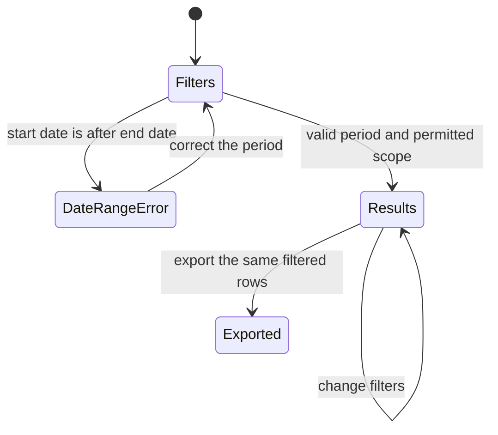

# Phase 3 — Requests, discrepancies, and audit

| | |
|---|---|
| Specification | [`../requirements.md`](../requirements.md), [`../design.md`](../design.md) — approved by the requester in a prior conversation; approval attribution remains pending |
| Status | `Complete` (implementation and backend verification; not reviewed or signed off) |
| Started / Closed | `2026-10-03` / `2026-10-03` |
| Author | Codex agent |
| Reviewed by | Not reviewed |
| Signed off | Not signed off |
| Landed in | Not published |
| Covers | Requirements 1.1–1.2, 1.5–1.6, 3.1–3.4, 4.1–4.2, 5.1 |

## What this phase makes true

An overseer can review requests, decisions, warnings, fulfillment states, recorded discrepancies, and cancelled fuelings in one audit report. Each discrepancy is recorded separately from its fueling transaction, with the recorder and date set by the server. The report links back to source records, applies the selected filters and permitted location scope, and distinguishes “no discrepancy was recorded” from a claim that no issue occurred. Fleet Approvers and Fleet Admins can open the Workspace and its three reports, while cancelled transactions stay out of fueling, performance, and spend totals.

## The rule, as observed

### Design vs. observed

| Specification edge | Observed | Verdict |
|---|---|---|
| `Filters → DateRangeError` | The report rejects a reversed date range before returning rows. | As designed |
| `DateRangeError → Filters` | Correcting the range returns the valid filtered result. | As designed |
| `Filters → Results` | Valid date, location, asset, fuel, and station filters return source-linked rows within the user's location scope. | As designed |
| `Results → Exported` | CSV contains the same filtered request, transaction, and discrepancy links as the report result. | As designed |
| `Results → Results` | Changing filters produces rows from the selected period and permitted locations. | As designed |

## Frappe-first / native-first

| What we needed | Native mechanism used | Custom code, and why |
|---|---|---|
| Record and link discrepancies | Standard DocType, Link field, and document permissions | Controller validation sets server audit values and checks access through the linked transaction's existing location scope. |
| Review and export request and audit activity | Script Report, Link columns, filters, and built-in CSV export | The report combines request decisions, warnings, fueling statuses, and discrepancy records, applying existing query permission helpers. |
| Open the three oversight reports | Standard Desk Workspace with report links | No separate dashboard or fourth report is needed. |

**Scope deliberately not taken:** no additional report, role, location access, or change to request or fueling rules.

## Verification

| # | Put the system in this state | Expect | Covers |
|---|---|---|---|
| 1 | On the disposable MariaDB site, create a discrepancy as a user allowed to access the linked transaction and submit client values for the recorder and date. | The server stores the actual user and current date; the linked fueling transaction remains unchanged; a user outside the location cannot create or list the record. | `3.3`, `4.1`, `5.1` |
| 2 | As a permitted overseer, submit a reversed date range, correct it, then filter Requests & Audit by a transaction's date, location, asset, fuel type, and station and export CSV. | The invalid range raises the date error; the corrected range shows request and decision dates, actors, reasons, warnings, fulfillment status, discrepancy details, and source links; the export matches the filtered rows and permitted location scope. | `1.1`, `1.2`, `1.5`, `3.1`, `3.2`, `3.3`, `4.1`, `4.2` |
| 3 | Inspect a transaction without a discrepancy entry. | The report says “No discrepancy was recorded” and does not imply that no issue occurred. | `3.3` |
| 4 | Cancel a submitted transaction, then run Requests & Audit, Fueling Summary, and Asset Performance with matching filters. | Requests & Audit retains the transaction with `Cancelled` status; the summary and performance report exclude its row and its counts, litres, and spend. | `3.4` |
| 5 | Open Fleet Oversight as Fleet Approver and Fleet Admin, then try as Fleet User. | Each overseer sees exactly the three approved reports; Fleet User does not gain report access. | `1.6`, `4.1` |
| 6 | Create, decide, and fulfill requests using the existing request and fueling workflows, including a request that fails an existing validation. | Existing approval, reason, evidence, and location checks continue to govern those actions. | `5.1` |

**How to run it.** Rebuild the disposable site with `bench fleet-test-site up --replace`, confirm it reports MariaDB and `dd/mm/yyyy`, then run the Requests & Audit, Fueling Discrepancy, Fleet Oversight Workspace, Fueling Summary, Asset Performance, Fuel Order, decision, signal, and Fueling Transaction test modules on `fleet_management-test.localhost`. No Desk walkthrough or full app suite was run in this phase turn; the pre-PR pipeline was not started. The fresh rebuild command currently lacks its configured `specs/001-fleet-fuel-management/verification/CREDENTIALS.md`, so verification used the existing disposable site after migration. Local outcomes and skipped checks are summarized in [`tasks.md`](../tasks.md#progress-log).

**Result:** The Phase 3 cancellation regression, discrepancy, Workspace, Asset Performance, and request/fueling workflow tests passed. One separate Fueling Summary integration assertion still expects a legacy seeded transaction without an invoice amount; the current sample data contains no such row. Its cancellation-specific cross-report check passed. This fixture mismatch is recorded for follow-up before a full-suite run.

## What we learned that the plan did not predict

- The current seeded test-site history contains invoice amounts on every transaction, while an existing Fueling Summary integration assertion assumes at least one legacy row without an amount. A fresh rebuild from the current sample data will not satisfy that assumption until the fixture or test is reconciled.
- The configured credential inventory needed to rebuild the test site is absent. The migrated disposable MariaDB site was available for verification, but a fresh-site walkthrough remains unavailable until that inventory is restored.
- The automatic permission review blocked teardown of the existing test site's database while the credential inventory is absent, so the site remains intact. Removing it requires explicit authorization.

## Known limitations — accepted, not fixed

- Desk walkthrough, full app suite, and pre-PR checks remain outstanding. They were not started because the requester asked to stop at Phase 3 and not begin the pre-PR pipeline.
- The Fueling Summary legacy-row fixture mismatch is outside Phase 3 and was not changed in this phase.

## Review

| Round | Date | Verdict | Closed by |
|---|---|---|---|
| — | — | Not performed | — |

**Closure:** Phase implementation and backend verification are complete. No independent review, requester sign-off, or publication occurred.

**Next:** Await a request to publish; run the outstanding pre-PR checks then.
