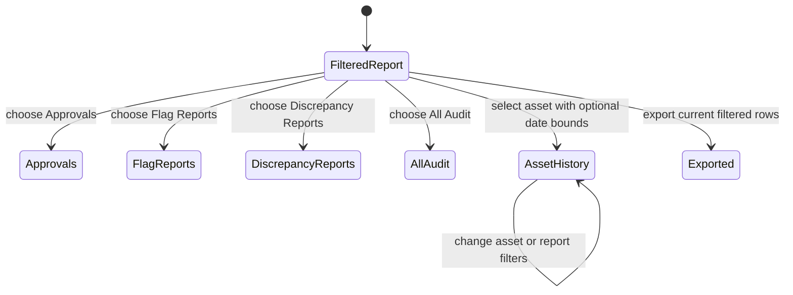

# Phase 4 — Report sections and vehicle trends

| | |
|---|---|
| Specification | [`../requirements.md`](../requirements.md) @ `dc16a58` · [`../design.md`](../design.md) @ `dc16a58` |
| Status | `Complete` (implementation and verification) |
| Started / Closed | `2026-10-07` / `2026-10-08` |
| Author | Codex agent |
| Reviewed by | Not reviewed |
| Signed off | Not signed off |
| Landed in | Not published |
| Covers | Requirements `1.5`, `1.7`, `2.1`, `2.5`, `3.5`, `3.6`, `4.1`, `4.2`, `5.1` |

## What this phase makes true

An overseer can focus Requests & Audit on approvals, flagged requests, or discrepancies while retaining the all-audit view for cancellations. Flagged requests keep their decision state, reason, and source links. Fueling Summary shades warned transaction rows by their Green or Red warning and leaves unflagged rows and monthly totals neutral. Asset Performance shows all retained activity for a selected asset by default, with optional date bounds, monthly delivered litres, and a separate vehicle efficiency trend for valid intervals.

## The rule, as observed

### Design vs. observed

| Specification edge | Observed | Verdict |
|---|---|---|
| `FilteredReport → Approvals` | The report button selected the approvals section; the seeded requests showed their current request and decision states. | As designed |
| `FilteredReport → FlagReports` | The seeded Red request and its decision appeared with warning reason and status. Automated tests cover section row membership and filtered export. | As designed |
| `FilteredReport → DiscrepancyReports` | The section is available as a distinct report view; automated tests cover discrepancy rows and their source details. | As designed |
| `FilteredReport → AllAudit` | The all-audit view remains available and cancellation rows are retained by the regression test. | As designed |
| `FilteredReport → AssetHistory` | The selected seeded asset opened without date bounds and rendered its monthly chart and activity rows. | As designed |
| `AssetHistory → AssetHistory` | Backend tests confirm optional one-sided dates, unbounded history, interval weighting, filters, and exports. | As designed |
| `FilteredReport → Exported` | Regression tests compare exported rows with the report's filtered source rows. | As designed |

## Frappe-first / native-first

| What we needed | Native mechanism used | Custom code, and why |
|---|---|---|
| Separate audit review views | Script Report filters and toolbar buttons | A shared section filter keeps source rows, shared filters, and standard export aligned. |
| Warning colors | Standard Script Report formatter and existing flag colors | The summary formatter applies a restrained full-row gradient from linked request warning metadata. |
| Asset trends | Native Script Report chart and chart data | A second chart uses monthly valid-interval km/L, separate from the delivered-litres scale. |

**Scope deliberately not taken:** no fourth report, no new roles, no location access changes, and no source-record edits for presentation.

## Verification

| # | Put the system in this state | Expect | Covers |
|---|---|---|---|
| 1 | As Fleet Admin, open Requests & Audit and choose All Audit, Approvals, Flag Reports, and Discrepancy Reports. | Each section shows only its matching rows; All Audit retains cancellation activity. Flag rows include warning reason, request/decision state, and source links. | `3.5`, `3.6`, `4.1` |
| 2 | Use Requests & Audit filters and export each selected section. | Dates, location, asset, fuel type, and station constrain rows and the standard export consistently; out-of-scope location access remains denied. | `1.5`, `4.1`, `4.2` |
| 3 | Open Fueling Summary for warned and unflagged fueling transactions. | Warned transaction detail rows receive the linked Green/Red gradient; unflagged rows and monthly totals remain neutral; export values and columns stay unchanged. | `1.7`, `4.1` |
| 4 | Select a vehicle in Asset Performance with both date filters blank, then set one or both bounds. | All retained history appears by default; monthly delivered litres and a separate km/L chart appear; months without valid intervals have no efficiency point. | `2.1`, `2.5` |
| 5 | Run the Requests & Audit, Asset Performance, and relevant Fueling Summary regression tests on the disposable MariaDB site. | Cancellation stays in audit and outside summary/performance totals; filters, exports, history, interval calculations, and warning metadata match their sources. | `1.5`, `1.7`, `2.1`, `2.5`, `3.5`, `3.6`, `4.1`, `4.2`, `5.1` |

**How to run it.** On the disposable test site run `bench --site fleet_management-test.localhost run-tests --module 'fleet_management.fleet_management.report.requests_&_audit.test_requests_audit'`, `bench --site fleet_management-test.localhost run-tests --module fleet_management.fleet_management.report.asset_performance.test_asset_performance`, and the two relevant Fueling Summary cases with `--test test_warning_metadata_is_only_attached_to_warned_detail_rows --test test_filters_match_source_totals_trend_details_and_export`. The browser walkthrough uses a Fleet Admin test login and the three standard report routes; no test records are created on the main site. Automated checks cover the report calculations, location permissions, source links, and export parity. The full app suite and pre-PR pipeline are outside this verification.

**Result:** Requests & Audit passed 3 unit and 3 integration tests; Asset Performance passed 10 unit and 6 integration tests; the focused Fueling Summary warning/filter-export checks passed 1 unit and 1 integration test. The browser walkthrough confirmed the distinct Requests & Audit buttons, warning reason and status on seeded Red flag rows, and an unbounded selected-asset report with its monthly chart. The current seed has no submitted fueling rows or valid vehicle interval for a live visual check of the row gradient or km/L chart point. The existing formatter and calculation checks passed. Migration and static quick checks passed; Ruff is unavailable. No test records were created on the main site.

## What we learned that the plan did not predict

- The test seed has flagged requests but no submitted fueling history, so the browser can confirm report navigation and audit detail but cannot show a colored fueling transaction row or a valid km/L interval.
- The test site's report runs are practical for isolated report suites; an unscoped test discovery run can fail on an unrelated missing optional `responses` dependency, so use the exact report module path.

## Known limitations — accepted, not fixed

- The full-row gradient and a valid-efficiency chart point were not visually observed in the current seed. The warning metadata, filter/export parity, interval arithmetic, and chart data are covered by focused automated checks; a future visual walkthrough needs a disposable seed containing a submitted warned fueling and a valid full-to-full interval.
- Ruff is unavailable in this environment.

## Review

| Round | Date | Verdict | Closed by |
|---|---|---|---|
| — | — | Not performed | — |

**Closure:** Implementation and verification are complete. No independent review, user sign-off, or publication occurred.

**Next:** Wait for the requester to ask to publish before starting the pre-PR pipeline.
