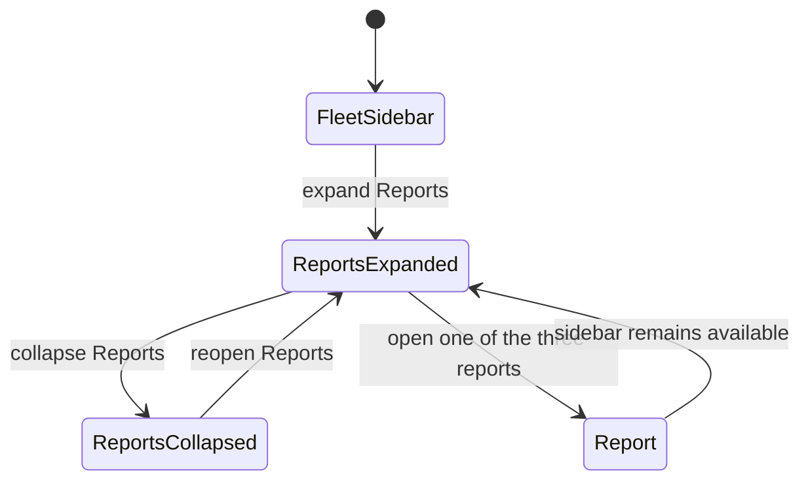

# Phase 5 — Persistent report navigation

| | |
|---|---|
| Specification | [`../requirements.md`](../requirements.md) · [`../design.md`](../design.md) |
| Status | `Complete` (implementation and verification) |
| Started / Closed | `2026-10-08` / `2026-10-08` |
| Author | Codex agent |
| Reviewed by | Not reviewed |
| Signed off | Not signed off |
| Landed in | Not published |
| Covers | Requirements `1.6`, `4.1`, `4.3` |

## What this phase makes true

Fleet Approver and Fleet Admin can open the three oversight reports from a persistent Reports group in the Fleet sidebar. They can expand or collapse the group and keep using it after opening a report. Users without report access do not receive those report links. This navigation change adds no report, role, or location access.

## The rule, as observed

### Design vs. observed

| Specification edge | Observed | Verdict |
|---|---|---|
| `FleetSidebar → ReportsExpanded` | The Reports group appears in Fleet Admin's Desk sidebar with all three report links. | As designed |
| `ReportsExpanded → ReportsCollapsed` | Clicking the group hides its children and changes its chevron to the closed state. | As designed |
| `ReportsCollapsed → ReportsExpanded` | Clicking again restores all three report links. | As designed |
| `ReportsExpanded → Report` | Fueling Summary opened from the group. | As designed |
| `Report → ReportsExpanded` | The persistent sidebar and its three links remained available on the report page. | As designed |

## Frappe-first / native-first

| What we needed | Native mechanism used | Custom code, and why |
|---|---|---|
| Persistent collapsible report group | Standard `Workspace Sidebar` with a Section Break and nested Report links | None; Frappe filters each report link by the current user's existing report permissions. |

**Scope deliberately not taken:** no fourth report, new role, report permission, location access rule, or test record on the main site.

## Verification

| # | Put the system in this state | Expect | Covers |
|---|---|---|---|
| 1 | In the disposable site, boot Desk as Fleet Approver or Fleet Admin. | Fleet sidebar contains a collapsible Reports group with Fueling Summary, Asset Performance, and Requests & Audit. | `4.1`, `4.3` |
| 2 | In the disposable site, boot Desk as Fleet User. | The sidebar contains no report links. | `4.3` |
| 3 | As Fleet Admin, open Fleet, collapse and reopen Reports, then open Fueling Summary. | The group toggles correctly and stays available on the report page. | `1.6`, `4.3` |

**How to run it.** Run `bench --site fleet_management-test.localhost run-tests --module fleet_management.tests.test_fleet_oversight_workspace` on the disposable MariaDB site. The integration check inspects the same per-user Desk boot payload used to build the sidebar and confirms exact report links for both permitted roles and none for Fleet User. For the live Desk check, sign in as the test Fleet Admin, open Fleet, toggle Reports closed and open, then open Fueling Summary from the group.

**Result:** Both Workspace integration tests passed. The Desk walkthrough showed the three links, confirmed collapse/reopen, and confirmed the sidebar persisted on Fueling Summary. Main and disposable test-site migrations passed with Locale matched. JSON validity, Python compilation, spec-check, and diff checks passed; Ruff is unavailable. No test records were created on the main site. The full app suite and pre-PR pipeline were not run.

## What we learned that the plan did not predict

- `Workspace Sidebar` JSON files are synchronized using their `modified` value when the stored document has no migration hash. The Fleet sidebar source timestamp must advance when editing an existing record so migration updates the site.
- The test runner's Desk boot payload includes dictionaries, not document objects; integration assertions should use key access for those items.

## Known limitations — accepted, not fixed

- No independent review or pre-PR pipeline was requested.

## Review

| Round | Date | Verdict | Closed by |
|---|---|---|---|
| — | — | Not performed | — |

**Closure:** Implementation and verification are complete. No independent review, user sign-off, or publication occurred.

**Next:** Wait for the requester to ask to publish before starting the pre-PR pipeline.
