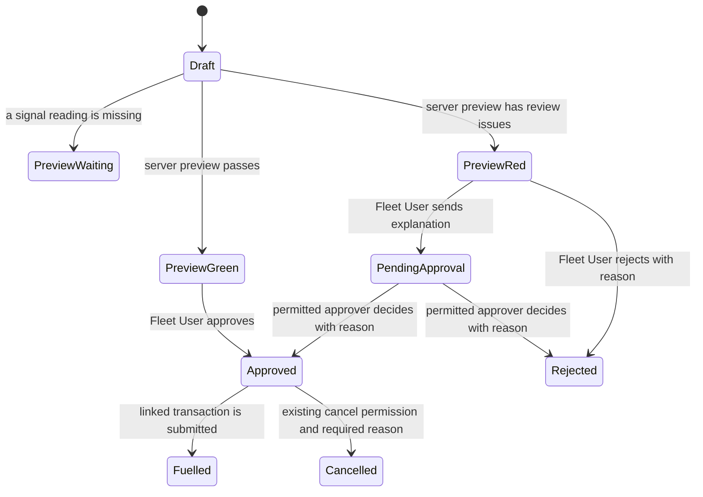

# Fuel Order experience: design

Approved by: pending

## Current state

Fuel Orders already select an asset first, fill assignment facts and the Previous Entry from server data, and store a server-calculated Green or Red signal. The calculation runs on save and approval; the form's introductory alert and its Signal fields repeat the result, and unsaved reading changes do not refresh it. The existing vehicle mileage check compares the current odometer with the latest submitted fueling reading, including a partial fueling, or the last approved order when there is no submitted fueling. Its comparator rounds the percentage difference to six decimal places before comparing it with the configured mileage margin.

Fueling Transactions already record actual fueling time, source, meter reading, litres, station, invoice identifiers, attendant, and signed evidence. A submitted transaction with Full Tank Confirmed, a vehicle odometer, positive litres, and a fueling time is a completed full-to-full interval. Cancelled transactions have `docstatus` 2 and are excluded from current Previous Entry and mileage interval queries. Fleet User, Fleet Approver, and Fleet Admin permissions and location checks are defined in the existing workflow, controllers, and permission hooks.

The Fuel Order currently has no separate partial-authorization reason. Validity extensions have a JSON history; print bookkeeping stores only the latest printed slip revision and time. Cancellation does not require a reason. Frappe's native Attach Image control offers a hover image preview for an attached image, so no custom image viewer is needed.

## Words in this request

| Requester's word | Means in this app |
|---|---|
| Previous Entry | The current existing reading source: the latest submitted Fueling Transaction, including a partial fueling, otherwise the latest approved Fuel Order, otherwise none. |
| Full-tank baseline | The latest submitted, non-cancelled vehicle Fueling Transaction that confirms a full tank and has its actual odometer and fueling date and time. |
| Recent average | The existing combined distance-over-litres average from up to five latest completed full-to-full vehicle intervals with positive recorded efficiency. |
| Vehicle target | The target km/L stored on the asset assignment snapshot and used when there is no recent average. |
| Signal issue | One reason returned by the shared server-side signal calculation, with the readings, comparison, limits, and next action that explain it. |
| Actual fueling | A submitted Fueling Transaction linked to an approved Fuel Order. It records what happened at the station; it does not change the authorization into a reconciliation record. |

## Decisions (locked)

- `D-1`: Show the four primary sections in the approved order and place Asset, Driver, and Actual Requester together when the available screen width supports it. Use Frappe column breaks so a narrow screen stacks the same fields.
- `D-2`: Keep the summary and system-supplied facts read-only. Put vehicle, assignment, Previous Entry, and supported estimates in a compact summary after an asset is selected; keep detailed system fields in a collapsible review section after the four primary sections.
- `D-3`: Use the native Attach Image preview for request evidence. Keep the existing private-file and image-type checks.
- `D-4`: Keep one visible signal panel after the last signal input. The preview calls the same server calculation used on save and approval. JavaScript only requests and displays the result; it does not reproduce signal rules.
- `D-5`: Treat a red signal as a review flag, not a validation or permission failure. Preserve the current green approval, red sign-off, rejection, and approver decision actions.
- `D-6`: Add the full-tank mileage check beside the existing mileage check. It uses the latest qualifying full-tank transaction, ignores later partial litres and readings, and uses the existing `round(variance, 6) > margin` comparison, so an exact margin passes.
- `D-7`: For the new check, estimate remaining litres as capacity × gauge percent ÷ 100, estimated consumption as capacity minus remaining litres, and expected distance as the applicable average × estimated consumption. Prefer the usable recent average, otherwise the usable vehicle target. A baseline with neither usable average is its own red cannot-calculate reason. No baseline skips only this new check.
- `D-8`: Generators receive neither vehicle-odometer mileage check. Their existing generator checks remain in place.
- `D-9`: Recompute the signal and full-tank result server-side before approval, then freeze the approved signal, source readings, baseline, and result. Leave existing Previous Entry behavior and source records unchanged.
- `D-10`: Keep existing roles, row permissions, location scope, evidence gates, and cancel permissions. Require a reason before a permitted user cancels an order or fueling transaction.
- `D-11`: Keep invoice discrepancies, late-entry rules, meter resets, and cost fields out of this change. Do not alter submitted fueling facts.

## Decisions awaiting the requester

- `Q-1`: Whether issue history records the first saved appearance and later snapshots only when captured readings or limits change, deduplicates identical saves, and records resolution separately.
- `Q-2`: Whether a baseline with unusable tank-capacity or gauge information adds a red cannot-calculate reason or skips the new check.
- `Q-3`: Whether zero estimated consumption adds a red cannot-calculate reason or skips the new check.

These decisions must be answered before their behavior is implemented. They do not block the entry-form work.

## Design

The unsaved preview is display-only. Save and approval run the same calculation again using server-sourced assignment, transaction history, economy, settings, and permissions. A whitelisted POST method combines unsaved fields with those server facts; it returns a waiting result when the asset, meter, or vehicle gauge is missing. The result includes a structured explanation, exact source inputs, and applicable limits. JavaScript only requests and renders that response. The full-tank source and calculated result become part of the approved snapshot. A linked transaction remains the source of actual fueling facts.

## Frappe-first

| What we need | Native Frappe mechanism | Custom code, and why it is unavoidable |
|---|---|---|
| Four sections, responsive columns, read-only review area, and conditional fields | DocType Section Break, Column Break, `depends_on`, `mandatory_depends_on`, and a collapsible review section | A small form script is needed for the asset summary, dynamic meter label, and asynchronous panel refresh. |
| Inspect request photos | Attach Image hover preview | None. |
| Signal calculation on save | Existing server calculation and read-only fields | Extend its shared result with explanatory facts and the new full-tank check. |
| Unsaved signal preview | Frappe form call to a whitelisted server method | The server method must combine unsaved readings with authoritative database facts and return the shared calculation result. |
| Full-tank baseline | Submitted Fueling Transaction rows and existing full-to-full intervals | A distinct calculation and approved snapshot are required; Previous Entry must retain its current behavior. |
| Durable issue and action history | Frappe Version history remains enabled | A dedicated append-only history record is needed because Version does not snapshot signal inputs, explanation, decision, cancellation reason, every print, and actual-fueling evidence as one event. Its read access must follow the linked Fuel Order's existing location scope. |
| Cancellation reason | Existing cancel action and controller lifecycle | A reason prompt and server-side cancellation gate are required; permission to cancel does not change. |

## Data and migration plan

Add a Partial Authorization Reason to Fuel Order. Add a Long Text field for all saved signal reason text and a server-managed structured signal snapshot with source readings and limits. Add server-managed full-tank baseline and calculation snapshot fields to Fuel Order; protect them with the existing approved-snapshot immutability rules. Add server-managed staging fields for cancellation reasons, and add a read-only history record linked to its Fuel Order and, where relevant, Fueling Transaction.

Existing approved orders and submitted Fueling Transactions keep their saved values. No new full-tank result is backfilled onto an approved order. Existing extension JSON remains intact; future extensions also create a history event. Existing printed revision fields keep their current transaction-submission purpose; each later print request adds a separate history event. New cancellations require a reason; prior cancellation records are not rewritten. Actual fueling values and evidence remain on the submitted Fueling Transaction.

## Correctness properties

### Property 1: Existing mileage check is unchanged

For every vehicle order, the existing check uses its current Previous Entry, economy source, missing-data behavior, and six-decimal rounded margin comparator, regardless of the separate full-tank result. A partial transaction can affect the old Previous Entry and cannot affect the new baseline or estimated consumed litres.

**Validates: Requirements 3.2, 4.2, 4.3**

### Property 2: Full-tank baseline is the latest qualifying transaction

For every vehicle, the new check uses the latest submitted, non-cancelled qualifying full-tank transaction by fueling time and never resets its baseline from a partial or cancelled transaction. With no baseline it adds no new-check reason. A generator never receives either vehicle mileage reason.

**Validates: Requirements 4.1, 4.3, 4.4, 4.6**

### Property 3: Server result matches preview, save, and approval snapshot

For every complete set of order readings and server facts, preview and save use the same calculation. Approval recalculates it, rejects a client override, and freezes the resulting signal and full-tank source and values against later changes.

**Validates: Requirements 2.2, 3.1, 4.5**

### Property 4: History is append-only and permission-scoped

For every saved issue or action, its actor, time, source values, reason, and evidence reference remain readable to users who can read the linked order and unavailable to users outside that order's location scope. A later event never edits an earlier event.

**Validates: Requirements 5.1, 5.2, 5.3, 5.4, 5.5**

## Errors and permissions

Missing meter or vehicle gauge readings produce a clear waiting message in the preview and remain subject to the existing server validation when the order leaves Draft. A red signal is reviewable and does not bypass or replace validation. Incomplete or unusable full-tank inputs follow the pending business decisions above; a missing baseline is a skip for only the new check.

Do not add roles or widen access. Fleet User, Fleet Approver, and Fleet Admin retain their current Fuel Order and Fueling Transaction permissions and location scope. History reads require access to the linked Fuel Order. Cancellation reasons are mandatory only when an actor already allowed to cancel uses that action. Evidence remains private and attached to its original order or transaction.
