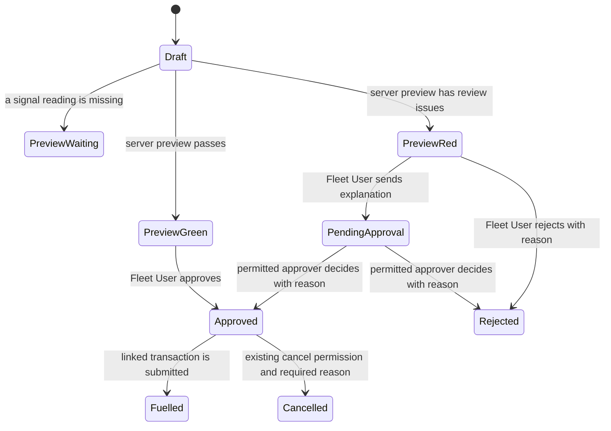

# Fuel Order experience: design

Approved by: pending

## Current state

Fuel Orders already select an asset first, fill assignment facts and the Previous Entry from server data, and store a server-calculated Green or Red signal. The calculation runs on save and approval; the form's introductory alert and its Signal fields repeat the result, and unsaved reading changes do not refresh it. The existing vehicle mileage check compares the current odometer with the latest submitted fueling reading, including a partial fueling, or the last approved order when there is no submitted fueling. Its comparator rounds the percentage difference to six decimal places before comparing it with the configured mileage margin.

Fueling Transactions already record actual fueling time, source, meter reading, litres, station, invoice identifiers, attendant, and signed evidence. A submitted transaction with Full Tank Confirmed, a vehicle odometer, positive litres, and a fueling time is a completed full-to-full interval. Cancelled transactions have `docstatus` 2 and are excluded from current Previous Entry and mileage interval queries. Fleet User, Fleet Approver, and Fleet Admin permissions and location checks are defined in the existing workflow, controllers, and permission hooks.

The Fuel Order currently has no separate partial-authorization reason. Validity extensions have a JSON history; print bookkeeping stores only the latest printed slip revision and time. Cancellation does not require a reason. Frappe's native Attach Image control offers a hover image preview for an attached image, so no custom image viewer is needed.

## Words in this request

| Requester's word | Means in this app |
|---|---|
| Previous Entry | The current existing reading source: the latest submitted Fueling Transaction, including a partial fueling, otherwise the latest approved Fuel Order, otherwise none. It is the fallback baseline for the new comparison when no Full-authorized transaction baseline exists. |
| Full-tank baseline | The latest submitted, non-cancelled vehicle Fueling Transaction linked to a Fuel Order with Full quantity authorization; its actual odometer and fueling date and time are used. The prior order's gauge and the transaction's Full Tank Confirmed field do not select this baseline. |
| Recent average | The existing combined distance-over-litres average from up to five latest completed full-to-full vehicle intervals with positive recorded efficiency. |
| Vehicle target | The target km/L stored on the asset assignment snapshot and used when there is no recent average. |
| Signal issue | One reason returned by the shared server-side signal calculation, with the readings, comparison, limits, and next action that explain it. |
| Actual fueling | A submitted Fueling Transaction linked to an approved Fuel Order. It records what happened at the station; it does not change the authorization into a reconciliation record. |

## Decisions (locked)

- `D-1`: Show the four primary sections in the approved order and place Asset, Driver, and Actual Requester in the first row when the screen allows. Pair each applicable meter reading with its photo. Keep long approval notes in a two-column group. Use Frappe column breaks with a scoped layout rule for three columns on wide screens, two at medium widths, and one on narrow screens; hide the vehicle-only reading column break for generators.
- `D-2`: Keep the summary and system-supplied facts read-only. Put vehicle, assignment, Previous Entry, and supported estimates in a compact responsive summary after the Vehicle and Order section. Keep detailed system fields in a collapsible review section outside the entry path; collapse it by default, align it to the top of the form in the separate far-right fourth column on wide screens, and place it after the four primary sections at medium and narrow widths without narrowing required entry controls or causing horizontal overflow.
- `D-3`: Use the native Attach Image preview for request evidence. Keep the existing private-file and image-type checks.
- `D-4`: Keep one visible signal and flagged-reasons panel after the last input that affects the calculation, including quantity authorization when applicable. Place it in the Quantity, Approval and Audit section after the conditional partial amount and reason. The preview calls the same server calculation used on save and approval. JavaScript only requests and displays the result; it does not reproduce signal rules.
- `D-5`: Treat a red signal as a review flag, not a validation or permission failure. Preserve the current green approval, red sign-off, rejection, and approver decision actions.
- `D-6`: Add the full-tank mileage check beside the existing mileage check. It prefers the latest submitted, non-cancelled transaction linked to a Fuel Order with Full quantity authorization; the prior order's gauge and the transaction's Full Tank Confirmed field do not select that baseline. If no Full baseline exists, use and identify the existing Previous Entry as the fallback; skip the new check only when neither source exists. It ignores later Partial-authorized transaction litres and readings after a Full baseline is selected and uses the existing `round(variance, 6) > margin` comparison, so an exact margin passes. Keep the existing mileage check and its behavior unchanged.
- `D-7`: For the new check, estimate remaining litres from the current order's gauge as capacity × gauge percent ÷ 100, estimated consumption as capacity minus remaining litres, and expected distance as the applicable average × estimated consumption. Prefer the usable recent average, otherwise the usable vehicle target. A selected baseline with unusable capacity or gauge data, no usable average, or zero estimated consumption gets its own red cannot-calculate reason. A gauge not entered yet remains in the existing waiting state. No Full baseline falls back to Previous Entry; skip only when neither baseline is available.
- `D-8`: Generators receive neither vehicle-odometer mileage check. Their existing generator checks remain in place.
- `D-9`: Recompute the signal and full-tank result server-side before approval, then freeze the approved signal, source readings, baseline, and result. Leave existing Previous Entry behavior and source records unchanged.
- `D-10`: Keep existing roles, row permissions, location scope, evidence gates, and cancel permissions. Require a reason before a permitted user cancels an order or fueling transaction.

**Confirmed:** The earlier Full-authorized fueling and its actual odometer establish the baseline; its gauge does not select the baseline. The current order's gauge estimates fuel used so the check can flag usage. When no Full-authorized source exists, use the existing Previous Entry fallback and identify it. Unusable tank capacity or gauge data with a selected baseline produces a red cannot-calculate reason; a gauge not yet entered stays in the existing waiting state.
- `D-11`: Keep invoice discrepancies, late-entry rules, meter resets, and cost fields out of this change. Do not alter submitted fueling facts.
- `D-12`: Start an issue episode on its first saved Red result. Append another issue snapshot only when the saved explanation or its relevant readings or limits change, deduplicate unchanged saves, and record resolution when a later saved Green result clears the episode. Link each decision to its latest issue snapshot and start a new issue episode if Red returns after resolution.
- `D-13`: Show the vehicle target, the recent weighted average only when qualifying completed intervals exist, and the economy selected for the checks as separate, source-labelled values. Never label a target fallback as a recent average or an estimated current-order comparison as observed consumption.
- `D-14`: Explain a flagged own-trend comparison with the recent weighted reference, latest observed full-to-full interval, equivalent L/km and L/100 km values, direction and percentage of difference, and configured margin. Keep the existing trend comparator unchanged.
- `D-15`: Keep the request date and time blank and read-only until the server sets it on first save. When a person changes or clears the asset, clear dependent readings, evidence, assignment suggestions, participant defaults, and station selection before loading that asset's facts. Company Representative remains independent of the asset; Driver and Actual Requester remain independently editable after the defaults in D-16 are applied.
- `D-16`: When Asset changes, default both Driver and Actual Requester to the newly selected asset's effective-assignment Custodian. If no effective custodian exists, leave both blank. Keep both fields required and independently editable; preserve user edits until another Asset change. Never default Actual Requester to the logged-in user. Keep Custodian read-only and preserve server-side assignment authority.
- `D-17`: Give each Fuel Order section and field control a visible theme-aware border, including read-only fields. Retain Frappe's focus indication and existing control behavior.

## Design

The unsaved preview is display-only. Save and approval run the same calculation again using server-sourced assignment, transaction history, economy, settings, and permissions. A whitelisted POST method combines unsaved fields with those server facts; it returns a waiting result when the asset, meter, or vehicle gauge is missing. The result includes a structured explanation, exact source inputs, and applicable limits. JavaScript only requests and renders that response. The full-tank source and calculated result become part of the approved snapshot. A linked transaction remains the source of actual fueling facts.

Each saved Red result records an immutable signal issue event with its full explanation, captured order and signal facts, actor, time, and evidence references. An unchanged issue fingerprint deduplicates repeated saves; a changed explanation or relevant displayed readings or limits adds a new event in the same issue episode. A later saved Green result adds a separate resolution linked to the latest issue event. A later Red after resolution starts a new issue key. Workflow decision events link to the latest issue event so reviewers can follow the explanation behind the decision.

## Frappe-first

| What we need | Native Frappe mechanism | Custom code, and why it is unavoidable |
|---|---|---|
| Four sections, responsive columns, read-only review area, and conditional fields | DocType Section Break, Column Break, `depends_on`, `mandatory_depends_on`, and a collapsible review section | A small form script renders the read-only asset summary and dynamic meter label; scoped CSS moves three-column groups through two and one columns at smaller widths. |
| Inspect request photos | Attach Image hover preview | None. |
| Signal calculation on save | Existing server calculation and read-only fields | Extend its shared result with explanatory facts and the new full-tank check. |
| Unsaved signal preview | Frappe form call to a whitelisted server method | The server method must combine unsaved readings with authoritative database facts and return the shared calculation result. |
| Full-tank baseline | Submitted Fueling Transaction rows and existing full-to-full intervals | A distinct calculation and approved snapshot are required; Previous Entry must retain its current behavior. |
| Durable issue and action history | Frappe Version history remains enabled | A dedicated append-only history record is needed because Version does not snapshot signal inputs, explanation, decision, cancellation reason, every print, and actual-fueling evidence as one event. Its read access must follow the linked Fuel Order's existing location scope. |
| Cancellation reason | Existing cancel action and controller lifecycle | A reason prompt and server-side cancellation gate are required; permission to cancel does not change. |

## Data and migration plan

Add a Partial Authorization Reason to Fuel Order. Add a Long Text field for all saved signal reason text and a server-managed structured signal snapshot with source readings and limits. Add server-managed full-tank baseline and calculation snapshot fields to Fuel Order; protect them with the existing approved-snapshot immutability rules. Stage cancellation reasons briefly in a user- and document-scoped server cache entry so the native cancel request can consume them. Add a read-only history record linked to its Fuel Order and, where relevant, Fueling Transaction.

Existing approved orders and submitted Fueling Transactions keep their saved values. No new full-tank result is backfilled onto an approved order. Existing extension JSON remains intact; future extensions also create a history event. Existing printed revision fields keep their current transaction-submission purpose; each later print request adds a separate history event. New cancellations require a reason; prior cancellation records are not rewritten. Actual fueling values and evidence remain on the submitted Fueling Transaction.

## Correctness properties

### Property 1: Existing mileage check is unchanged

For every vehicle order, the existing check uses its current Previous Entry, economy source, missing-data behavior, and six-decimal rounded margin comparator, regardless of the separate full-tank result. A partial transaction can affect the old Previous Entry and cannot affect the new baseline or estimated consumed litres.

**Validates: Requirements 3.2, 4.2, 4.3**

### Property 2: Full-tank baseline is the latest qualifying transaction

For every vehicle, the new check prefers the latest submitted, non-cancelled transaction linked to a Full-authorized Fuel Order by actual fueling time; the transaction's Full Tank Confirmed field and the prior order's gauge do not determine it. If no such transaction exists, it uses and identifies the existing Previous Entry. A transaction linked to a Partial-authorized order or a cancelled transaction never replaces an available Full baseline. With neither source, it adds no new-check reason. A generator never receives either vehicle mileage reason.

**Validates: Requirements 4.1, 4.3, 4.4, 4.6**

### Property 3: Server result matches preview, save, and approval snapshot

For every complete set of order readings and server facts, preview and save use the same calculation. Approval recalculates it, rejects a client override, and freezes the resulting signal and full-tank source and values against later changes.

**Validates: Requirements 2.2, 3.1, 4.5**

### Property 4: History is append-only and permission-scoped

For every saved issue or action, its actor, time, source values, reason, and evidence reference remain readable to users who can read the linked order and unavailable to users outside that order's location scope. Identical saved signal results do not create duplicate issue entries; changed issue snapshots and later resolutions link to the earlier event. A later event never edits an earlier event.

**Validates: Requirements 5.1, 5.2, 5.3, 5.4, 5.5**

## Errors and permissions

Missing meter or vehicle gauge readings produce a clear waiting message in the preview and remain subject to the existing server validation when the order leaves Draft. A red signal is reviewable and does not bypass or replace validation. A selected mileage baseline with unusable capacity or gauge input, no usable economy, or zero estimated consumption produces a red cannot-calculate reason; a missing baseline is a skip only when there is no Previous Entry fallback either.

Do not add roles or widen access. Fleet User, Fleet Approver, and Fleet Admin retain their current Fuel Order and Fueling Transaction permissions and location scope. History reads require access to the linked Fuel Order. Cancellation reasons are mandatory only when an actor already allowed to cancel uses that action. Evidence remains private and attached to its original order or transaction.
