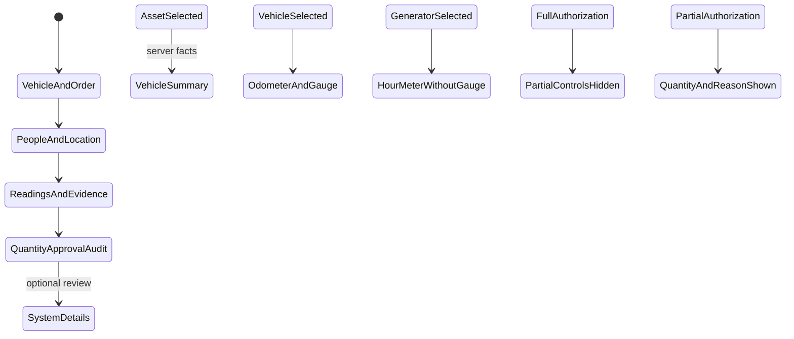

# Phase 1 — Entry form

| | |
|---|---|
| Specification | [`../requirements.md`](../requirements.md) @ working tree |
| Status | Built and database-verified; Fleet User walkthrough completed at wide, medium, and phone widths |
| Started / Closed | 2026-10-02 / — |
| Author | Codex |
| Reviewed by | — |
| Signed off | — |
| Landed in | — |
| Covers | Requirements 1.1–1.8 and 3.3 |

## What this phase makes true

Fuel Order has the four named primary sections in order. Asset, Driver, and Actual Requester share the first row. A read-only responsive summary follows Vehicle and Order and groups vehicle facts, assignment, Previous Entry, and supported estimates. Three-column groups become two columns at medium widths and one column on narrow screens. Meter readings pair with their evidence; the generator hides the vehicle-only gauge column. Approval notes use two columns. Meter wording changes to Odometer or Hour Meter. Partial litres and their separate reason appear only for Partial authorization; the server requires the amount and a specific reason before a Partial order leaves Draft. Quantity authorization, signal, approval, and issue/action history are grouped before collapsible system details.

## The rule, as observed

### Design vs. observed

| Specification edge | Observed | Verdict |
|---|---|---|
| Four named primary sections appear in the required order | `test_entry_form_groups_and_conditions_review_fields` checks the DocType metadata | Verified by automated test |
| Asset, Driver, Actual Requester share the first row; wide/medium/narrow layouts use three/two/one columns | DocType column breaks and scoped CSS provide the breakpoints | Observed at 1440 px (three columns), 900 px (two columns), and 390 px (one column); phone `scrollWidth` and `clientWidth` both measured 390 px |
| Vehicle assignment, Previous Entry, and supported estimates appear in a read-only summary | The summary reads the existing server-filled read-only fields and escapes displayed values | Observed summary updated on Asset change; absent history showed “No previous entry” and “Not available,” not 0 km |
| Vehicle and generator meter labels differ; gauge is vehicle-only | Form script sets the label from the server-supplied asset type; gauge and gauge photo use vehicle dependencies | Observed Odometer and vehicle gauge/photo fields for vehicles; Hour Meter and no gauge/economy fields for the generator |
| Full hides Partial controls; Partial shows them and requires a reason before leaving Draft | Conditional DocField metadata and `test_partial_authorization_requires_reason_before_leaving_draft` | Verified by automated test |
| Request photo uses Frappe's native preview | The installed Attach Image control implements its existing hover preview; the order field remains Attach Image | Opened existing meter and gauge attachments from the form; each rendered as an image in a separate tab |
| System details are outside the primary sections and collapsible | DocType metadata check confirms the extra collapsible System Details section follows the four entry sections | Expanded in Desk: asset and print snapshots appeared; with no Previous Entry, the default zero meter and blank date fields were hidden while the summary showed “No previous entry” |

## Frappe-first / native-first

| What we needed | Native mechanism used | Custom code, and why |
|---|---|---|
| Four sections and responsive columns | DocType Section Break and Column Break | Scoped CSS adjusts three-column groups to two and one columns at smaller widths. |
| Conditional gauge and Partial fields | `depends_on` and `mandatory_depends_on` | Server validation remains authoritative. |
| Inspect request photos | Frappe Attach Image hover preview | None. |
| Vehicle summary and dynamic meter wording | Existing server facts and Frappe form events | A compact summary renderer groups returned read-only facts; the existing event labels the meter by asset type. |

**Scope deliberately not taken:** No change to who can create or decide an order, location scoping, evidence privacy, or the approval-slip layout.

## Verification

On 05/10/2026, `test_fuel_order` passed **28/28 integration tests** on the disposable `fleet_management-test.localhost` MariaDB site using this 009 worktree. Coverage includes section and field order, read-only system snapshots, editable required participants, no requester/representative/request-time defaults, server-set request time preserved on later save, editable meter and evidence fields, Partial visibility and reason requirements, effective assignment facts, and suggesting a station only when exactly one eligible station exists. The site received a focused `reload-doc fleet_management doctype fuel_order` before the run.

Python compilation, JavaScript syntax, DocType JSON parsing, `e2e/sid.ts` import, `git diff --check`, and spec-check passed. The spec checker retains filename-based coverage warnings for requirements covered from existing test modules. No full suite was run.

The Fleet User walkthrough used a non-debug Gunicorn server bound only to `127.0.0.1:18001`, with the 009 worktree and disposable MariaDB test site. On a new order, Actual Requester and Company Representative stayed blank and editable, Driver and Operational Location received the asset's usual suggestions, Custodian stayed read-only, and Planned Station stayed blank where multiple eligible stations existed. Changing from KDA to KDJ replaced John Mwangi with Samuel Kiprono and cleared the odometer, gauge, and photos. Full hid Partial Litres and its reason; Partial displayed both after Quantity Authorization and those controls remained visible across the asset change. The existing native Meter Photo and Gauge Photo links opened real image previews from copied test fixtures in the temporary shadow site; no order was saved or changed. The responsive screenshots showed the required 3/2/1 columns. The saved sample form displayed its server-set Request Date and Time read-only. When `previous_entry_source` is `none`, the main summary displays “No previous entry” and “Not available”; System Details now hides the zero-valued meter and empty date fields for that case.

An earlier full migration attempt ended during Frappe orphan cleanup (`Module None not found`) and a prior main-site migration placed Fueling Summary and Asset Performance in Frappe's recovery bin. Neither was restored or changed in this task. No functional/database tests or migrations ran against the main site during this verification.

## What we learned that the plan did not predict

This Frappe version supports collapsible sections and remembers a user's collapsed state, but has no DocField setting to start a section collapsed. System Details therefore remains a separate collapsible section. The installed Attach Image control supports a hover preview, so a custom image viewer is unnecessary. A pre-existing Partial approval-slip test needed a specific reason after this rule became server-enforced.

## Known limitations — accepted, not fixed

- The collapsible System Details section was present after the four primary sections; its review data remain available outside the entry path.

## Review

| Round | Date | Verdict | Closed by |
|---|---|---|---|

**Closure:** Not reviewed.

**Next:** Independent review remains; no further Phase 1 walkthrough is pending.
