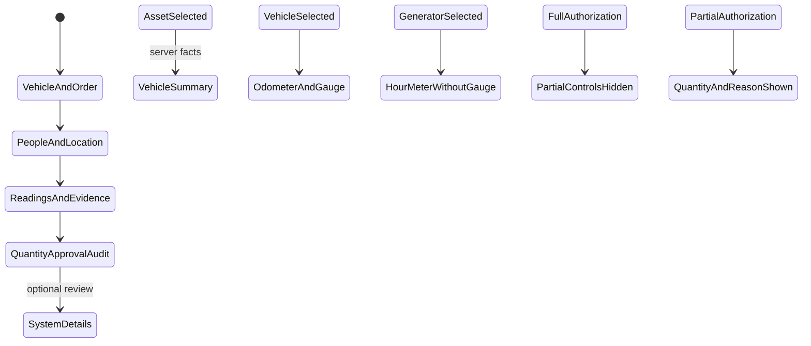

# Phase 1 — Entry form

| | |
|---|---|
| Specification | [`../requirements.md`](../requirements.md) @ working tree |
| Status | Built; automated checks pass; Desk walkthrough pending a server serving this worktree |
| Started / Closed | 2026-10-02 / — |
| Author | Codex |
| Reviewed by | — |
| Signed off | — |
| Landed in | — |
| Covers | Requirements 1.1–1.8 and 3.3 |

## What this phase makes true

Fuel Order has the four named primary sections in order. Asset, Driver, and Actual Requester share the first row. A read-only responsive summary follows Vehicle and Order and groups vehicle facts, assignment, Previous Entry, and supported estimates. Three-column groups become two columns at medium widths and one column on narrow screens. Meter readings pair with their evidence; the generator hides the vehicle-only gauge column. Approval notes use two columns. Meter wording changes to Odometer or Hour Meter. Partial litres and their separate reason appear only for Partial authorization; the server requires the amount and a specific reason before a Partial order leaves Draft. Quantity authorization, signal, approval, and issue/action history are grouped before collapsible system details.

## The rule, as observed

### Design vs. observed

| Specification edge | Observed | Verdict |
|---|---|---|
| Four named primary sections appear in the required order | `test_entry_form_groups_and_conditions_review_fields` checks the DocType metadata | Verified by automated test |
| Asset, Driver, Actual Requester share the first row; wide/medium/narrow layouts use three/two/one columns | DocType column breaks and scoped CSS provide the breakpoints | Static layout review passes; visible alignment awaits Desk walkthrough |
| Vehicle assignment, Previous Entry, and supported estimates appear in a read-only summary | The summary reads the existing server-filled read-only fields and escapes displayed values | Code and static checks pass; visible rendering awaits Desk walkthrough |
| Vehicle and generator meter labels differ; gauge is vehicle-only | Form script sets the label from the server-supplied asset type; gauge and gauge photo use vehicle dependencies | Metadata and code checked; visible behavior awaits Desk walkthrough |
| Full hides Partial controls; Partial shows them and requires a reason before leaving Draft | Conditional DocField metadata and `test_partial_authorization_requires_reason_before_leaving_draft` | Verified by automated test |
| Request photo uses Frappe's native preview | The installed Attach Image control implements its existing hover preview; the order field remains Attach Image | Native control confirmed; visible interaction awaits Desk walkthrough |
| System details are outside the primary sections and collapsible | DocType metadata check confirms the extra collapsible System Details section follows the four entry sections | Verified by automated test |

## Frappe-first / native-first

| What we needed | Native mechanism used | Custom code, and why |
|---|---|---|
| Four sections and responsive columns | DocType Section Break and Column Break | Scoped CSS adjusts three-column groups to two and one columns at smaller widths. |
| Conditional gauge and Partial fields | `depends_on` and `mandatory_depends_on` | Server validation remains authoritative. |
| Inspect request photos | Frappe Attach Image hover preview | None. |
| Vehicle summary and dynamic meter wording | Existing server facts and Frappe form events | A compact summary renderer groups returned read-only facts; the existing event labels the meter by asset type. |

**Scope deliberately not taken:** No change to who can create or decide an order, location scoping, evidence privacy, or the approval-slip layout.

## Verification

On 05/10/2026, `fleet_management.fleet_management.doctype.fuel_order.test_fuel_order` passed **28/28 integration tests** on the disposable `fleet_management-test.localhost` MariaDB site. The run includes metadata assertions for the four primary sections, paired meter/evidence fields, a vehicle-only gauge column, quantity and approval grouping, signal placement, and collapsible history before System Details, along with the existing request, permission, evidence, approval, extension, and slip behavior. The test site received a focused `reload-doc fleet_management doctype fuel_order` from this worktree before the run.

The requested visual walkthrough could not be completed. The test site redirects to its sign-in page, and the required local `specs/001-fleet-fuel-management/verification/CREDENTIALS.md` is missing from both worktrees. No test account or password was invented, and no new sample user was added. The site rebuild helper also requires that missing file. A full migration on the disposable site exited with `Module None not found` during Frappe's orphan cleanup. A focused `reload-doc fleet_management doctype fuel_order` then synced the intended 009 form fields from this worktree; the tests below ran against that metadata. A migration of the local main site reached the same orphan cleanup error; no tests ran there. It placed `Fueling Summary` and `Asset Performance` in Frappe's recovery bin, and their restoration is pending the requester. The missing cleanup condition was not repaired.

For the 05/10/2026 UI refinement, DocType JSON validation, JavaScript syntax, Python hook/test-file compilation, `git diff --check`, and `spec-check` passed. The spec checker reports filename-based test-coverage warnings for existing requirements and properties. The focused integration run and metadata reload targeted only the disposable test site; no tests or migration ran on the main site. The shared Desk server serves the separate `feature/008-overseer-reports` checkout rather than this 009 worktree, so it cannot show these edits.

Update 05/10/2026: `e2e/sid.ts` provides passwordless test login, so the login inventory is not the remaining blocker. The shared Desk server is attached to the separate `feature/008-overseer-reports` checkout and cannot verify this 009 worktree. The absent credential inventory still prevents a fresh disposable-site rebuild.

## What we learned that the plan did not predict

This Frappe version supports collapsible sections and remembers a user's collapsed state, but has no DocField setting to start a section collapsed. System Details therefore remains a separate collapsible section. The installed Attach Image control supports a hover preview, so a custom image viewer is unnecessary. A pre-existing Partial approval-slip test needed a specific reason after this rule became server-enforced.

## Known limitations — accepted, not fixed

- The three/two/one column breakpoints, summary-card rendering, meter-label changes, and image hover preview remain visually unverified. Passwordless test login is available through `e2e/sid.ts`, but the shared Desk server serves the separate `feature/008-overseer-reports` checkout rather than this 009 worktree. The missing credential inventory still prevents a fresh disposable-site rebuild.

## Review

| Round | Date | Verdict | Closed by |
|---|---|---|---|

**Closure:** Not reviewed.

**Next:** Complete the Fleet User Desk walkthrough against a test server serving this 009 worktree at wide, medium, and phone widths. The earlier Phase 1 automated checks passed; this visual refinement still needs a Desk walkthrough.
