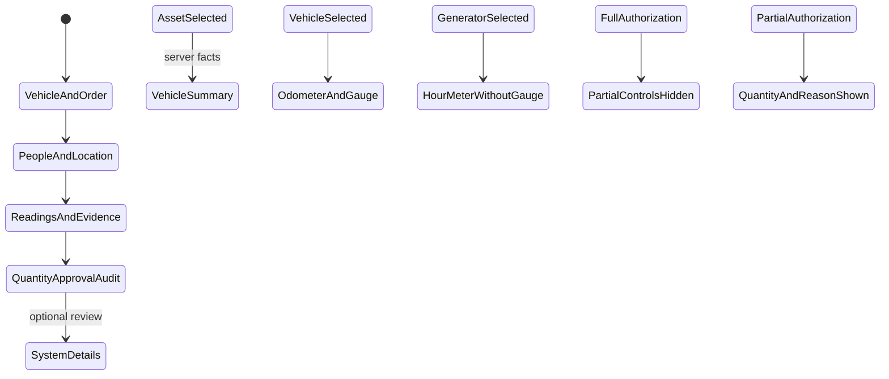

# Phase 1 — Entry form

| | |
|---|---|
| Specification | [`../requirements.md`](../requirements.md) @ working tree |
| Status | Built; automated checks pass; Desk walkthrough blocked |
| Started / Closed | 2026-10-02 / — |
| Author | Codex |
| Reviewed by | — |
| Signed off | — |
| Landed in | — |
| Covers | Requirements 1.1–1.8 and 3.3 |

## What this phase makes true

Fuel Order has the four named entry sections in order. Asset, Driver, and Actual Requester are in three Frappe columns in the first section, which stack at narrow widths. Selecting an asset fills server-sourced, read-only vehicle, assignment, Previous Entry, and estimate fields. Meter wording changes to Odometer or Hour Meter. Gauge controls are vehicle-only. Partial litres and their separate reason appear only for Partial authorization, and the server requires the amount and a specific reason before a Partial order leaves Draft. System and print details remain available in a collapsible section after the entry path.

## The rule, as observed

### Design vs. observed

| Specification edge | Observed | Verdict |
|---|---|---|
| Four named primary sections appear in the required order | `test_entry_form_groups_and_conditions_review_fields` checks the DocType metadata | Verified by automated test |
| Asset, Driver, Actual Requester occupy the first three columns | Metadata order and server-provided asset facts are covered by the Fuel Order integration module | Code and automated coverage pass; visible alignment awaits Desk walkthrough |
| Vehicle assignment, Previous Entry, and supported estimate fields are read-only | Metadata checks cover their read-only flags; `get_request_facts` tests cover the selected vehicle facts | Verified by automated test |
| Vehicle and generator meter labels differ; gauge is vehicle-only | Form script sets the label from the server-supplied asset type; gauge and gauge photo use vehicle dependencies | Metadata and code checked; visible behavior awaits Desk walkthrough |
| Full hides Partial controls; Partial shows them and requires a reason before leaving Draft | Conditional DocField metadata and `test_partial_authorization_requires_reason_before_leaving_draft` | Verified by automated test |
| Request photo uses Frappe's native preview | The installed Attach Image control implements its existing hover preview; the order field remains Attach Image | Native control confirmed; visible interaction awaits Desk walkthrough |
| System details are outside the primary sections and collapsible | DocType metadata check confirms the extra collapsible System Details section follows the four entry sections | Verified by automated test |

## Frappe-first / native-first

| What we needed | Native mechanism used | Custom code, and why |
|---|---|---|
| Four sections and responsive columns | DocType Section Break and Column Break | None. |
| Conditional gauge and Partial fields | `depends_on` and `mandatory_depends_on` | Server validation remains authoritative. |
| Inspect request photos | Frappe Attach Image hover preview | None. |
| Vehicle summary and dynamic meter wording | Existing server facts and Frappe form events | The form displays the returned read-only facts and labels the meter by asset type. |

**Scope deliberately not taken:** No change to who can create or decide an order, location scoping, evidence privacy, or the approval-slip layout.

## Verification

The `fleet_management.fleet_management.doctype.fuel_order.test_fuel_order` module passed **28/28 integration tests** on `fleet_management-test.localhost`. It covers the metadata and Partial reason tests added in this phase, plus the existing request, permission, evidence, approval, extension, and slip behavior. JSON validation and JavaScript syntax checks also pass.

The requested visual walkthrough could not be completed. The test site redirects to its sign-in page, and the required local `specs/001-fleet-fuel-management/verification/CREDENTIALS.md` is missing from both worktrees. No test account or password was invented, and no new sample user was added. The site rebuild helper also requires that missing file. A migration on the disposable site synced the 009 DocType fields, then exited with `Module None not found` during Frappe's unrelated orphan cleanup. The updated site was used for tests; the migration failure was not repaired or bypassed. The main site received no tests or migration.

## What we learned that the plan did not predict

This Frappe version supports collapsible sections and remembers a user's collapsed state, but has no DocField setting to start a section collapsed. System Details therefore remains a separate collapsible section. The installed Attach Image control supports a hover preview, so a custom image viewer is unnecessary. A pre-existing Partial approval-slip test needed a specific reason after this rule became server-enforced.

## Known limitations — accepted, not fixed

- Desk interaction, wide/narrow layout, meter-label changes, and image hover preview remain visually unverified until the existing test-role credentials are available.

## Review

| Round | Date | Verdict | Closed by |
|---|---|---|---|

**Closure:** Not reviewed.

**Next:** Complete the Fleet User Desk walkthrough when the test account inventory is available. The automated Phase 1 checks are complete.
