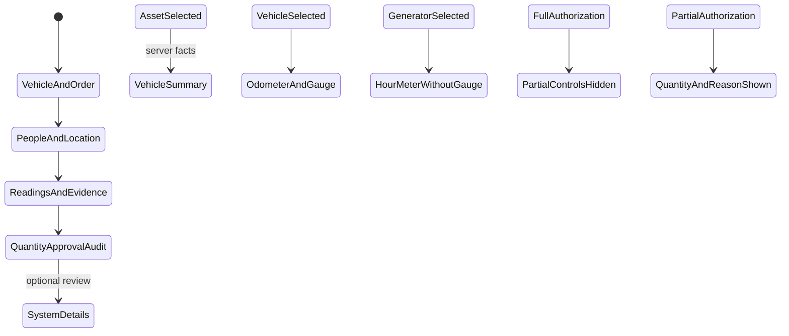

# Phase 1 — Entry form

| | |
|---|---|
| Specification | [`../requirements.md`](../requirements.md) @ working tree |
| Status | Built and database-verified; updated Fleet User and Fleet Approver views walked at wide, medium, and phone widths |
| Started / Closed | 2026-10-02 / — |
| Author | Codex |
| Reviewed by | — |
| Signed off | — |
| Landed in | — |
| Covers | Requirements 1.1–1.8 and 3.3 |

## What this phase makes true

Fuel Order has the four named primary sections in order. Asset, Driver, and Actual Requester share the first row when space permits; both required participant fields default to the selected asset's effective-assignment Custodian and remain independently editable. Changing Asset replaces both suggestions; no effective custodian leaves both blank. Custodian itself is read-only. A read-only responsive summary follows Vehicle and Order and groups vehicle facts, assignment, Previous Entry, and supported estimates. Three-column entry groups become two columns at medium widths and one column on narrow screens. Meter readings pair with their evidence; the generator hides the vehicle-only gauge column. Approval notes use two columns. Meter wording changes to Odometer or Hour Meter. Partial litres and their separate reason appear only for Partial authorization; the server requires the amount and a specific reason before a Partial order leaves Draft. Quantity authorization, signal, approval, and issue/action history are grouped before System Details. At wide widths System Details occupies the far-right fourth column as a read-only review sidebar; at medium and narrow widths it follows the four primary sections.

## The rule, as observed

### Design vs. observed

| Specification edge | Observed | Verdict |
|---|---|---|
| Four named primary sections appear in the required order | `test_entry_form_groups_and_conditions_review_fields` checks the DocType metadata | Verified by automated test |
| Asset, Driver, Actual Requester share the first row; wide/medium/narrow layouts use three/two/one entry columns | DocType column breaks and scoped CSS provide the breakpoints | Observed at 1600 px (three entry columns plus System Details in the fourth column), 900 px (two entry columns), and 390 px (one entry column); document and body widths matched the viewport at all three widths |
| Vehicle assignment, Previous Entry, and supported estimates appear in a read-only summary | The summary reads the existing server-filled read-only fields and escapes displayed values | Observed summary updated on Asset change; absent history showed “No previous entry” and “Not available,” not 0 km |
| Vehicle and generator meter labels differ; gauge is vehicle-only | Form script sets the label from the server-supplied asset type; gauge and gauge photo use vehicle dependencies | Observed Odometer and vehicle gauge/photo fields for vehicles; Hour Meter and no gauge/economy fields for the generator |
| Full hides Partial controls; Partial shows them and requires a reason before leaving Draft | Conditional DocField metadata and `test_partial_authorization_requires_reason_before_leaving_draft` | Verified by automated test |
| Request photo uses Frappe's native preview | The installed Attach Image control implements its existing hover preview; the order field remains Attach Image | Opened existing meter and gauge attachments from the form; each rendered as an image in a separate tab |
| System Details stay read-only and outside the main entry path | DocType metadata confirms the extra System Details section; CSS places it in column four at wide widths and after the primary sections below the wide breakpoint | At 1600 px it occupied the far-right sidebar; at 900 and 390 px it followed History. User and Approver views had no horizontal overflow. With no Previous Entry, the default zero meter and blank date fields were hidden while the summary showed “No previous entry.” |
| Driver and Actual Requester default from the selected asset's effective Custodian and stay independently editable | Asset facts supply the effective-assignment Custodian; focused tests cover required/editable participants and the absent-custodian case | On Asset selection, both values were Grace Wanjiku while logged in as Philip; changing Driver to John left Actual Requester unchanged, and changing Actual Requester to Daniel left Driver unchanged. Changing Asset refreshed both suggestions. Custodian remained read-only. The missing-custodian response leaves both defaults blank in focused coverage. |

## Frappe-first / native-first

| What we needed | Native mechanism used | Custom code, and why |
|---|---|---|
| Four sections and responsive columns | DocType Section Break and Column Break | Scoped CSS adjusts three-column groups to two and one columns at smaller widths. |
| Conditional gauge and Partial fields | `depends_on` and `mandatory_depends_on` | Server validation remains authoritative. |
| Inspect request photos | Frappe Attach Image hover preview | None. |
| Vehicle summary and dynamic meter wording | Existing server facts and Frappe form events | A compact summary renderer groups returned read-only facts; the existing event labels the meter by asset type. |

**Scope deliberately not taken:** No change to who can create or decide an order, location scoping, evidence privacy, or the approval-slip layout.

## Verification

On 05/10/2026, the updated `test_fuel_order` module passed **31/31 integration tests** on the disposable `fleet_management-test.localhost` MariaDB site using this 009 worktree. Coverage includes section and field order, responsive System Details placement, read-only system snapshots, required/editable participant fields, effective-custodian defaults, the missing-custodian case, server-set request time, editable meter and evidence fields, Partial visibility and reason requirements, effective assignment facts, and station suggestions. The preceding six-module run passed 146 tests with one existing concurrency test skipped by its environment guard. No full suite was run.

Python compilation, JavaScript syntax, DocType JSON parsing, `e2e/sid.ts` import, `git diff --check`, and spec-check passed. The spec checker retains filename-based coverage warnings for requirements covered from existing test modules. No full suite was run.

The Fleet User walkthrough used a non-debug Gunicorn server bound only to `127.0.0.1:18001`, with the 009 worktree and disposable MariaDB test site. On a new order, selecting KDA 412M set Driver and Actual Requester to effective Custodian Grace Wanjiku while the logged-in user was Philip. Changing Driver to John Mwangi left Actual Requester at Grace; changing Actual Requester to Daniel Kiptoo left Driver at John. Selecting KDJ 507K then reset both suggestions from the newly selected asset; its effective Custodian was also Grace Wanjiku. Custodian stayed read-only. The focused tests cover the no-effective-custodian case. Company Representative stayed blank; Driver and Operational Location received asset suggestions; Planned Station stayed blank where multiple eligible stations existed. Changing Asset cleared the odometer, gauge, and photos. Full hid Partial Litres and its reason; Partial displayed both after Quantity Authorization. Existing Meter Photo and Gauge Photo links opened image previews from copied test fixtures in the temporary shadow site. The saved sample form displayed its server-set Request Date and Time read-only. When `previous_entry_source` is `none`, the main summary displays “No previous entry” and “Not available”; System Details hides the zero-valued meter and empty date fields for that case.

The updated page was observed at 1600, 900, and 390 px for Fleet User and Fleet Approver. At 1600 px the form had three entry columns and System Details in the far-right fourth column. At 900 px it used two entry columns and put System Details after the four primary sections. At 390 px the entry controls stacked in one column and System Details followed the primary sections. Document and body `scrollWidth` matched the viewport at all measured widths. Approver controls were not rendered as editable inputs. Screenshots: `verification/screenshots/phase-01-02-wide-user-selected.png`, `phase-01-03-medium-user.png`, `phase-01-04-phone-user.png`, and Phase 4's wide/medium/phone Approver captures.

The earlier observation that Actual Requester stayed blank was from before this follow-up change and is superseded by the effective-Custodian default above.

An earlier full migration attempt ended during Frappe orphan cleanup (`Module None not found`) and a prior main-site migration placed Fueling Summary and Asset Performance in Frappe's recovery bin. Neither was restored or changed in this task. No functional/database tests or migrations ran against the main site during this verification.

## What we learned that the plan did not predict

This Frappe version supports collapsible sections and remembers a user's collapsed state, but has no DocField setting to start a section collapsed. System Details therefore remains a separate collapsible section. The installed Attach Image control supports a hover preview, so a custom image viewer is unnecessary. A pre-existing Partial approval-slip test needed a specific reason after this rule became server-enforced.

## Known limitations — accepted, not fixed

- In wide layouts the System Details sidebar starts alongside the primary sections and may continue below them; at medium and narrow widths it follows the primary sections.

## Review

| Round | Date | Verdict | Closed by |
|---|---|---|---|

**Closure:** Not reviewed.

**Next:** Independent review remains; no Phase 1 walkthrough is pending.
