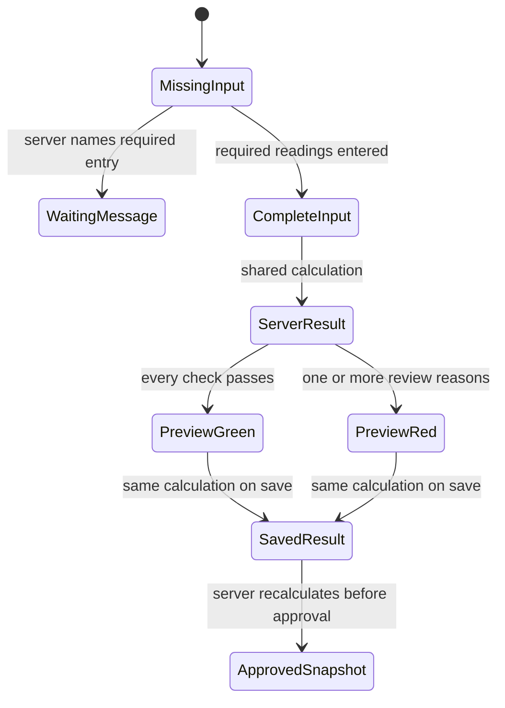

# Phase 2 — Signal panel

| | |
|---|---|
| Specification | [`../requirements.md`](../requirements.md) @ working tree |
| Status | Built, database-verified, and visually walked through as Fleet User and Fleet Approver |
| Started / Closed | 2026-10-02 / — |
| Author | Codex |
| Reviewed by | — |
| Signed off | — |
| Landed in | — |
| Covers | Requirements 2.1–2.6, 3.1, 3.2, and 3.3 |

## What this phase makes true

The entry path shows one signal and flagged-reasons panel in Quantity, Approval and Audit, after the applicable readings and quantity-authorization inputs. Incomplete previews name the missing asset, odometer/hour meter, or vehicle gauge and replace the previous result. Complete previews call the server method that uses the same calculation as save and approval. The result includes its source readings, comparisons, limits, economy source, and next step. A target economy is not labelled observed; a recent full-to-full average shows km/L and equivalent L/km and L/100 km. Green, red, and sent-up states describe the existing workflow choices. The result and its input snapshot are saved read-only; approval recalculates it, and Frappe prevents changes after submission.

## The rule, as observed

### Design vs. observed

| Specification edge | Observed | Verdict |
|---|---|---|
| Missing reading replaces older signal with a named waiting state | `test_signal_preview_waits_for_required_readings_without_reusing_old_result` and `test_waiting_preview_names_vehicle_and_generator_readings` | Verified by integration and unit tests |
| Changed readings call the server preview | `preview_signal` accepts entry facts, recomputes authoritative assignment and history facts, and calls `_calculate_signal_result`; client event handlers only request and render | Observed waiting state replaced by the current Red result after readings changed. Desk's string-encoded numeric inputs exposed a TypeError; inputs are now normalized and a browser-shaped regression test passes. |
| Preview and save use the same result | `test_preview_and_save_use_the_same_server_signal_calculation` compares signal, reasons, captured inputs, and summary | Verified by integration test |
| Reason gives comparison, threshold, source, and next step | `test_signal_explanation_names_distance_estimate_economy_margin_and_action` and target-source test | Verified by unit tests |
| Green, red, and sent-up order actions are explained | Signal builder uses workflow state; sent-up integration test checks Fleet Approver action and written reason | Verified by integration tests |
| Client cannot set the saved result; approval uses current limits | Client override test and approval-after-limit-change test | Verified by integration tests |
| One panel appears after the final signal-affecting input in Quantity, Approval and Audit | DocType field order places the HTML panel after the conditional quantity fields and before the approval record; the old form introduction was removed | Observed as one panel after Partial Litres and its reason. Saved Green as Fleet User and saved Red as Fleet Approver both showed the respective server result; approver fields were read-only. |

## Frappe-first / native-first

| What we needed | Native mechanism used | Custom code, and why it is unavoidable |
|---|---|---|
| Request an unsaved preview | Frappe form call to a whitelisted POST method | The server must combine unsaved user inputs with authoritative assignment, history, average, and current limits. |
| Render one signal panel | DocType HTML field after the quantity inputs and before approval details | Frappe's existing introduction and raw fields repeated the result in the entry path. |
| Keep signal authority on the server | Existing document validation and workflow save | The method calls the shared calculation; JavaScript contains no signal rules. |
| Retain the saved result | Read-only Long Text snapshot in System Details | The snapshot keeps exact input values and settings alongside reason explanations. |

**Scope deliberately not taken:** No change to the old “Mileage does not add up” calculation, approval roles, permission boundaries, validation failures, or transaction facts.

## Verification

The latest focused modules passed on the disposable `fleet_management-test.localhost` MariaDB site: `test_fuel_order_signal` **19/19 integration tests**, `test_fuel_signal` **41/41 unit tests**, and `test_fuel_order` **28/28 integration tests**. They cover the waiting state, Desk-style string input, preview/save parity, server authority, approval-time recomputation and frozen results, target fallback versus an actual recent average, the 10 km/L reference versus a 5 km/L observed interval at a 15% margin with equivalent units and direction, and the existing distance-check exact/beyond-margin behavior. Neither distance-only comparison describes estimated current-order use as observed economy.

The live walkthrough showed the empty-reading waiting state, then a Red result after Odometer and gauge entry; changing Asset cleared the prior result and readings and returned to the waiting state. Partial Litres and its distinct reason appeared before the single panel. An approved Green order was read as Fleet User, and a pending Red order with its sign-off explanation was read as Fleet Approver; the approver form was not editable. A target-only asset showed “Applicable fuel economy (vehicle target)” and no recent observed average. The 10 vs. 5 km/L exact trend wording and equivalent units are covered by the unit test; the live sample did not contain a trend reason to display. The shared Desk server serving `feature/008-overseer-reports` was not used.

Python compilation, JavaScript syntax, DocType JSON, `e2e/sid.ts` import, `git diff --check`, and spec-check passed. No full suite was run. The earlier orphan-cleanup failure and main-site recovery-bin changes remain documented; no functional/database tests or migrations ran against the main site during this verification.

## What we learned that the plan did not predict

The installed Frappe form handles the HTML field directly. `signal_reasons` needed a Long Text field to retain all raw reasons, while `signal_details_json` stores the structured explanation and calculation inputs. Existing Frappe update-after-submit protection already refuses edits to an approved signal; approval-time recalculation is checked before submission.

## Known limitations — accepted, not fixed

- The live sample did not include an own-trend reason, so that exact explanation was verified by unit test rather than observed in a saved order.

## Review

| Round | Date | Verdict | Closed by |
|---|---|---|---|

**Closure:** Not reviewed.

**Next:** Independent review remains; no Phase 2 role or responsive walkthrough is pending.
