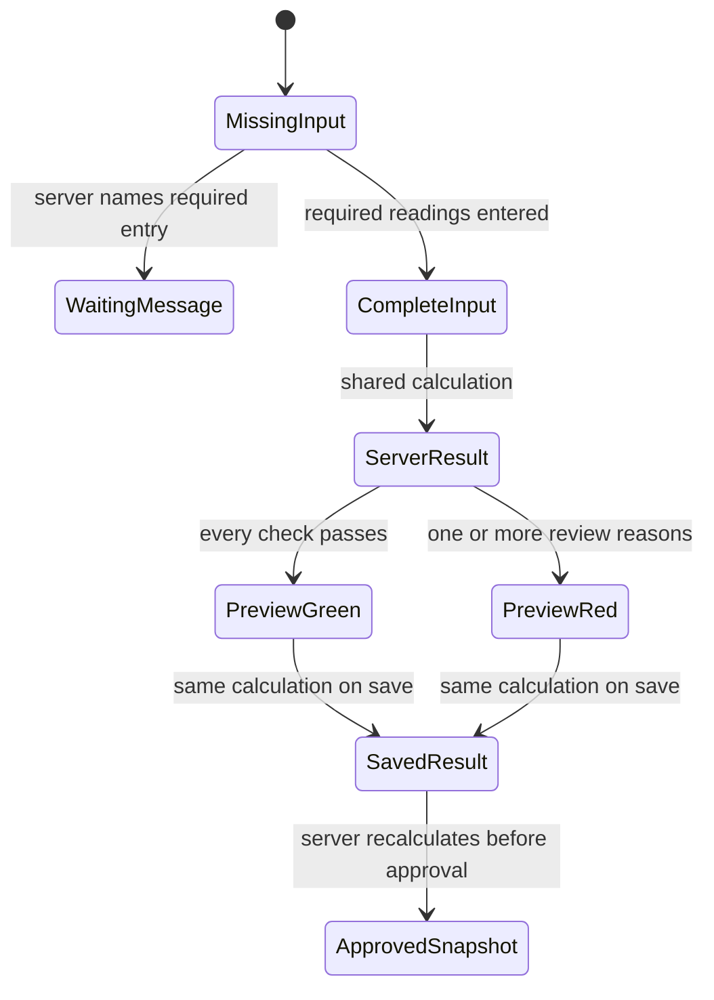

# Phase 2 — Signal panel

| | |
|---|---|
| Specification | [`../requirements.md`](../requirements.md) @ working tree |
| Status | Built; automated checks pass; Desk walkthrough pending a server serving this worktree |
| Started / Closed | 2026-10-02 / — |
| Author | Codex |
| Reviewed by | — |
| Signed off | — |
| Landed in | — |
| Covers | Requirements 2.1–2.6, 3.1, 3.2, and 3.3 |

## What this phase makes true

The entry path shows one signal and flagged-reasons panel in Quantity, Approval and Audit, after the applicable readings and quantity-authorization inputs. Incomplete previews name the missing asset, odometer/hour meter, or vehicle gauge and replace the previous result. Complete previews call the server method that uses the same calculation as save and approval. The result includes its source readings, comparisons, limits, economy source, and next step. A target economy is not labelled observed; a recent full-to-full average shows km/L and equivalent L/km and L/100 km. Green, red, and sent-up states describe the existing workflow choices. The result and its input snapshot are saved read-only; approval recalculates it, and Frappe prevents changes after submission.

## The rule, as observed

### Design vs. observed

| Specification edge | Observed | Verdict |
|---|---|---|
| Missing reading replaces older signal with a named waiting state | `test_signal_preview_waits_for_required_readings_without_reusing_old_result` and `test_waiting_preview_names_vehicle_and_generator_readings` | Verified by integration and unit tests |
| Changed readings call the server preview | `preview_signal` accepts entry facts, recomputes authoritative assignment and history facts, and calls `_calculate_signal_result`; client event handlers only request and render | Server method verified; browser event timing awaits Desk walkthrough |
| Preview and save use the same result | `test_preview_and_save_use_the_same_server_signal_calculation` compares signal, reasons, captured inputs, and summary | Verified by integration test |
| Reason gives comparison, threshold, source, and next step | `test_signal_explanation_names_distance_estimate_economy_margin_and_action` and target-source test | Verified by unit tests |
| Green, red, and sent-up order actions are explained | Signal builder uses workflow state; sent-up integration test checks Fleet Approver action and written reason | Verified by integration tests |
| Client cannot set the saved result; approval uses current limits | Client override test and approval-after-limit-change test | Verified by integration tests |
| One panel appears after the final signal-affecting input in Quantity, Approval and Audit | DocType field order places the HTML panel after the conditional quantity fields and before the approval record; the old form introduction was removed | Source and static checks reviewed; visual placement awaits Desk walkthrough |

## Frappe-first / native-first

| What we needed | Native mechanism used | Custom code, and why it is unavoidable |
|---|---|---|
| Request an unsaved preview | Frappe form call to a whitelisted POST method | The server must combine unsaved user inputs with authoritative assignment, history, average, and current limits. |
| Render one signal panel | DocType HTML field after the quantity inputs and before approval details | Frappe's existing introduction and raw fields repeated the result in the entry path. |
| Keep signal authority on the server | Existing document validation and workflow save | The method calls the shared calculation; JavaScript contains no signal rules. |
| Retain the saved result | Read-only Long Text snapshot in System Details | The snapshot keeps exact input values and settings alongside reason explanations. |

**Scope deliberately not taken:** No change to the old “Mileage does not add up” calculation, approval roles, permission boundaries, validation failures, or transaction facts.

## Verification

On the disposable `fleet_management-test.localhost` MariaDB site:

- `fleet_management.fleet_management.doctype.fuel_order.test_fuel_order_signal`: **16/16 integration tests pass**, including two Phase 3 baseline lookup/freeze tests.
- `fleet_management.tests.test_fuel_signal`: **34/34 unit tests pass**. Existing exact-margin, beyond-margin, no-forward-movement, missing-history, and old distance-check cases still pass.
- `fleet_management.fleet_management.doctype.fuel_order.test_fuel_order`: **28/28 integration tests pass** after the Phase 1 and signal-field layout changes.
- `node --check fleet_management/public/js/fuel_order.js`, JSON validation, Python compilation, and `python3 scripts/spec-check.py specs/009-fuel-order-ux` pass. The spec checker reports test-name coverage warnings for the still-unbuilt UI walkthrough, full-tank phase, and history phase. Ruff and Prettier were unavailable in the environment.

The Desk walkthrough remains blocked by the missing local `specs/001-fleet-fuel-management/verification/CREDENTIALS.md`. The isolated browser reached the test site's sign-in page; no login or extra test account was created. A fresh disposable-site rebuild also remains unavailable for the same missing file. A full migration on the disposable site exited with `Module None not found` during Frappe's orphan cleanup. A focused `reload-doc fleet_management doctype fuel_order` then synced the intended 009 signal fields from this worktree; the tests below ran against that metadata. A migration of the local main site reached the same orphan cleanup error; no tests ran there. It placed `Fueling Summary` and `Asset Performance` in Frappe's recovery bin, and their restoration is pending the requester. The missing cleanup condition was not repaired.

On 05/10/2026, the installed app source was confirmed as the separate `feature/008-overseer-reports` checkout while the focused CLI test process imports this 009 worktree. `e2e/sid.ts` provides passwordless test login, but the shared Desk server therefore cannot verify this worktree's form or signal panel. A fresh site rebuild remains unavailable because the required local credentials file is absent.

Update 05/10/2026: `e2e/sid.ts` provides passwordless test login, so the login inventory is not the remaining blocker. The shared Desk server is attached to the separate `feature/008-overseer-reports` checkout and cannot verify this 009 worktree. The absent credential inventory still prevents a fresh disposable-site rebuild.

Update 05/10/2026: the single signal/flagged-reasons panel follows the conditional quantity authorization fields in the Quantity, Approval and Audit area. The updated field-order assertion passed in the 28-test Fuel Order integration module on the disposable MariaDB site after a focused DocType reload. No migration or test ran on the main site.

## What we learned that the plan did not predict

The installed Frappe form handles the HTML field directly. `signal_reasons` needed a Long Text field to retain all raw reasons, while `signal_details_json` stores the structured explanation and calculation inputs. Existing Frappe update-after-submit protection already refuses edits to an approved signal; approval-time recalculation is checked before submission.

## Known limitations — accepted, not fixed

- The live Desk panel placement, refresh latency, role-specific text, and narrow-screen layout have not been visually exercised against this worktree because the shared server serves another checkout.

## Review

| Round | Date | Verdict | Closed by |
|---|---|---|---|

**Closure:** Not reviewed.

**Next:** Complete the Fleet User and Fleet Approver Desk walkthrough against a test server serving this worktree. Phase 3's calculation and database matrix are now verified.
