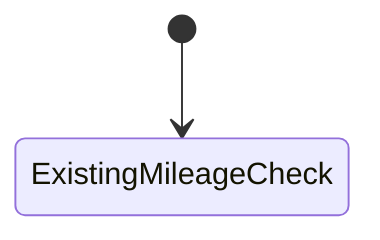

# Phase 3 — Full-tank mileage check

| | |
|---|---|
| Specification | [`../requirements.md`](../requirements.md) @ working tree |
| Status | Not started |
| Started / Closed | 2026-10-02 / — |
| Author | Codex |
| Reviewed by | — |
| Signed off | — |
| Landed in | — |
| Covers | Requirements 3.1, 3.2, and 4.1–4.6 |

## What this phase makes true

A vehicle's new mileage comparison starts from its latest submitted, non-cancelled fueling record that confirms a full tank. Later partial transactions neither add litres to the estimate nor replace the baseline. A newer full tank does replace it; no full-tank history skips only this check. The existing Previous Entry comparison remains independent.

## The rule, as observed

### Design vs. observed

| Specification edge | Observed | Verdict |
|---|---|---|
| `LatestFullTank → NewBaseline` | Not yet observed | Unbuilt or untested |
| `PartialFueling → BaselineUnchanged` | Not yet observed | Unbuilt or untested |
| `NoBaseline → NewCheckSkipped` | Not yet observed | Unbuilt or untested |
| `ApprovedOrder → BaselineAndResultFrozen` | Not yet observed | Unbuilt or untested |
| `Generator → VehicleMileageChecksSkipped` | Not yet observed | Unbuilt or untested |

## Frappe-first / native-first

| What we needed | Native mechanism used | Custom code, and why it is unavoidable |
|---|---|---|
| Find the full-tank baseline | Submitted Fueling Transaction records and their actual event times | A distinct lookup must filter full-tank confirmations without changing Previous Entry. |
| Calculate expected distance | Existing up-to-five interval average and vehicle target | Add the requested estimated-consumption formula and independent reason. |
| Freeze the approved result | Existing Fuel Order snapshot validation | Add the new server-managed baseline and result fields to its immutable set. |

**Scope deliberately not taken:** Do not change the current mileage check, fueling transactions, generator checks, or vehicle economy intervals.

## Verification

| # | Put the system in this state | Expect | Covers |
|---|---|---|---|
| 1 | A vehicle has a full-tank transaction and no later fueling | Its actual odometer and fueling time are the new baseline | `4.1` |
| 2 | Add one or more submitted partial transactions after that baseline | The new baseline and estimated consumed litres stay unchanged; the old check still uses its latest Previous Entry | `3.2`, `4.2`, `4.3` |
| 3 | Add a newer submitted, non-cancelled full-tank transaction | The new transaction becomes the baseline | `4.1` |
| 4 | Add a later full-tank transaction, then cancel it | The cancelled transaction is ignored and the prior qualifying full tank remains the baseline | `4.1` |
| 5 | Give the vehicle no qualifying full-tank history | The new check adds no reason; the existing check follows its current Previous Entry behavior | `3.2`, `4.4` |
| 6 | Use 300 km expected distance with a 15% margin | 255 km and 345 km pass; 254.97 km and 345.03 km fail under the existing rounded comparator | `3.2`, `4.2` |
| 7 | Set a partial fueling between the two check baselines so the old and new results differ | Both reasons are calculated independently; the old one is unchanged and the new one uses the full-tank baseline | `3.2`, `4.3` |
| 8 | Use a generator reading | Neither vehicle mileage check runs; existing generator checks still run | `4.6` |
| 9 | Give the baseline vehicle no usable recent average and no usable target | The new check adds its own red cannot-calculate reason; the old check keeps its current behavior | `4.4` |
| 10 | Approve an order, then change settings or add a newer fueling source | The saved signal, full-tank baseline, and result remain frozen on that approved order | `3.1`, `4.5` |
| 11 | Use unusable capacity or gauge data, or a full gauge with zero estimated consumption | Apply the behavior selected by the requester before running this row | `4.2` |

**How to run it.** All calculation and database rows are focused tests on the disposable MariaDB site. The visible source and result need a Fleet User Desk walkthrough on that site.

**Result:** Not run yet. Rows 11 awaits the requester's open decisions.

## What we learned that the plan did not predict

The current previous-entry lookup already excludes cancelled transactions and includes partial transactions. The existing recent average comes from submitted positive full-to-full interval records and otherwise falls back to the vehicle target.

## Known limitations — accepted, not fixed

- The response to unusable capacity or gauge data and zero estimated consumption is pending the requester.

## Review

| Round | Date | Verdict | Closed by |
|---|---|---|---|

**Closure:** Not reviewed.

**Next:** Resolve the capacity, gauge, and zero-consumption decisions, then build the separate check.
