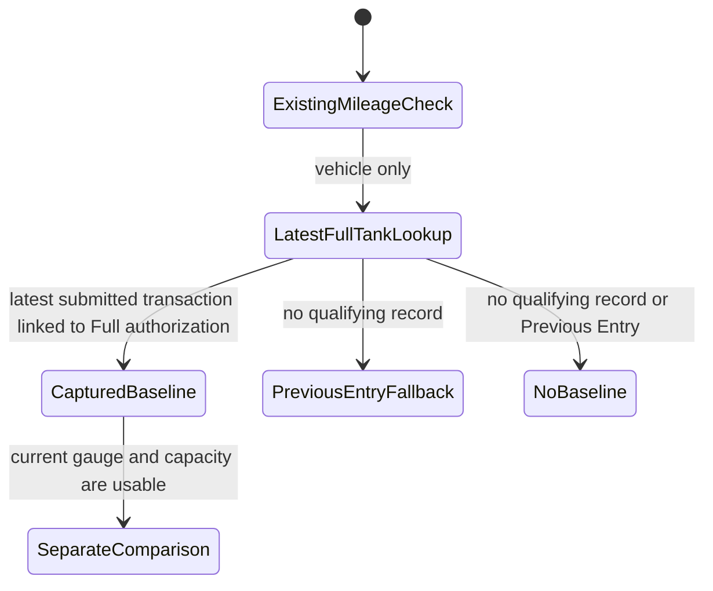

# Phase 3 — Full-tank mileage check

| | |
|---|---|
| Specification | [`../requirements.md`](../requirements.md) @ working tree |
| Status | Built and database-verified on the disposable MariaDB site; the role-based Desk walkthrough is pending a server serving this worktree |
| Started / Closed | 2026-10-02 / — |
| Author | Codex |
| Reviewed by | — |
| Signed off | — |
| Landed in | — |
| Covers | Requirements 3.1, 3.2, and 4.1–4.6 |

## What this phase makes true

A vehicle's new mileage comparison prefers its latest submitted, non-cancelled Fueling Transaction linked to a Fuel Order with Full quantity authorization. The transaction's Full Tank Confirmed field and the prior order's gauge do not determine that baseline. Later transactions linked to Partial-authorized orders neither add litres to the estimate nor replace an available Full baseline. If no Full baseline exists, the new comparison falls back to and identifies the existing Previous Entry; if neither exists, it is skipped. The existing Previous Entry comparison remains independent and unchanged.

## The rule, as observed

### Design vs. observed

| Specification edge | Observed | Verdict |
|---|---|---|
| `LatestFullAuthorization → NewBaseline` | `get_latest_full_tank_baseline` now joins the linked Fuel Order and filters for Full authorization. The regression case gives Full transactions `full_tank_confirmed=0` to prove that field does not select the baseline | Observed in database test |
| `PartialAuthorization → BaselineUnchanged` | The regression case gives a later Partial-authorized transaction `full_tank_confirmed=1` and verifies it does not replace the newer Full-authorized source | Observed in database test |
| `NoFullBaseline → PreviousEntryFallback` | `_select_mileage_baseline` captures the current Previous Entry as the selected fallback and the signal panel identifies it | Observed in integration test; visual Desk walkthrough pending |
| `NoBaseline → NewCheckSkipped` | Skip only when both the Full-authorized baseline and existing Previous Entry are absent | Confirmed by unit and integration tests |
| `ApprovedOrder → BaselineAndResultFrozen` | `test_signal_is_frozen_once_approved` asserts the captured transaction and Full order, calculation status, estimated consumption, and expected distance, then adds a newer source and checks approved JSON remains unchanged | Observed in database test |
| `Generator → VehicleMileageChecksSkipped` | `test_full_tank_baseline_is_missing_without_vehicle_history_or_for_generator` confirms the vehicle-only lookup returns no generator baseline | Confirmed by unit and integration tests |

## Frappe-first / native-first

| What we needed | Native mechanism used | Custom code, and why it is unavoidable |
|---|---|---|
| Find and identify the comparison baseline | Frappe Query Builder Link-field selection and filters over submitted Fueling Transactions | Select the latest linked Full authorization, otherwise capture and identify the existing Previous Entry as fallback. |
| Calculate expected distance | Existing up-to-five interval average and vehicle target | Add the requested estimated-consumption formula and independent reason. |
| Freeze the approved result | Existing Fuel Order snapshot validation | Add the new server-managed baseline and result fields to its immutable set. |

**Scope deliberately not taken:** Do not change the current mileage check, fueling transactions, generator checks, or vehicle economy intervals.

**Existing mileage behavior to preserve:** `fuel_signal._check_mileage` compares `round(variance, 6) > margin`, so the exact margin passes. `test_mileage_at_margin_passes` and `test_mileage_past_margin_fails` already cover that boundary. The new comparison will be an independent signal reason; Phase 3 must keep these existing expectations passing and verify that a partial fueling can make the old and new comparisons differ.

## Verification

On 05/10/2026, 40 signal unit tests, 18 signal integration tests, and 28 Fuel Order lifecycle integration tests passed on fleet_management-test.localhost, confirmed as MariaDB, using the 009 worktree code. These cover the Full-authorized source, partial records, newer and cancelled transactions, fallback, no baseline, exact/beyond margin, old/new differences, generators, unavailable economy, invalid capacity/gauge and zero-use behavior, preview/save refresh, server authority, and approved freezing. Python compilation, JavaScript syntax, DocType JSON parsing, git diff --check, and spec-check also passed. Ruff was unavailable. No migration or test was run against the main site in this verification.

The role-based Desk walkthrough remains pending: the shared Desk server serves the separate `feature/008-overseer-reports` checkout, while the focused CLI test process imports this 009 worktree. Passwordless test login is supported by `e2e/sid.ts`; a fresh site rebuild remains unavailable because the required local credentials file is absent.

| # | Put the system in this state | Expect | Covers |
|---|---|---|---|
| 1 | A vehicle has a submitted fueling transaction linked to a Full-authorized Fuel Order and no later fueling | Its actual odometer and fueling time are the new baseline, regardless of the transaction's Full Tank Confirmed field | `4.1` |
| 2 | Add one or more submitted transactions linked to Partial-authorized orders after that baseline | The new baseline and estimated consumed litres stay unchanged; the old check still uses its latest Previous Entry | `3.2`, `4.2`, `4.3` |
| 3 | Add a newer submitted, non-cancelled transaction linked to a Full-authorized order | The new transaction becomes the baseline | `4.1` |
| 4 | Add a later transaction linked to a Full-authorized order, then cancel it | The cancelled transaction is ignored and the prior qualifying baseline remains | `4.1` |
| 5 | Give the vehicle no Full-authorized history but a partial transaction or approved order supplies Previous Entry | The new check falls back to and identifies that Previous Entry; the existing check remains unchanged | `3.2`, `4.4` |
| 5a | Give the vehicle neither Full-authorized history nor Previous Entry | The new check adds no reason | `4.4` |
| 6 | Use 300 km expected distance with a 15% margin | 255 km and 345 km pass; 254.97 km and 345.03 km fail under the existing rounded comparator | `3.2`, `4.2` |
| 7 | Set a partial fueling between the two check baselines so the old and new results differ | Both reasons are calculated independently; the old one is unchanged and the new one uses the full-tank baseline | `3.2`, `4.3` |
| 8 | Use a generator reading | Neither vehicle mileage check runs; existing generator checks still run | `4.6` |
| 9 | Give the baseline vehicle no usable recent average and no usable target | The new check adds its own red cannot-calculate reason; the old check keeps its current behavior | `4.4` |
| 10 | Approve an order, then change settings or add a newer fueling source | The saved signal, full-tank baseline, and result remain frozen on that approved order | `3.1`, `4.5` |
| 11 | Use a selected baseline with zero/missing tank capacity or an unusable current gauge | Add a red cannot-calculate reason; a gauge not entered yet stays in the current waiting state | `4.2` |
| 12 | Use a 100% gauge so estimated consumption is zero | Add a red cannot-calculate reason | `4.2` |

**How to run it.** All calculation and database rows are focused tests on the disposable MariaDB site. The visible source and result need a Fleet User Desk walkthrough on that site.

**Result:** The code selects the preferred source by linked Fuel Order Full authorization, captures the Previous Entry fallback when needed, and labels the selected source in the signal panel. A separate server calculation now uses the current order gauge, selected baseline, applicable average, and existing rounded margin comparator; unusable capacity/gauge/economy and zero estimated consumption produce a red cannot-calculate reason. The panel shows the selected baseline and successful calculation details. Focused assertions cover source priority, partial readings and litres, cancelled transactions, fallback, exact/beyond margin, differing old/new results, unusable inputs, preview refresh, server authority, and approved freezing. Disposable-site verification passed; the role-based Desk walkthrough has not run.

## What we learned that the plan did not predict

The current Previous Entry lookup already excludes cancelled transactions and includes transactions linked to Partial-authorized orders. The existing recent average continues to come from submitted positive full-to-full interval records using the existing Full Tank Confirmed field, and otherwise falls back to the vehicle target. The new baseline is deliberately selected from linked Fuel Order authorization instead.

## Known limitations — accepted, not fixed

- The role-based Desk walkthrough has not yet run against this worktree because the shared server serves another checkout.

## Review

| Round | Date | Verdict | Closed by |
|---|---|---|---|

**Closure:** Not reviewed.

**Next:** Complete the role-based Desk walkthrough on a disposable test server serving this worktree. The calculation and database matrix are verified.
