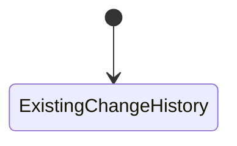

# Phase 4 — Issue and action history

| | |
|---|---|
| Specification | [`../requirements.md`](../requirements.md) @ working tree |
| Status | Not started |
| Started / Closed | 2026-10-02 / — |
| Author | Codex |
| Reviewed by | — |
| Signed off | — |
| Landed in | — |
| Covers | Requirements 3.3, 3.4, and 5.1–5.5 |

## What this phase makes true

A Fleet User, Fleet Approver, or fleet administrator can follow the original signal readings and limits, explanations, decisions, partial-authorization reason, cancellation reason, validity changes, every slip print, and the linked actual fueling facts and evidence. Earlier entries remain unchanged, and each person sees history only when they can read the linked order.

## The rule, as observed

### Design vs. observed

| Specification edge | Observed | Verdict |
|---|---|---|
| `SavedIssue → ImmutableSnapshot` | Not yet observed | Unbuilt or untested |
| `IssueCleared → ResolutionEvent` | Not yet observed | Unbuilt or untested |
| `WorkflowAction → ActorAndReasonEvent` | Not yet observed | Unbuilt or untested |
| `Cancellation → ReasonedEvent` | Not yet observed | Unbuilt or untested |
| `PrintOrExtension → SeparateEvent` | Not yet observed | Unbuilt or untested |
| `FuelingTransaction → SourceAndEvidenceLink` | Not yet observed | Unbuilt or untested |

## Frappe-first / native-first

| What we needed | Native mechanism used | Custom code, and why it is unavoidable |
|---|---|---|
| Preserve the original order and fueling source records | Existing Frappe document change history and submitted-record immutability | It does not retain each signal's captured inputs, decision reason, cancellation reason, and print event as one durable event. |
| Read the event trail on the Fuel Order | Existing location-scoped Fuel Order read permission | A read-only event record and parent-based permission check are needed to retain the same scope. |
| Require a cancellation reason | Native before-cancel lifecycle | Prompt and server staging are needed because the action runs across separate client and server requests. |

**Scope deliberately not taken:** No new role, wider location access, invoice discrepancy, late-entry rule, meter-reset record, cost field, or reconciliation process.

## Verification

| # | Put the system in this state | Expect | Covers |
|---|---|---|---|
| 1 | Save a red issue for the first time, save unchanged readings again, change a captured reading or limit, then clear the issue | Follow the requester's chosen snapshot rule; unchanged saves do not create unapproved duplicates if that rule is selected; resolution is a separate event | `5.1`, `5.2` |
| 2 | Send a red order for approval, then approve or reject it | History retains the explanation, actor, time, decision reason, and link to the issue without changing prior issue facts | `5.2` |
| 3 | Approve a Partial authorization | Its quantity and separate reason are retained apart from red-order and decision explanations | `1.4`, `5.2` |
| 4 | Cancel a Fuel Order or Fueling Transaction as a user who already has permission | A blank reason is refused; a written reason, actor, time, and source facts are retained; other roles keep their current cancel access | `3.3`, `5.3` |
| 5 | Extend an approved order and print the slip more than once, including after the extension | Each extension and each print/reprint appears with its reason where required and the applicable slip revision | `5.4` |
| 6 | Submit then cancel a Fueling Transaction | History links to the actual station facts, time, meter, litres, invoice identifiers, attendant, and signed evidence; cancellation records its reason without changing those source values | `3.4`, `5.3`, `5.5` |
| 7 | Read an event as a user with and without access to the linked order's location | Permitted users can read it; users outside the location cannot list or open it directly | `3.3`, `5.1` |
| 8 | Attempt to edit or delete an earlier event through the form and server API | The event remains unchanged and the attempt is refused | `5.1`, `5.2` |

**How to run it.** Event, cancellation, permission, and append-only checks run on the disposable MariaDB site. A Desk walkthrough uses Fleet User, Fleet Approver, and Fleet Admin only where the existing role permits the action.

**Result:** Not run yet. The issue snapshot timing rule is pending the requester's answer.

## What we learned that the plan did not predict

The existing extension JSON records prior extensions, but the current form retains only the latest print revision and time. A separate durable history event is needed to show each print and link it to the extension that required it.

## Known limitations — accepted, not fixed

- Issue snapshot timing is pending the requester's decision.
- Historical cancellations do not have reasons and will not be rewritten.

## Review

| Round | Date | Verdict | Closed by |
|---|---|---|---|

**Closure:** Not reviewed.

**Next:** Resolve the issue snapshot timing decision, then implement the event record and append-only history.
