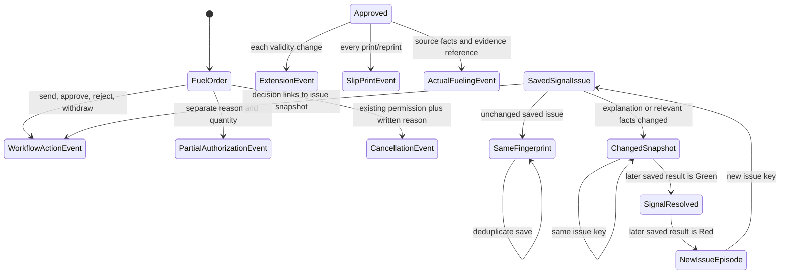

# Phase 4 — Issue and action history

| | |
|---|---|
| Specification | [`../requirements.md`](../requirements.md) @ working tree |
| Status | Issue and action history built and database-verified; event rendering walkthrough remains pending because the existing visual fixture predates event capture |
| Started / Closed | 2026-10-05 / — |
| Author | Codex |
| Reviewed by | — |
| Signed off | — |
| Landed in | — |
| Covers | Requirements 3.3, 3.4, and 5.1–5.5 |

## What this phase makes true

Append-only records retain the first saved Red result, changed issue snapshots, deduplicated unchanged saves, later resolution, workflow decisions and explanations, a separate Partial authorization reason, reasoned cancellations, each slip print, validity extensions, and submitted or cancelled actual fueling with its original source facts and evidence links. Decisions link to the latest issue snapshot they explain. Reads inherit the linked Fuel Order's permissions and location scope.

## The rule, as observed

### Design vs. observed

| Specification edge | Observed | Verdict |
|---|---|---|
| `SavedIssue → ImmutableSnapshot` | The first saved Red result creates an immutable `Signal Issue` event. A changed issue explanation or relevant displayed reading/limit appends a linked snapshot under the same issue key; an unchanged save adds nothing. | Verified by database tests for first appearance, evidence capture, deduplication, changed odometer/gauge facts, and a changed gauge limit with the reading held fixed. |
| `IssueCleared → ResolutionEvent` | A later saved Green result creates one `Signal Resolved` event linked to the latest issue snapshot. Repeated Green saves add nothing; a later Red result starts a new issue key. | Verified by database tests. |
| `WorkflowAction → ActorAndReasonEvent` | Send-up, approve, reject, and withdraw transitions write actor, time, explanation/decision reason, captured order facts, and a link to the issue snapshot. Partial authorization gets a separate event linked to its approval. | Verified by database tests. |
| `Cancellation → ReasonedEvent` | The existing cancel permission remains authoritative. A written reason is staged for the native cancel action; the server rejects cancellation without one and saves actor, time, reason, and source facts. | Verified for Fuel Orders and Fueling Transactions. |
| `PrintOrExtension → SeparateEvent` | Each slip render, including repeat prints of the same revision, writes an event. Each extension records its reason, actor, time, old/new validity, and revision. | Verified by database tests. |
| `FuelingTransaction → SourceAndEvidenceLink` | Submission and cancellation write separate parent-order events with transaction source facts and private evidence references. Submitted source records remain unchanged. | Verified by database tests. |
| `HistoryRead → LinkedOrderPermission` | Event read permission checks the linked Fuel Order; list-query conditions filter through the order's assigned location. The history endpoint checks ordinary parent read access. | Verified by database tests. |
| `EarlierEvent → Immutable` | The event controller refuses update, delete, and rename actions; role permissions grant read only. | Update and delete refusal verified by database tests. |

## Frappe-first / native-first

| What we needed | Native mechanism used | Custom code, and why it is unavoidable |
|---|---|---|
| Preserve original order and fueling records | Existing document history and submitted-record immutability | A read-only event DocType retains action-specific facts, reasons, and evidence references across later changes. |
| Show the trail on a Fuel Order | Existing linked-order read permission and location scope | A small form reader renders the escaped, captured events and checks parent access on the server. |
| Require cancellation reasons | Native `before_cancel` lifecycle and existing cancel action | A short-lived, user/document-scoped staged reason carries the written answer into the native server cancellation request. |

**Scope deliberately not taken:** No new role, wider location access, invoice discrepancy, late-entry rule, meter-reset record, cost field, or reconciliation process. Historical cancellations are not rewritten.

## Verification

The latest six focused modules passed on `fleet_management-test.localhost`, confirmed as MariaDB: **146 passed and one existing concurrency test skipped by its environment guard**. This includes 12 decision-history integration tests; 2 transaction unit and 31 integration tests (30 passed, one expected skip); 6 permission unit and 8 integration tests; 28 Fuel Order integration tests; 19 signal integration tests; and 41 signal unit tests. Coverage includes first issue appearance, evidence capture, identical-save deduplication, changed readings and limits, resolution and a new issue episode, decision links, immutable events, cancellations, extensions, every print/reprint, actual fueling source and evidence, linked-order permission checks, preview/save parity, approval recalculation, and frozen approved results.

Python compilation, JavaScript syntax, DocType JSON, `e2e/sid.ts` import, `git diff --check`, and spec-check passed. The spec checker reports filename-based coverage warnings because relevant cases live in existing test modules; Ruff was unavailable. No full suite was run.

The Fleet Approver inspected saved pending Red order FO-2026-00043 and expanded its Issue and Action History section. The pre-existing sample order displayed “No saved history events yet,” so that fixture does not exercise event rendering: it predates the history phase. No issue-resolution, cancellation, extension, reprint, or fueling events were created or visually inspected. The current event lifecycle remains database-verified by the focused suites; Phase 4.4 stays unchecked pending a disposable order with post-capture history events. The shared server serving `feature/008-overseer-reports` was not used. The earlier orphan-cleanup failure and main-site recovery-bin changes remain documented; no functional/database tests or migrations ran against the main site during this verification.

| # | Put the system in this state | Expect | Covers |
|---|---|---|---|
| 1 | Save a red issue, save unchanged readings, change a captured reading or limit, clear it, save green again, then make it red | Keep one initial snapshot for unchanged saves, append changed snapshots and one resolution, then start a new issue episode | `5.1`, `5.2` |
| 2 | Send a red order for approval, then approve, reject, or withdraw it | Retain explanation, actor, time, decision reason, and any issue link without changing earlier facts | `5.2` |
| 3 | Approve a Partial authorization | Retain quantity and its separate reason apart from red-order and decision explanations | `1.4`, `5.2` |
| 4 | Cancel an order or fueling transaction as a user who already has permission | Refuse a blank reason; retain a written reason, actor, time, and source facts; preserve existing role access | `3.3`, `5.3` |
| 5 | Extend an approved order and print the slip more than once, including after extension | Retain each extension and each print with applicable reason and slip revision | `5.4` |
| 6 | Submit then cancel a Fueling Transaction | Link station, time, meter, litres, invoice identifiers, attendant, and signed evidence; retain cancellation facts without changing the submitted source | `3.4`, `5.3`, `5.5` |
| 7 | Read an event as users with and without access to its linked order | Permit the same linked-order readers and deny out-of-location listing and direct reads | `3.3`, `5.1` |
| 8 | Attempt to edit, delete, or rename an earlier event | Refuse the action and leave the event unchanged | `5.1`, `5.2` |

## What we learned that the plan did not predict

The existing extension history already captures each earlier validity change, but it did not capture every print of an unchanged revision. The existing transaction is the source of actual fueling facts and signed evidence, so events link and snapshot those values instead of replacing them. The server can enforce a written cancellation reason in the native lifecycle while keeping role and location permissions unchanged. The test CLI can mint browser sessions without a password, but the shared server still serves the separate checkout.

## Known limitations — accepted, not fixed

- The saved history-event lifecycle has not been visually exercised because the existing safe sample order predates event capture and contains no event rows.
- Historical cancellations do not have reasons and are not rewritten.

## Review

| Round | Date | Verdict | Closed by |
|---|---|---|---|

**Closure:** Not reviewed.

**Next:** Use a disposable order that has events written by the current history implementation to complete task 4.4; do not rewrite historical cancellations.
