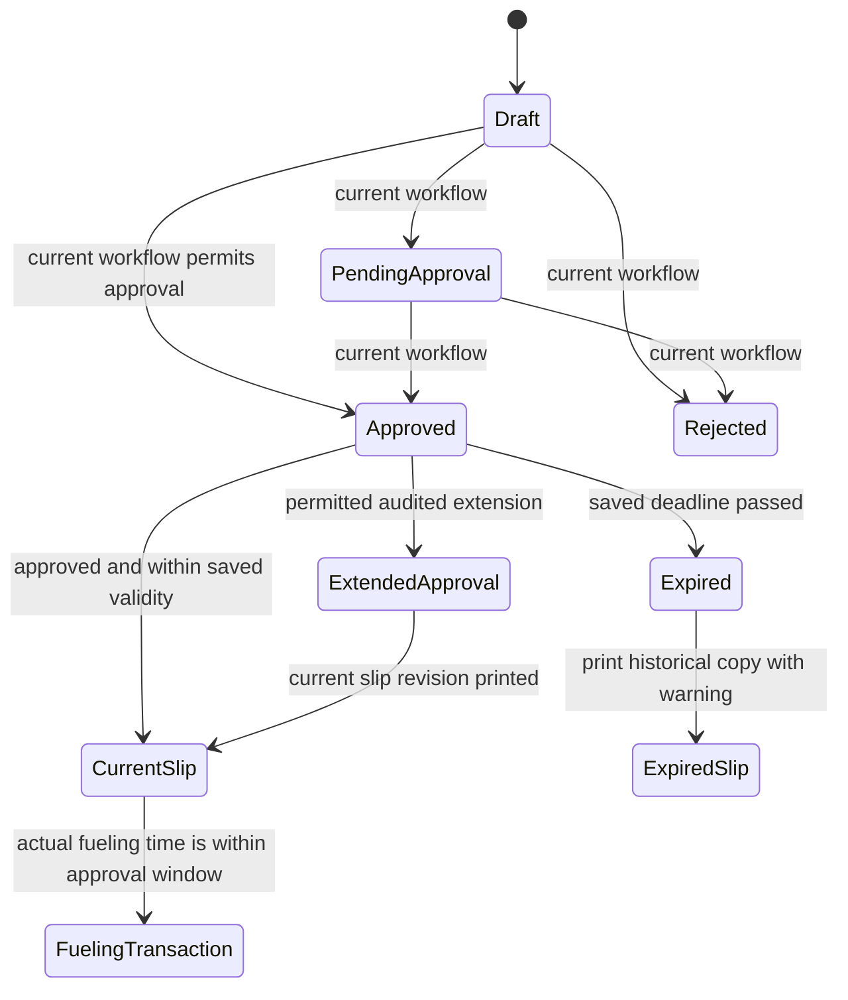

<!--
How the requirements will be met. Implementation files may be named here; keep requirement text
in business language. Approval is pending until the requester explicitly approves it.
-->

# Fuel Order authorization and fueling record: design

Approved by: pending

## Current state

- The Fuel Order approval workflow records the approver and approval time. The existing
  `default_validity_days` setting controls approval validity; its code default and the live site's
  saved value are both three calendar days. On approval, the order saves its own `valid_until`
  timestamp. Per the requester, retain the live saved value of three; after the change, new
  approvals on this site use three working days until an administrator sets it to two. Set the
  new-install default and code fallback to two.
- A separate `transaction_entry_sla_hours` setting is 48 hours for entering a Fueling Transaction
  after fueling. The existing project requirements say that its late-entry deadline excludes
  Sundays and public holidays but counts Saturdays. It is not the order authorization period.
- The order reports itself as expired after that saved timestamp. The Fueling Transaction
  controller refuses a submitted fueling whose actual time is before approval or after the
  order's saved deadline.
- The order's `fulfillment_status` is already a derived property that returns “Expired”; use it
  to show the form warning rather than adding another stored status field.
- Fleet Management Settings has a `holiday_list` Link field, but this bench has only Frappe and
  Fleet Management installed. It has no Holiday List DocType or working-day calculation using
  that field.
- The approved order already links the vehicle, driver, company representative, fuel type, and
  planned station. Fleet Asset identifies a vehicle by its registration/name and links its make
  and model. A station's postal address is kept in Frappe Address records linked to that station.
- The current “Fuel Order Approval Slip” is a Chrome-generated A5 print format. It uses the site
  Letter Head and current station address, but it shows request-time details and an estimated
  quantity, and does not provide a structured actual-fueling record.
- The current Fueling Transaction already stores actual fueling date/time, invoice litres,
  vehicle odometer or generator hour meter, full-tank confirmation, attendant name, approved
  station, approved fuel, order number, slip revision, and signed-order evidence. Its approved
  order link supplies the company representative.
- The controller derives vehicle efficiency from qualifying full-tank transactions, but the app
  has no existing transaction report with an estimated fuel-before value. This design adds the
  estimate as a calculated report column, not as another stored transaction field.
- The order controller's `before_print` blocks printing unless the order is submitted, approved,
  and the user has an existing print role. It records the printed slip revision and clears the
  existing reprint-required flag. The form does not currently provide a distinct “Print Fuel
  Order” action.
- Fleet Asset's configured link search uses its vehicle model. Fuel Station has no configured
  search fields. The slip will use the selected order links and saved related records; it will
  not re-run a search or select new records while rendering.

## Words in this request

| Requester's word | Means in this app |
|---|---|
| Vehicle / asset | The Fleet Asset already linked to the approved Fuel Order; its document name is the asset identifier. |
| Company representative | The Fleet Person linked to the approved Fuel Order; print the person's saved display name. |
| Fueling record | The existing Fueling Transaction linked to one approved Fuel Order. |
| Working day | A company operating day. Exclude Sundays and public holidays; count Saturdays. This is the same calendar rule already documented for transaction entry. |
| Instance search | The existing identifying details and link-search configuration for the vehicle and station. The printout uses the chosen order links and does not allow replacement. |

## Existing field map

| Printed or recorded value | Existing source |
|---|---|
| Fuel Order number, approval date, expiry | `Fuel Order.name`, `approved_on`, `valid_until`; form warning uses derived `fulfillment_status` |
| Authorized vehicle / generator | `Fuel Order.asset` → `Fleet Asset.asset_identifier`; `Fuel Order.asset_type`; read-only `Fuel Order.vehicle_model` for make/model when available |
| Driver and company representative | `Fuel Order.driver`, `company_representative` → `Fleet Person.person_name` |
| Fuel and quantity authorization | `Fuel Order.fuel_type`, `quantity_authorization`, `authorized_quantity_litres` |
| Authorized station | `Fuel Order.planned_station` → `Fuel Station.station_name`; `Fuel Station.operational_location` → `Fleet Location.location_name`; full address from the station's linked Frappe `Address` record |
| Actual fueling record | `Fueling Transaction.fuel_order`, `actual_station`, `fuel_type`, `actual_fueling_datetime`, `invoice_litres`, `vehicle_odometer` or `hour_meter`, `full_tank_confirmed`, `attendant_name`, and `signed_order` |
| Estimated fuel before fueling | Calculated in the transaction report from `asset_tank_capacity_snapshot - invoice_litres`, only for a confirmed full tank with valid source values; never stored or printed on the slip |

## Decisions (locked)

- `D-1`: Reuse the current Fuel Order, its approved links, the existing print tracking, and the
  existing Fueling Transaction. Do not create duplicate order, vehicle, station, or fueling data.
- `D-2`: Reuse `default_validity_days` for approval validity and interpret its configured count in
  working days. New-install default and code fallback are two. Per the requester, preserve the
  current site's saved value of three for now; new approvals there will therefore use three
  working days until a fleet administrator changes the setting to two. Keep already approved
  orders' saved deadlines unchanged.
- `D-3`: Existing approved orders keep their saved deadline. Changing the setting affects only
  approvals made after the change; approved extensions continue through the current audited
  extension action and require the current slip revision to be printed.
- `D-4`: Preserve the current approval-time clock value when adding working days. The deadline
  is the same local clock time on the configured number of working days after approval.
- `D-5`: Preserve partial authorization. A full authorization prints “FULL TANK”; a partial
  authorization prints the approved litre limit and is not described as a full tank.
- `D-6`: Print the known representative name from the order and leave only confirmation,
  signature, and date for handwriting. The signed paper is attached through the transaction's
  existing signed-order evidence field.
- `D-7`: Keep calculated fuel remaining off the paper and out of stored transaction data. Add a
  calculated transaction-report column from tank capacity minus actual litres only when a full
  tank was confirmed and the source values are valid; label the result “Estimated fuel before
  fueling.”
- `D-8`: Do not add QR verification in this change. The app has no secure verification route; the
  printed order number is the lookup key under existing permissions.
- `D-9`: An expired approved order may be reprinted as an expired historical copy, but it cannot
  authorize fueling after its saved deadline. Transaction submission continues to validate the
  actual fueling timestamp, so a delayed electronic entry may record a fueling that occurred
  within the authorized window.

## Holiday calendar integration

The application has a `holiday_list` settings link but this bench has no installed Holiday List
DocType or calculation using that link. Reuse that configured list wherever the DocType is
available. Where it is unavailable, add a small Fleet Management Settings child table for
company-maintained public-holiday dates. This is a fallback under the existing settings, not a
second calendar DocType.

## Design

Update the existing “Fuel Order Approval Slip” print format rather than creating a competing
format. Add a “Print Fuel Order” form action for submitted, approved orders and the roles already
allowed to print; the existing server-side `before_print` remains the authoritative guard and
continues tracking the printed slip revision. Expired orders may still produce a historical copy,
but both the opened order and print show “EXPIRED — DO NOT FUEL.”

**This diagram is the design, not the build.** Approval continues to come from the current
workflow. The saved deadline determines whether the order can authorize the actual fueling time.
The slip shows the approved values and provides handwritten completion space; the linked
transaction remains the electronic record.

## Print layout

1. Company Letter Head, document title, order number, and approval status.
2. High-contrast approval date and valid-until date/time with the “DO NOT FUEL AFTER” warning.
3. Authorized vehicle, fuel, driver, representative, and station with its operational location
   and saved postal address.
4. Full-tank request or the exact approved partial limit, plus the station-only instruction.
5. Blank actual fueling date/time, litres, meter reading, and full-tank yes/no boxes.
6. Representative checks, printed representative name, signature, and date.
7. Attendant confirmation, name, signature, date, and stamp.
8. Footer with the order number and current slip revision for matching the paper copy to the
   transaction.

Use the existing A5 portrait Chrome print format. Keep expiry warning and signature sections
together, use black text and borders that remain legible without color, and render all essential
values from server-side document data.

## Frappe-first

| What we need | Native Frappe/ERPNext mechanism | Custom code, and why it is unavoidable |
|---|---|---|
| Official printable order | Existing Workflow, permission checks, `before_print`, and Print Format | A small approved-only form action improves discoverability; the existing server check remains authoritative. |
| Company identity and address | Existing Letter Head and linked Address records | The print format must lay out the saved order values and full address on one A5 page. |
| Working-day deadline | Existing Fleet Management Settings value; no usable Holiday List engine is installed | A date calculation must skip the agreed non-working days and keep an immutable saved deadline. |
| Actual fueling and signed paper | Existing Fueling Transaction fields and signed-order attachment | No new transaction model or stored estimate field is needed; add a Script Report for Fleet Admin and Fleet Approver using `frappe.get_list` permission-filtered record access, with the calculated estimate and full-tank exception. |
| Paper layout and PDF | Existing Chrome PDF generator and A5 print CSS | Jinja/HTML and print CSS are needed for the structured fields and page-break safety. |

## Data and migration plan

- Reuse `default_validity_days`; do not add another validity number. Change its label and
  description to working-day grace period and set its code default and fallback to two. Preserve
  the current site's saved value of three per the requester's direction; future approvals use
  three working days there until an administrator changes it to two. Leave every already
  approved Fuel Order's `valid_until` unchanged.
- Reuse the Fuel Order's selected vehicle, driver, representative, fuel, and station. Render the
  station's linked Address record; do not add copies of those details to the order.
- Reuse the Fueling Transaction's actual date/time, invoice litres, meter, full-tank result,
  attendant, order link, and signed-order attachment. Do not store the inferred fuel-before value;
  derive and label it in a new Fueling Transaction Script Report available to the existing
  report-permitted roles, Fleet Admin and Fleet Approver. Use `frappe.get_list` so the current
  location and read-permission filters remain effective.
- Exclude Sundays and dates from the configured public-holiday calendar; count Saturdays. Reuse
  `holiday_list` where it resolves to an installed calendar, and use the smallest settings-based
  holiday-date source only where that DocType is unavailable. Leave the separate 48-hour
  transaction-entry deadline and its late-entry controls unchanged.

## Correctness properties

### Property 1: Approval and validity are server-enforced

For every Fuel Order, only the current approved state can produce an official slip. Every
submitted Fueling Transaction must have an actual fueling timestamp at or after approval and at
or before the saved deadline. A settings change cannot change an already saved deadline.

**Validates: Requirements 1.1, 1.2, 1.4, 2.2, 2.3, 2.4**

### Property 2: Printed authorization comes from the approved order

For every printed slip, order number, approval facts, asset, fuel, driver, representative, and
station match the approved order and its linked records. A partial limit remains a partial limit.

**Validates: Requirements 1.3, 3.1, 3.3, 3.4, 3.5, 6.2**

### Property 3: Physical completion does not invent transaction facts

For every printed slip, actual litres and meter values are blank, the full-tank result is a
human yes/no choice, and no calculated remaining-fuel value appears. The completed signed slip
can be attached to its linked transaction.

**Validates: Requirements 4.1, 4.2, 4.6, 5.1, 5.2**

### Property 4: Fuel estimates remain estimates

For every full-tank-confirmed transaction with valid capacity and positive litres no greater
than capacity, the report shows capacity minus litres as an estimate. A transaction without a
confirmed full tank or with invalid source values has no such estimate. A non-full result remains
available for review with the actual litres and meter reading.

**Validates: Requirements 5.3, 5.4**

### Property 5: Existing access and audit controls remain in force

For every role and location, print, extension, fueling submission, and linked evidence continue
to use current permission checks, workflow rules, location checks, and slip revision controls.

**Validates: Requirements 1.1, 1.2, 2.5, 5.5, 6.1**

## Errors and permissions

- A draft, pending, rejected, cancelled, or otherwise unapproved order is refused by the server
  when a user tries to render the official slip.
- An expired approved order is clearly labelled and may be printed as a historical copy; a
  transaction with a fueling time after its saved deadline is refused.
- Only the roles already permitted to print may use the print action. Existing transaction,
  attachment, location, and extension permissions are unchanged.
- A missing station address is shown as unavailable rather than replaced with a different
  station or an address typed on the slip.
