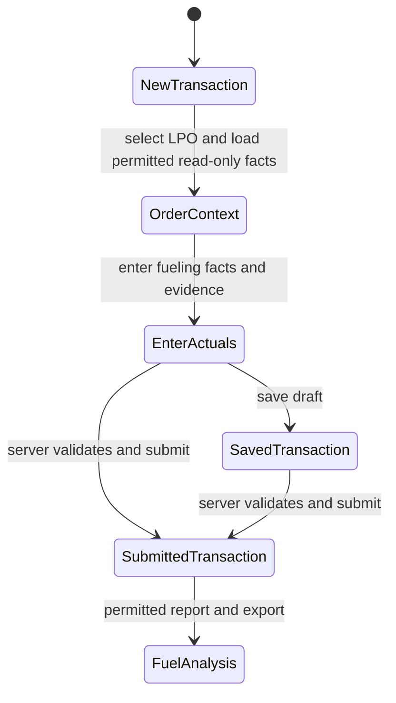

<!--
Design for the approved transaction-only scope. The linked Fuel Order remains read-only.
-->

# Fueling Transaction layout and fuel analysis: design

Approved by: Brian Kipngetich (@BrianKipngetich1) · 06/10/2026 · revision 1acee32 (explained by agent)

## Current state

- The app has one submittable Fueling Transaction linked to a Fuel Order. Its controller copies
  the order's asset, location, approval facts, and asset snapshots when the transaction is
  validated or submitted. Submission already enforces order approval and validity, station and
  fuel matching, measured values, signed evidence, role checks, and location permissions.
- The transaction form stores the order link, approved station/fuel/date/deadline, actual station
  and fuel, actual fueling date/time, invoice and CU numbers, litres, vehicle odometer or
  generator hour meter, full-tank confirmation, attendant, signed invoice/order, and existing
  vehicle-efficiency facts. The approved context fields are mostly hidden, and the form does not
  show the selected order's driver, representative, request estimate, or quantity authorization
  together with the actual transaction facts.
- The app has no fuel-only cost fields or Fueling Transaction analysis report. Vehicle efficiency
  for existing qualifying full fills is calculated by the transaction controller. Generator
  litres per operating hour and cost analysis are not currently reported.
- `Fueling Transaction` permissions allow Fleet Users to create, read, write, and submit; Fleet
  Approvers to read, print, and report; and Fleet Admins to manage, report, export, and submit.
  Existing hooks additionally scope transactions to permitted locations.

## Words in this request

| Requester's word | Means in this app |
|---|---|
| LPO / approved order | The existing Fuel Order linked in `Fueling Transaction.fuel_order`. |
| Asset identity | The linked Fleet Asset and its existing asset identifier and asset type. |
| Estimated litres | `Fuel Order.estimated_litres`, when it is available; this is a request estimate, not actual fuel. |
| Actual litres | `Fueling Transaction.invoice_litres`, as recorded from the fuel invoice. |
| Full tank | The explicit `Fueling Transaction.full_tank_confirmed` confirmation. |
| Fuel-only cost | The invoice's pre-tax fuel amount in KES, excluding other goods and tax. |
| Fuel analysis | A permission-filtered report over Fueling Transaction records, with export controlled by existing roles. |

## Decisions (locked)

- `D-1`: Reuse the current Fueling Transaction and linked Fuel Order. Show approved order details
  as read-only context and do not write back to, extend, or otherwise change the LPO.
- `D-2`: Keep approved and actual facts visibly distinct. The order context is loaded from the
  saved order; the transaction continues to store actual fueling details and its existing order
  snapshots.
- `D-3`: A vehicle transaction uses the vehicle odometer; a generator transaction uses the hour
  meter. The form shows the applicable meter only, while the existing server validation remains
  authoritative.
- `D-4`: Compare litres only. At or below the saved LPO estimate is within estimate; above
  estimate through 15% over is a warning; more than 15% over is an overrun. Without a positive
  estimate and positive actual litres, show no comparison.
- `D-5`: Store fuel-only pre-tax cost in KES. Calculate tax at 8% and the invoice total on the
  server. Analysis and cost per litre use pre-tax cost. Leave all historical cost values blank
  and display them as “Not recorded.”
- `D-6`: Use existing transaction and location permissions for the report and export. Fleet
  Users do not gain report or export access from this change.
- `D-7`: Keep existing order, validity, station, evidence, duplicate, and location checks in the
  transaction controller. New form feedback is advisory and cannot replace server validation.

## Design

When staff select an LPO, show a read-only context panel on the existing Fueling Transaction.
It presents the order number and approval state, asset and location, authorized station and
fuel, full or partial authorization and estimated litres where available, approval deadline,
driver, and company representative. A server method reads the linked order only after checking
the current user's Fuel Order read permission. The client renders returned values as escaped
text. Selecting or clearing the link refreshes or clears the panel; it does not save changes to
the order.

Organize the transaction form into approved order context, actual fueling details, evidence,
and review sections. Keep existing data fields and submission behavior. Default the transaction's
station and fuel from its linked order so staff do not re-enter them; the server continues to
set and validate these values on submission. Show the odometer for vehicles and hour meter for
generators. Present a live variance status beside entered litres, calculated only from the linked
order's saved estimate and actual litres.

Add pre-tax fuel amount, calculated tax, and invoice total to the existing transaction. The
server calculates tax as 8% of the pre-tax amount and total as their sum on save; calculated
fields are read-only. Do not populate costs on existing transactions. Add a Fueling Transaction
Script Report with date range, asset, location, fuel, and station filters, existing permission
scoping, and spreadsheet export under existing report/export permissions. It shows actual and
estimated litres, variance, pre-tax spend, pre-tax cost per litre, applicable meter, full-tank
result and exceptions, valid vehicle efficiency, and generator litres per operating hour when
two confirmed full-tank readings with increasing hour-meter values are available. Combined cost
per litre is total pre-tax spend divided by total litres.

**This diagram is the design, not the build.** The order context is read-only; actual fueling
facts are stored on the existing transaction. Server validation remains the authority for
submission.

## Frappe-first

| What we need | Native Frappe mechanism | Custom code, and why it is unavoidable |
|---|---|---|
| Linked order context | Existing Link field, read-only transaction fields, and an HTML form field | A permission-checked method and form script are needed to present multiple linked records together without storing duplicate display fields. |
| Actual transaction facts | Existing submittable Fueling Transaction and its controller | Small controller changes fill approved station/fuel defaults and calculate costs while preserving established validation. |
| Fuel cost and totals | Currency fields and document validation | Tax and total need server-side calculation so API and Desk saves agree. |
| Variance feedback | Existing estimate and actual litre values | A small form script shows the requested live threshold state; submission checks remain server-side. |
| Fuel analysis and export | Frappe Script Report, report permissions, and native report export | Calculated variance, aggregate cost, and generator efficiency require report logic. Queries must respect the app's location permission hooks. |

## Data and migration plan

- Add a pre-tax KES fuel amount plus read-only calculated tax and invoice-total fields to the
  existing Fueling Transaction. New transactions require the pre-tax amount and litres; existing
  transactions remain unchanged and show “Not recorded” where cost is absent.
- Add a read-only order-context display only; do not add copied driver, representative,
  estimate, or order-display fields to the Fuel Order or persist duplicate context on the
  transaction.
- Add the report and form script. No new DocType is required. No existing Fuel Order or
  Fueling Transaction is rewritten by migration, and historical costs are not backfilled.

## Correctness properties

### Property 1: Linked order remains unchanged

For any user who can read a linked order, loading and viewing transaction context returns facts
from that order without saving or changing any order field. A user without read permission gets
no linked order facts.

**Validates: Requirements 1.1, 1.2, 1.3**

### Property 2: Actual entry uses the correct asset meter and litre comparison

For every transaction, a vehicle displays its odometer and no generator hour meter; a generator
displays its hour meter and no vehicle odometer. Variance uses only positive estimated and
actual litres and applies the three approved thresholds; missing inputs produce no comparison.

**Validates: Requirements 1.4, 1.7**

### Property 3: Fuel costs are calculated from new actual values only

For every new transaction, actual litres and a pre-tax KES amount are required. Tax is 8% of
pre-tax amount, total is pre-tax amount plus tax, and cost per litre is pre-tax amount divided
by positive litres. Historical costs remain empty and are never inferred.

**Validates: Requirements 1.5, 2.1, 2.2, 2.3, 2.4, 2.8, 2.9**

### Property 4: Analysis follows transaction and location permissions

Every report row and exported row is limited by existing transaction read, report, export, and
location permissions. The report shows no vehicle or generator efficiency where the required
qualifying readings are absent or invalid.

**Validates: Requirements 2.5, 2.6, 2.7, 2.10**

### Property 5: Existing submission controls remain authoritative

For every transaction submission, existing order approval, validity, station and fuel matching,
fueling-time source and explanation, evidence, duplicate prevention, measured-value, role, and
location checks continue to run.

**Validates: Requirements 1.6, 1.8**

## Errors and permissions

- If the selected order cannot be read, the panel shows that its details are unavailable and
  returns no order values. Submission still follows the existing permission checks.
- If no order is selected, the panel is empty and the existing required-link validation applies.
- A missing or invalid estimate displays “No comparison available”; it does not block entry by
  itself. Existing submission checks continue to decide whether the transaction is valid.
- Missing pre-tax cost or litres blocks saving a new transaction. Historical transactions with
  no cost remain readable and show “Not recorded.”
- The report and export use existing role and location permissions. Fleet User access is not
  expanded; Fleet Admin and Fleet Approver retain only their existing rights.
