<!-- Small presentation change for the existing Fueling Transaction. -->

# Fueling Transaction entry layout: design

Approved by: pending

## Current state

The wide-screen form places the order context and invoice fields side by side. The order facts
use a two-column card, and the vehicle registration number appears together with the asset type
and model. Invoice fields use two columns, with the amount fields in three columns. The signed
invoice currently appears before the signed Fuel Order. The baseline and efficiency summary is
already below the two panels.

## Words in this request

| Requester's word | Means in this app |
|---|---|
| Fuel Order in a column | Show the linked, read-only Fuel Order facts as one vertical list in the left panel. |
| Transaction in rows | Keep invoice entry on the right and arrange its fields across horizontal rows with more room. |
| Asset vehicle number | Show the linked vehicle registration number on its own line above the other vehicle details. |
| Signed order to the left | Show Signed Fuel Order first, beside Signed Invoice in the same row. |
| Summary can be left as it is | Keep the current baseline, litre status, and efficiency summary below the panels. |

## Decisions (locked)

- `D-1`: Keep the order context as a vertical list in the left column and give the right
  transaction panel most of the available width; this follows the request to keep the order as
  a column and make invoice details easier to read.
- `D-2`: Show the vehicle registration number as its own prominent order fact; this makes the
  requested vehicle number easy to find without changing its source.
- `D-3`: Place Signed Fuel Order before Signed Invoice in the same horizontal row.
- `D-4`: Keep the current summary and transaction checks unchanged.
- `D-5`: Keep the existing narrow-screen stacking behaviour.

## Design

```mermaid
stateDiagram-v2
    [*] --> WideLayout
    WideLayout : Fuel Order vertical list left; transaction rows right; signed order then invoice
    WideLayout --> NarrowLayout : viewport narrows
    NarrowLayout : order above transaction; summary below
    NarrowLayout --> WideLayout : viewport widens
```

## Frappe-first

| What we need | Native Frappe/ERPNext mechanism | Custom code, and why it is unavoidable |
|---|---|---|
| Keep the order and transaction in separate areas | Existing Section Break and Column Break fields | Small CSS layout adjustment gives the transaction rows more width. |
| Show the asset number distinctly | Existing read-only order context | Adjust the rendered order facts; no new field is needed. |
| Place the signed files side by side | Existing Attach fields and DocType field order | Reorder the two existing fields so their left-to-right order matches the request. |
| Preserve the summary | Existing HTML summary field and client events | No summary changes are needed. |

## Data and migration plan

No existing data is changed and no new fields are added. Update only Fueling Transaction form
presentation and migrate the disposable test site. Do not migrate the main site.

## Correctness properties

### Property 1: Order, transaction, and evidence are easy to distinguish

For every Fueling Transaction, wide screens show the order facts as a vertical list on the left,
the transaction in horizontal rows on the right, the vehicle registration number on its own
line, and the signed order to the left of the signed invoice. The existing summary remains
below, and narrow screens stack the order above the transaction.

**Validates: Requirements 1.1, 1.2, 1.3, 1.4, 1.5**

### Property 2: Existing transaction behaviour is preserved

For every Fueling Transaction, the linked Fuel Order remains read-only and the existing save,
submit, calculation, validation, and permission behaviour is unchanged.

**Validates: Requirements 2.1**

## Errors and permissions

The change introduces no new permission checks or data operations. Existing Fuel Order read
permission and transaction validation remain in force.
