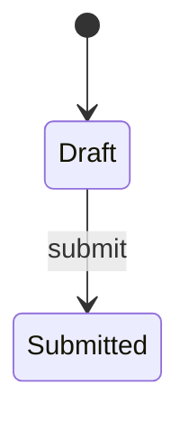

<!--
How the requirements will be met (Kiro's design.md). Written in step 2 of the Kaysalt
workflow and approved before building starts; a small task writes it with requirements.md
and shares that approval. Audience: the requester, who may ask for a plain-language
explanation, and an agent resuming cold who must not reopen settled decisions.

This is the first file allowed to name DocTypes, fields, routes, and roles. Every
correctness property validates at least one acceptance criterion. Never invent records or
labels for existing data; ask the requester and record the answer in "Data and migration
plan".

The approval line is written only after an explicit "approve" and reset to `pending`
whenever this file changes.
-->

# <Feature name>: design

Approved by: pending

## Current state

What exists today, named by surface and behaviour.

## Root cause

Bugs only; delete for a feature. Why the current behaviour happens, traced to the code.

## Words in this request

What the requester's words mean in this app. Resolve every ambiguity by asking, then record
it here.

| Requester's word | Means in this app |
|---|---|
| <word> | <DocType, field, role, or report> |

## Decisions (locked)

One line each: the decision, and the alternative it beat. An agent resuming work does not
reopen these.

- `D-1`: <decision>. Chosen over <alternative> because <reason>.

## Design

**This diagram is the design, not the build.** Each verification record redraws it from what
was actually observed and tallies the two. Use one transition per line and stable node names
so the two diagrams diff cleanly.

## Frappe-first

Fill before writing custom code. An empty right-hand column is the goal.

| What we need | Native Frappe/ERPNext mechanism | Custom code, and why it is unavoidable |
|---|---|---|

## Data and migration plan

Schema changes, and what happens to existing records. Write "No existing data affected"
when that is true.

## Correctness properties

Rules that hold for every input. Each is tested by a parameterised `IntegrationTestCase`
whose docstring names the spec folder and what it checks
(`"""<NNN-name>: Requirements 1.1; Property 1. ..."""`).

### Property 1: <name>

<The rule, stated for every record or input.>

**Validates: Requirements 1.1**

## Errors and permissions

What each role may and may not do, and what the person sees when something is refused.
