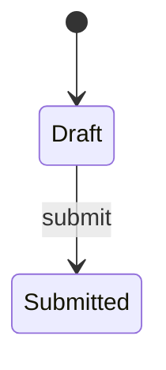

<!--
The design document. Written before implementation, from the user's request.
Audience: a human deciding whether this is the right thing to build, and an agent
resuming cold who must not relitigate settled decisions.

Business-functional language above "Current state": name an actor, an action, and an
outcome. No file paths, no function names, no field names in the human-facing sections.
Keep the whole file under ~400 lines for its entire life.
-->

# <Feature name>

| | |
|---|---|
| Status | `Draft` \| `Approved` \| `Implementing` \| `Complete` |
| Owner | `<name>` |
| Started | `<YYYY-MM-DD>` |
| Approved by / date | `<name> / <YYYY-MM-DD>` |
| Approved revision | `<commit>` |
| Branch | `<type>/<name>` |

## Problem

One or two paragraphs, in business terms. What can a person not do today, or what goes
wrong when they try? No solution here.

## Goal

What becomes true when this ships. Observable by a person, not by a test.

## Decisions (locked)

The continuation payload. One line each: the decision, and the alternative it beat.
An agent resuming work does not reopen these.

- `D-1` — <decision>. Chosen over <alternative> because <reason>.

## Current state

What exists today, named by surface and behaviour — the first section allowed to name a
DocType, route, workflow, or field.

## Design

**This diagram is the design, not the build.** Each phase's verification record redraws it
from what was actually observed and tallies the two. Use one transition per line and stable
node names so the two diagrams diff cleanly.

## Frappe-first

Fill before writing custom code. An empty right-hand column is the goal.

| What we need | Native Frappe/ERPNext mechanism | Custom code, and why it is unavoidable |
|---|---|---|

## Tracer bullet plan

Each phase is a thin vertical slice with an observable outcome — never schema-only,
backend-only, or UI-only.

### Phase 0 — <name>

<What changes.>

**Tracer:** <the one thing a person can do afterwards that they could not do before.>

**Acceptance**
- `AC-1` — <what must be observably true when this phase closes. The phase record's
  verification table cites these ids in its "Covers" column, so give every one a stable id
  and never renumber them.>

## Out of scope

What this deliberately does not do, so a reviewer does not raise it as a gap.

## Progress log

One entry per phase, appended when the phase closes. Link the verification record.

- `<YYYY-MM-DD>` — Phase 0 ✅ <outcome>. [Verification](verification/phase-00-<name>.md)
