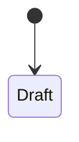

<!--
The proof document. Written as the phase is verified, from what was actually observed.
Audience: a reviewer who did not write the code — human or agent. They must be able to
run it and get a yes or no.

Three rules that keep this file from growing into a chronicle:

1. Procedure, not transcript. Never "I ran X and got Y". Always "do X, expect Y".
   The test: could a reader who did not write this run it and get a yes or no?
2. If a check can be automated it belongs in a test file, not here. This file holds only
   what a machine cannot assert — Desk walkthroughs, role permissions as a real user
   experiences them, visual outcomes.
3. Evidence of a run belongs in CI and git, linked from here. Never pasted in. A CI run
   proves it on an exact commit; pasted terminal output proves nothing and goes stale silently.

Never record credentials, tokens, cookies, or session ids in any form.
-->

# Phase <N> — <name>

| | |
|---|---|
| Specification | [`../spec.md`](../spec.md) @ `<approved revision>` |
| Status | `Not started` \| `In progress` \| `Ready for review` \| `Complete` |
| Started / Closed | `<YYYY-MM-DD>` / `<YYYY-MM-DD>` |
| Author | `<name>` |
| Reviewed by | `<reviewer>` |
| Signed off | `<name>, <YYYY-MM-DD>` |
| Landed in | `<PR link>` |
| Covers | `<acceptance criteria>` |

## What this phase makes true

Business-functional. What a person can now do, or now cannot do wrongly. Three to five
sentences. No file paths, no function names.

## The rule, as observed

Drawn from the verification table below, **not** copied from the specification. An edge
appears here only if a numbered row observed it — which makes this diagram a coverage map.
Keep the specification's node names unless observation contradicts them; that contradiction
is a finding, not a rename.

### Design vs. observed

Every edge in the specification's diagram, tallied against the one above. A difference is a
finding, never a silent edit.

| Specification edge | Observed | Verdict |
|---|---|---|
| `A → B` | yes | As designed |

Verdicts: **As designed** · **Unbuilt or untested** (in the design, never observed — blocking)
· **Undesigned behaviour** (observed, not in the design — reconcile into the spec or remove it)
· **Drift** (observed differently — someone made an undocumented call; record it) ·
**Not in scope** (another phase delivers it).

## Frappe-first / native-first

| What we needed | Native mechanism used | Custom code, and why |
|---|---|---|

**Scope deliberately not taken:** <permissions, roles, or dependencies rejected, and why.>

## Verification

Runnable by a reviewer who did not write this. Each row is a state to put the system into
and the outcome that must follow.

| # | Put the system in this state | Expect | Covers |
|---|---|---|---|
| 1 | <as role X, do Y> | <outcome> | `AC-n` |

**How to run it.** <Which rows the automated suite covers and the command; which rows need a
real Desk walkthrough or a live pull request, and why they cannot be automated.>

**Result:** <n of n observed.> Evidence is in the CI runs and commits linked above.

## What we learned that the plan did not predict

Read this before touching these surfaces again. Gotchas, wrong assumptions, and anything
that cost time. This is what a cold agent needs most.

## Known limitations — accepted, not fixed

- <Limitation, why it is accepted, and what would have to change to fix it.>

## Review

A review is scoped to one phase. Two rounds maximum: round 1 raises findings, round 2 checks
only those findings. Zero blocking findings closes the cycle regardless of how many
non-blocking remain. Non-blocking findings never reopen a review — each becomes a
**Known limitation** above or a new specification. If round 2 still returns blocking
findings the phase was scoped too wide: split it, do not re-review it.

| Round | Date | Verdict | Closed by |
|---|---|---|---|
| 1 | `<date>` | `Approved` \| `Changes required` | `<PR or commit>` |

**Closure:** <blocking findings remaining, and any departure from the rules above.>

**Next:** <the phase or action that follows.>
